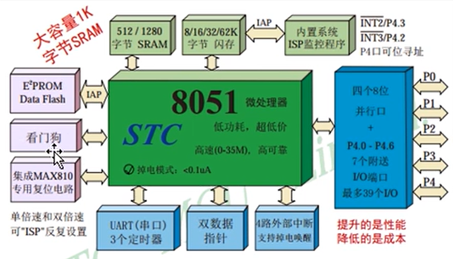
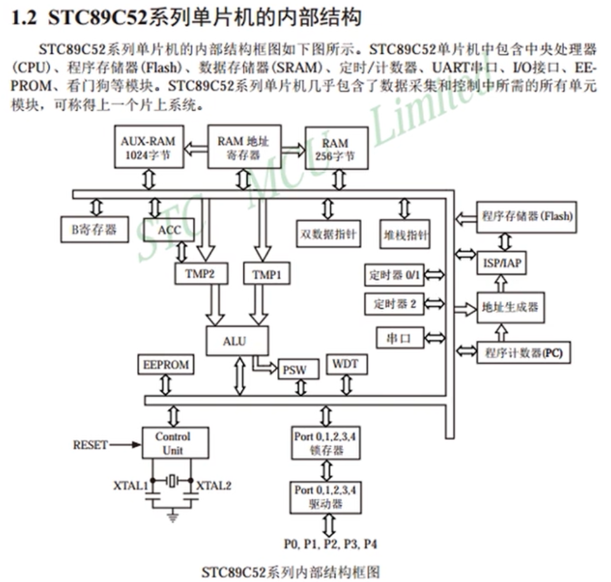
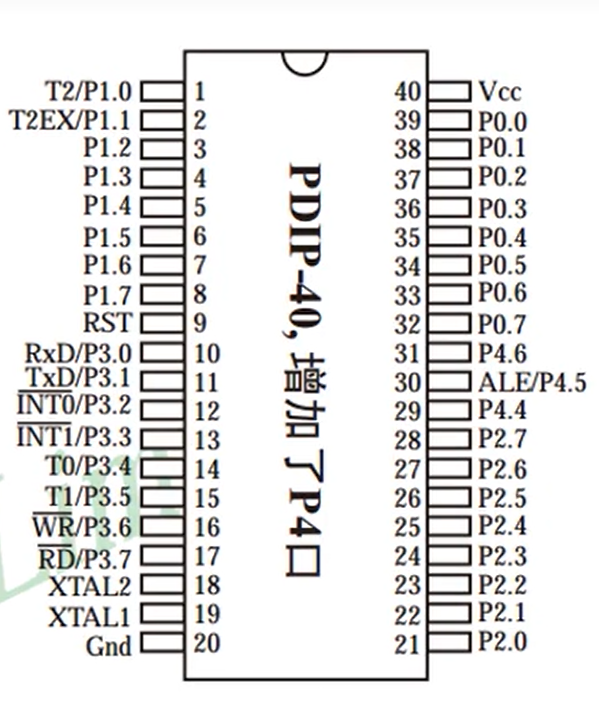
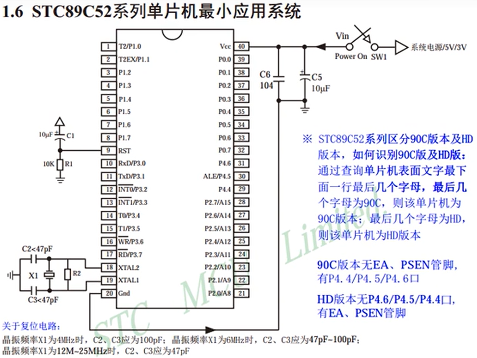
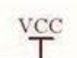
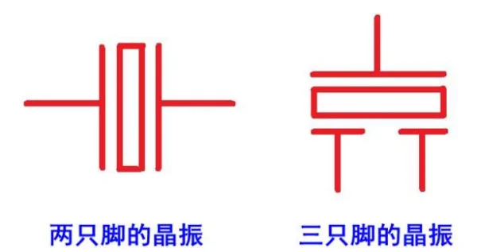
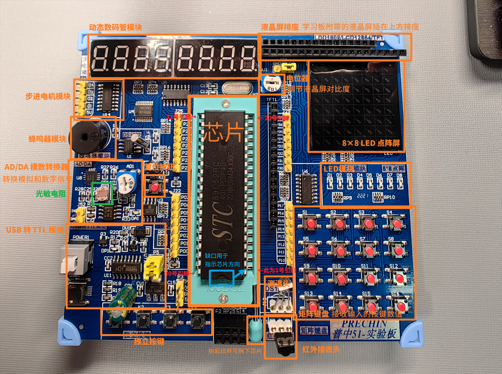

#### 视频： https://b23.tv/BV1Mb411e7re 本讲为第 3 讲  
#### 普中 51 开发板官方资料： https://pan.baidu.com/s/1z2NvYz_Yz32RGqTIa5eb2w?pwd=9d0q  
随时参考文件 [00-1](00-1-STC89Cxx中文参考手册.pdf)、[00-2](00-2-普中-2&普中-3&普中-4开发板原理图.pdf)、[00-3](00-3-普中-2&普中-3&普中-4开发板尺寸图.pdf)  

### 单片机，英文 Micro Controller Unit ，简称 MCU  
- 内部集成 CPU、RAM、ROM、定时器、中断系统、通讯接口等一系列的电脑常用硬件功能  
- 其内部是信息采集（依靠传感器）、处理（依靠 CPU）和硬件设备（电机、LED等）  
- 算是袖珍版计算机，一个芯片就能构成完整的计算机系统；但性能上与计算机相差甚远  
- 成本低、体积小、结构简单，生活和工业领域大有所用  
- 同时学习单片机是了解计算机原理与结构的最佳选择  
- 应用领域已经十分广泛，如智能仪表、实时工控、通讯设备、家用电器等  

### STC89C52 单片机  
**详见 [STC89Cxx中文参考手册](https://github.com/Leo204-LKY/Code-Learning/blob/main/51%20MCU/Bilibili%20Courses/0-1-STC89Cxx%E4%B8%AD%E6%96%87%E5%8F%82%E8%80%83%E6%89%8B%E5%86%8C.pdf)**  
- 所属系列： 51 单片机系列  
- 公司： STC 公司  
- 位数： 8 位  
- 随机存储器 RAM ： 512 字节  
- 只读存储器 ROM ： 8K (Flash)  
- 工作频率： 12 MHz (本开发板使用)  
- 内部结构图：   第二张图是一种总线结构，所有外部设备挂接在总线上， CPU 可以通过总线访问所有外部设备，如：  
  - 中间下方 P1、P2 等：引脚  
  - 左下方 XTAL1/2 ：晶振的连接方式  
- 管脚图：  注：需要记住大概位置  
  - VCC ：电源 + 极； GND ：电源 - 极  
  - XTAL1/2 ：单片机时钟用，外接晶振可以为单片机提供时序，驱动代码逐步运行；如没有晶振代码只会执行第一条；有的芯片会内置晶振  
  - RSD ： Reset 复位  
  - P0/P1/P2/P3 组：每组有 0-7 共八个引脚（对应单片机是 8 位的）  

### 单片机的最小系统  
 单片机本身就是一个系统，但想让其运行起来仍需要一些外部内容  
- 右上角电源，不像中学需要将电路连成回路，▷ 符号(或者  符号)代表电源正极，⏚ (接地)符号代表电源负极  
- 电源左下方的两个电容：用于滤波，防止电源不稳定干扰芯片  
- 18、19 号引脚左侧：晶振模块  同时还有晶振左侧的起振电容、右侧的电阻(也有的不会接电阻)  
- 9 号引脚：复位模块，接入正极时(高电平)复位，接入负极时(低电平)没有影响；上电一瞬间电容不带电，相当于短路，会复位芯片，达到上电复位的效果(复位模块也可以不接)  

### 开发板介绍  
**详见[开发板原理图](00-2-普中-2&普中-3&普中-4开发板原理图.pdf)、[开发板尺寸图](00-3-普中-2&普中-3&普中-4开发板尺寸图.pdf)**  
简略介绍：  
  