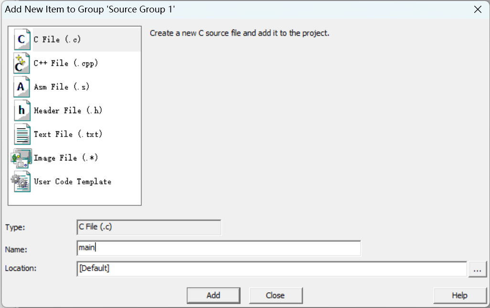

### LED  
- 中文名：发光二极管  
- 英文名：Light Emitting Diode  
- 符号：  (左侧为正极)  
- 不同类型 LED 正负极判断： https://zhuanlan.zhihu.com/p/472025147  


### LED 模块原理图  
  

- 电阻用于限流
- 控制 LED 点亮/熄灭即控制 P2 口输出高/低电平(开发板使用 TTL 电平，高电平为 5V ，低电平为 0V)  
- 由于图中 VCC 已经有 5V 电压，只有右侧 P2 口电压也为 5V (高电平)时， LED 两侧没有电位差，才是熄灭状态  
- 要让图中的 D1 LED 灯点亮，只需要让 P2 的最低位为 0  

### 2-1 点亮 LED  
  ```C
  #include <REGX52.H>
  // 在 Keil μVision 5 中可以直接右键点击 "Insert '#include <REGX52.H>'" 来插入这行代码
  // 引入了 AT89X52.H 系列芯片的寄存器
  // 可以在 Keil 中右键 #include 行，点击 "Open document <REGX52.H>" 查看详细内容

  void main()
  {
    // 让 P2 赋值二进制 1111 1110
    // 但如果直接使用 P2 = 1111 1110 ，程序会认为这是 10 进制数
    // 因此应该把 1111 1110 转为 16 进制(首选)或 10 进制
    P2 = 0xFE;  //这里的 FE 大小写都无所谓
    while(1)
    {

    }
    // 如果不加 while ，程序循环执行 void main 中的程序(即循环点亮 LED ， LED 会快速闪烁[但是看不出来])
  }
  ```  

### 2-2 LED 闪烁  
要让 LED 闪烁，只需要让 P2 在 1111 1110 和 1111 1111 直接闪烁  
开发板以 MHz 的速度运行 (即 1 秒能运行 1 000 000 次) ，因此需要进行延时  
1. STC-ISP 中包含 `软件延时计算器` 工具，可以使用其中的工具生成相应延时的代码  
2. 对于 51 开发板和当前程序，应将相关参数调整为 系统频率 `12.000 MHZ`、定时长度 `500 毫秒` (注意：默认是微秒) 、 8051 指令集 `STC-Y1`  
3. 随后添加头文件 `#include <INTRINS.H>` ，再将上步生成的代码复制进 Keil μVision 5 的 `main.c` 文件 `main` 前即可  
    

最终获得：  
```C
#include <REGX52.H>
#include <INTRINS.H>

void Delay500ms()		//@12.000MHz
{
	unsigned char i, j, k;

	_nop_(); // ´ú±í¿ÕÓï¾ä
	i = 4;
	j = 205;
	k = 187;
	do
	{
		do
		{
			while (--k);
		} while (--j);
	} while (--i);
}

void main()
{
	while(1)
	{
		P2 = 0xFE; // 1111 1110
		Delay500ms();
		P2 = 0xFF; // 1111 1111
		Delay500ms();
	}
}
```

### 2-3 LED 流水灯  
进制对照表：  
| 十进制 | 二进制 | 十六进制 | 十进制 | 二进制 | 十六进制 |   
| ---: | --- | --- | ---: | --- | --- |  
| 0 | 0000 | 0x00 | 8 | 1000 | 0x08 |
| 1 | 0001 | 0x01 | 9 | 1001 | 0x09 |  
| 2 | 0010 | 0x02 | 10 | 1010 | 0x0A |  
| 3 | 0011 | 0x03 | 11 | 1011 | 0x0B |  
| 4 | 0100 | 0x04 | 12 | 1100 | 0x0C |  
| 5 | 0101 | 0x05 | 13 | 1101 | 0x0D |  
| 6 | 0110 | 0x06 | 14 | 1110 | 0x0E |  
| 7 | 0111 | 0x07 | 15 | 1111 | 0x0F |  
<details>
<summary>代码</summary>
<pre>

```C
#include <REGX52.H>
#include <INTRINS.H>

void Delay500ms()		//@12.000MHz
{
	unsigned char i, j, k;

	_nop_();
	i = 4;
	j = 205;
	k = 187;
	do
	{
		do
		{
			while (--k);
		} while (--j);
	} while (--i);
}

void main()
{
	while(1)
	{
		P2 = 0xFE;       // 1111 1110
		Delay500ms();
		P2 = 0xFD;       // 1111 1101
		Delay500ms();
		P2 = 0xFB;       // 1111 1011
		Delay500ms();
		P2 = 0xF7;       // 1111 0111
		Delay500ms();
		P2 = 0xEF;       // 1110 1111
		Delay500ms();
		P2 = 0xDF;       // 1101 1111
		Delay500ms();
		P2 = 0xBF;       // 1011 1111
		Delay500ms();
		P2 = 0x7F;       // 0111 1111
		Delay500ms();
	}
}
```
</pre></details>

### 2-4 LED 流水灯 Plus  
假设我们需要改变延时，让流水灯“流动”的速度更快(例如改为 `300 ms` )，那么就需要在 STC-ISP 中生成新的代码，但是每次改变延时都需要重新生成，那应该如何优化呢  
首先需要获得延时 1ms 的代码：  
```C
#include <INTRINS.H>

void Delay1ms()		//@12.000MHz
{
	unsigned char i, j;

	i = 2;
	j = 239;
	do
	{
		while (--j);
	} while (--i);
}
```
其中 `Delay1ms()` 为函数名，后方的括号中没有参数  
要实现任意变换，首先需要有参数，将其改为 `Delayms(xms)`  
但是 `xms` 变量未定义，因此需要先定义变量  
对于 16 位单片机，其所能存储的最大整数为 2^16-1 ，进行定义时，使用 `unsigned int xms` 表示定义无符号整型，范围为 0 ~ 65535 ；而使用 `signed int xms` (`sign` 可省略) 则需要去掉一半数据用来表示负数，范围为 -32768 ~ 32767  
具体的数据类型见下表：  
  
函数名接下来应该改为 `Delay(unsigned int xms)`  
再对其余部分进行修改
```C
#include <INTRINS.H>

void Delay(unsigned int xms)		//@12.000MHz, Delay [xms] ms
{
	unsigned char i, j;
  while(xms)
  {
	  i = 2;
	  j = 239;
	  do
	  {
	  	while (--j);
	  } while (--i);
    xms--;
  }
}
```
对 2-3 中的代码进行优化可得：  
<details>
<summary>代码</summary>
<pre>

```C
#include <REGX52.H>
#include <INTRINS.H>

void Delay(unsigned int xms)		//@12.000MHz, Delay [xms] ms
{
	unsigned char i, j;
  while(xms)
  {
	  i = 2;
	  j = 239;
	  do
	  {
	  	while (--j);
	  } while (--i);
    xms--;
  }
}

void main()
{
	while(1)
	{
		P2 = 0xFE;       // 1111 1110
		Delay(300);
		P2 = 0xFD;       // 1111 1101
		Delay(300);
		P2 = 0xFB;       // 1111 1011
		Delay(300);
		P2 = 0xF7;       // 1111 0111
		Delay(300);
		P2 = 0xEF;       // 1110 1111
		Delay(300);
		P2 = 0xDF;       // 1101 1111
		Delay(300);
		P2 = 0xBF;       // 1011 1111
		Delay(300);
		P2 = 0x7F;       // 0111 1111
		Delay(300);
	}
}
```
</pre></details>

### 补充 1： 电路元器件中一些数字的读取方式  
一些电阻、电容、电位器等原件用以下方式表示其数值(如阻值)  
如开发板中的电位器有数字 103：  
数字最后一位数为末尾跟的 0 的个数  
如：  
- 102 是 10 后面跟 2 个 0 ，即 10 00 或 1K  
- 104 即 10 0000  
- 1001 即 100 0  
- 前文中的电位器 () 最大阻值为 10 000Ω 或 10KΩ  

### 补充 2： Keil μVision 5 使用说明
1. 启动 Keil μVision 5 ，左上角 `Project` -> `New μVision Project...` 新建工程<br><br>弹出 `Create New Project` 窗口，选择新建工程的位置 _(注：建议为空文件夹)_ 和工程名后点击 `保存(S)` 完成创建  
2. 弹出新窗口 `Select Device for 'Target 1'...`，对于学习过程使用的开发板，搜索并选择 `AT89C52` (软件中没有 STC89C52 ，用 AT89C52 作为替代)，然后点击 `OK`<br><br>接下来会弹出对话框询问是否添加启动文件，此处选择不影响。但由于启动文件一般不需要进行改动，选择 `否(N)` 即可<br><br>完成后展开 `Project` 窗口中的文件夹，可以看到 `Source Group 1` 文件夹，即为编写代码的文件夹<br>  
3. 右键 `Source Group 1` 文件夹，点击 `Add New Item to Group 'Source Group 1'...`<br><br>在弹出的窗口中选择 `C Fille (.c)` ，然后在 `Name` 栏输入 `main` ，点击 `Add`<br><br> _注：工程中第一个 `.c` 文件名均应为 `main`_  
4. 使用下图中 `Project` 窗口上方的 `Build` 按钮 (或键盘上的 `F7`) 来编译程序<br><br>
**补充：需要在 `Options for Target...` -> `Output` 中勾选 `Create HEX File` ，用于后续烧录步骤使用**<br><br>  

### 补充 3： STC-ISP 使用说明  
在 Keli μVision 5 中完成程序的编译后，使用 STC-ISP 来烧录程序  
1. 启动 STC-ISP ，在 `单片机型号` 下拉框中依次选择 `STC89C52RC 系列` -> `STC89C52RC / LE52RC`<br>程序会自动检索单片机所连接的串口，一般无需调整串口号<br>  
2. 点击 `打开程序文件` ，找到工程文件夹下的 `Objects` 文件夹，选择编译好的 `.hex` 文件  
3. 点击 `下载/编程` ，重启单片机(关闭开关后重新开启)，输出 `操作成功 !` 即表示烧录成功<br>  
