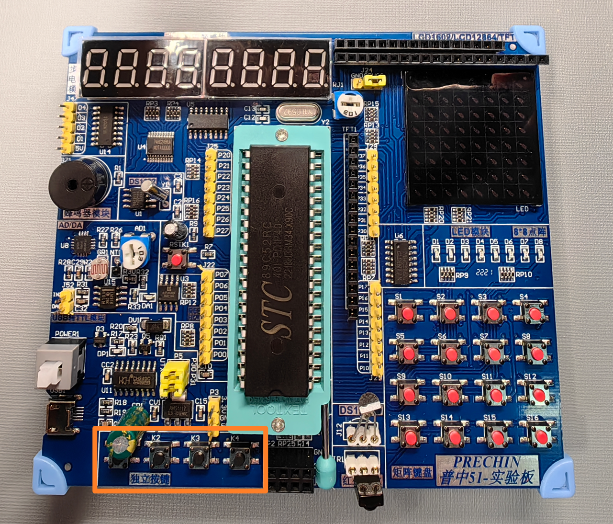
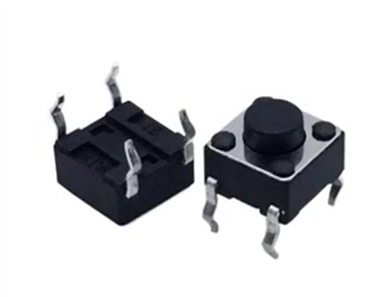
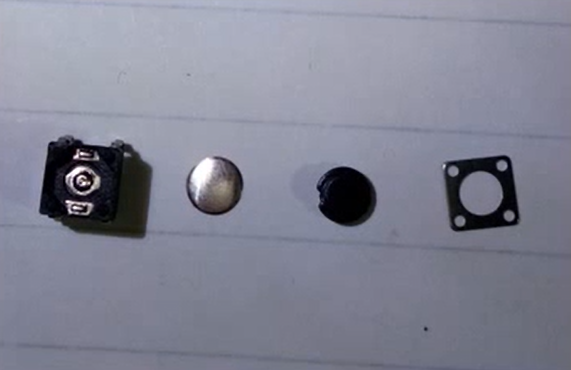
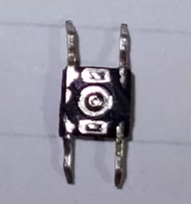
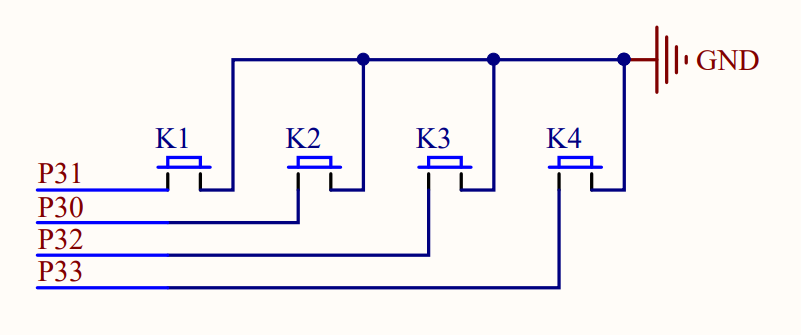
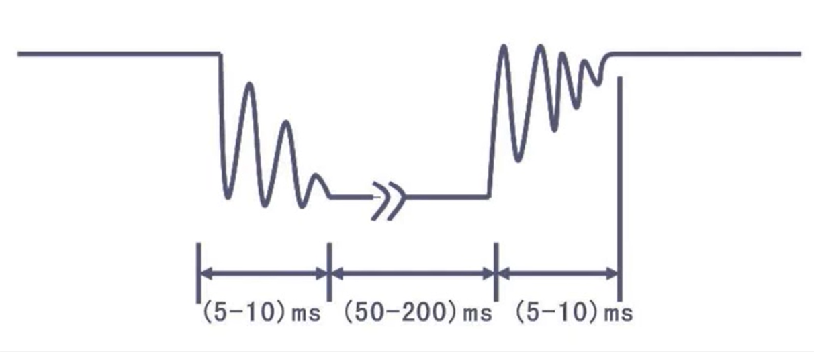
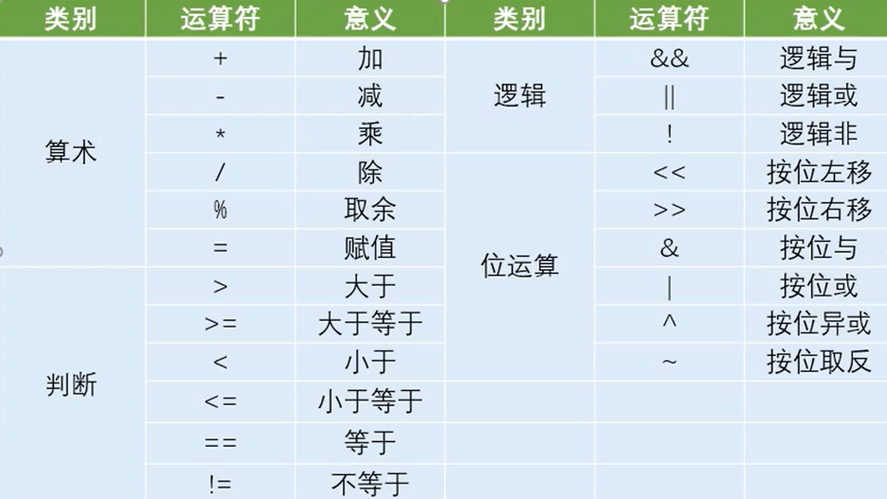

### 独立按键  
- 位于 51 开发板左下角的四个黑色按键<br><br>_注：右侧 4 × 4 矩阵键盘会在之后学习_  
- 轻触按键：相当于电子开关，按下时接通，松开时断开<br>  
  - 拆开后可分为四个部分：<br>  
  - 对左一继续拆解可得<br>  - 左侧两个脚与右侧两个脚分别连通，按下按钮时，前一幅图中的左二金属弹片挤压使左右两侧四个引脚线路接通，产生信号  

### 独立按键模块原理图  
  

- 右侧线路接地，左侧接入芯片 P3 引脚  
- 线路断开时，左侧输入 5V 电压，为高电平；线路接通是，左右两侧电压均为 0V ，为低电平  
- 寄存器通过检测高/低电平来检测按钮是否被按下  

### 3-1-独立按键控制 LED 亮灭  
上章中如果需要控制某一 LED 的亮灭，需要同时控制 8 个 LED  
```C
P2 = 0xFE;
```
实际上 `<REGX52.H>` 中有对每个引脚进行定义，可以进行只改变其中一个  
如果需要控制 D1 LED 灯，只需将 `P2` 改为 `P2_0`  
```C
P2_0 = 1;
```
使用 `if` 检测独立按键 K1 是否被按下，然后控制灯的亮灭  
```C
#include <REGX52.H>

void main()
{
    while(1)
    {
        if(P3_1 == 0)  // 注：当 P3_1 的值为 0 (低电平) 时按钮被按下
        {
            P2_0 = 0;  // 灯亮
        }
        else
        {
            P2_0 = 1;  // 灯灭
        }
    }
}
```

### 3-2 独立按键控制 LED 状态  
#### 按键的抖动
对于机械开关，机械触点断开/闭合时，由于其弹性作用，不会一下子稳定接通或断开，也就是抖动  
  

主要有两种方法消除抖动：  
- 硬件： 使用特殊的电路，较为麻烦  
- 软件： 检测到按键状态发生变化后，延时 20 ms 再进行后续步骤即可  
```C
// 注： void main 以外的其他部分省略
void main()
{
	while(1)
	{
		if(P3_1 == 0)
		{
			Delay(20);
			while(P3_1 == 0);  // while 函数中不包含内容时，可以直接用分号结尾
      // 松开按钮后执行后续步骤
			Delay(20);
			
			P2_0 = ~P2_0;    // 取反
		}
	}
}
```

### 补充 1：C51 数据运算  
  

算数、判断类型的运算符在软件的编写中十分常见；位运算类型虽然在软件并不常见，但在单片机中应用比较广泛  
- `<<` 按位左移  
  - 0011 1100 << 1  ->  0111 1000  
  - 按位左移 1 位，高位移出、低位补零  
- `>>` 按位右移  
  - 0011 1100 >> 2  ->  0000 1111  
  - 按位右移 2 位，高位补零、低位移出  
- `&` 按位与  
  - 0001 1000 & 0010 1010  ->  0000 1000  
  - 对两个数据的每一位分别进行操作，均为 `1` 时输出 `1`  
- `|` 按位或  
  - 0001 1000 | 0010 1010  -> 0011 1010  
  - 对两个数据的每一位分别进行操作，有 `1` 即输出 `1`  
- `^` 按位异或  
  - 0001 1000 ^ 0010 1010  ->  0011 0010  
  - 对两个数据的每一位分别进行操作，不同时输出 `1`  
- `~` 按位取反  
  - ~0011 1100  ->  1100 0011  
  - 对每一位进行操作，将 `0` 与 `1` 互换  

### 补充 2： C51 基本语句  


