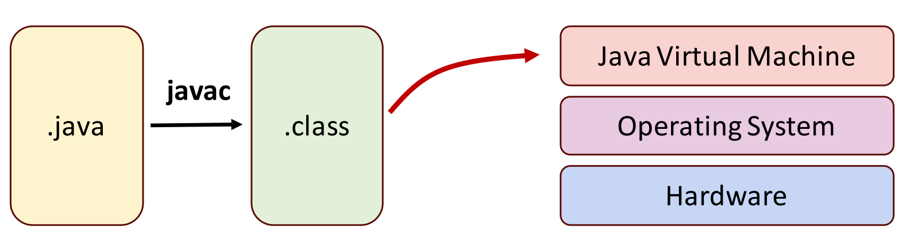
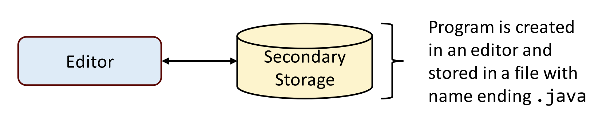

## Session 2: Introduction to Java language  

### 为什么选择 Java ？  
- Java 是世界上使用最广泛的计算机编程语言之一  
- 对于许多组织来说，满足其企业编程需求的首选语言是 Java  
- 根据甲骨文 2016 年 JavaOne 大会的主题演讲(http://bit.ly/JavaOne2016Keynote)，现在全球有 1000 万 Java 开发人员，Java 在 150 亿台设备上运行，其中包括 20 亿辆汽车和 3.5 亿台医疗设备  
- Android 是 Java 的变种  

### Java 的历史  
- Java 历史悠久  
    - Sun Microsystems 公司在 1991 年资助了一个由 James Gosling 领导的公司内部研究项目，该项目产生了一种基于 C++ 的面向对象编程语言，Sun 称之为 Java  
- 互联网助长 Java  
    - Java吸引了商业社区的注意，因为人们对互联网产生了巨大的兴趣  
    - Java程序可以在各种各样的计算机系统和计算机控制的设备上运行（*“一次编写，随处运行”*：细节将在后面介绍）  
    - 现在用于开发大型企业应用程序，增强 Web 服务器的功能，为消费者设备提供应用程序，开发机器人软件和许多其他目的  

### Java 的版本  
- 有不同的 Java 版本在使用；最新发布的标准版  （Standard Edition, SE） Java 开发工具包（Java development kit, JDK）为 20  
    - 具有长期支持(long term support, LTS)的最新版本是 JDK 17  
    - 并非所有版本都相等;本课程主要基于 Java 11 并提供 LTS  
    - 对于本课程中的基本概念，任何 Java 8 版本的代码看起来几乎相同  
- 旧的 Java RE 运行时可能无法运行为新版本编写的代码，并且新运行时可能缺少为旧程序编写的程序所需的库!  

### Java 的批评  
- 太详细  
    - 然而，更容易阅读！  
    - 当您响应中断呼叫（outage call）时，或者当您需要维护和修补由早就离开的开发人员编写的代码时，额外的冗长可能是一个好处  
- 变化缓慢  
    - 最近版本中出现的新语言功能是解决最常见的关于缺少功能的抱怨的重要一步  
- 性能低  
    - 适用于早期版本，但不再是约束条件  
- 安全问题  
    - 2013 年期间，Java 平台存在大量安全漏洞，导致 Java 8 的发布日期被推迟  
    - 这些漏洞中有许多涉及 Java 系统的桌面和 GUI 组件，并不影响网站或其他用 Java 编写的服务器端代码  
- 太公司（corporate）  
    - 实际上，Java是开源软件项目中广泛使用的语言  

### Java Virtual Machine (JVM) Java 虚拟机  
- JVM 是一个程序，它提供 Java 程序执行所必需的“runtime environment”（运行时环境，或 executed environment 执行环境）  
    
- 使用 `javac Program.java` 来将 .java 文件编译为 .class 文件  
- 使用 `java <arguments> Program` 来运行 .class 文件  

### JVM 的优点  
- 包含一个容器，用于在其中运行应用程序代码  
- 提供安全可靠的执行环境（与 C/C++ 相比）  
- 将内存管理的任务从开发人员手中转移出去  
- 提供一个跨平台的执行环境，即“一次编写，到处运行”（Write once, run anywhere 或 WORA）  
- 利用运行时信息进行自我管理，即即时（just-in-time，JIT）编译  

### 典型的 Java 开发环境  
通常， Java 程序开发有五个阶段：  
1. **编辑**代码  
2. **编译**为*字节码（bytecode）*  
3. **加载**字节码  
4. **验证**字节码  
5. **运行**字节码  

#### 阶段 1.1：创建程序  
- 阶段 1 包括使用编辑器程序编辑文件  
- 使用编辑器时：  
    - 编写 Java 程序（源代码）  
    - 进行必要的修正  
    - 将其保存在辅助存储设备上  
        

#### 阶段 1.2：编辑代码文件  
- 您可以使用任意文本编辑器（Vim, Notepad, TextEdit等）编辑源代码文件  
- 也可以使用集成开发环境（Integrated Development Environment, IDE）  
    - 提供支持软件开发过程的工具，如编辑器、定位逻辑错误的调试器等  
    - 最受欢迎的 IDE 包括：  
        - Eclipse (http://www.eclipse.org)   
        - IntelliJ IDEA (http://www.jetbrains.com)  
        - NetBeans (http://www.netbeans.org)   

#### 阶段 2：编译 Java 程序  
- 使用命令 `javac`（Java compiler，Java 编译器）将源代码编译为程序  
- 要将源文件 `Welcome.java` 编译，你需要输入：  
  ```powershell
  javac Welcome.java
  ```
- 编译器创建字节码并将其存储在以. class 结尾的文件中  