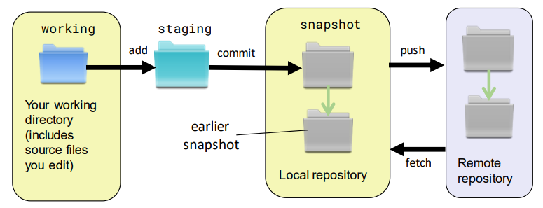
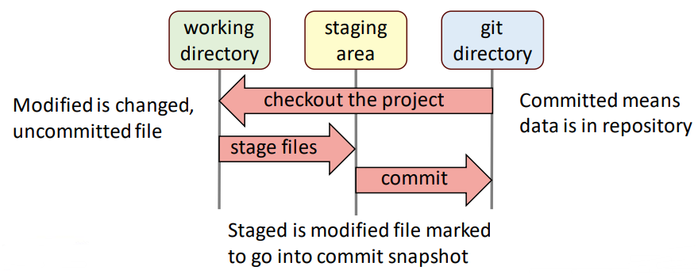
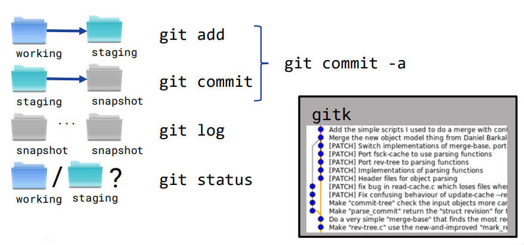
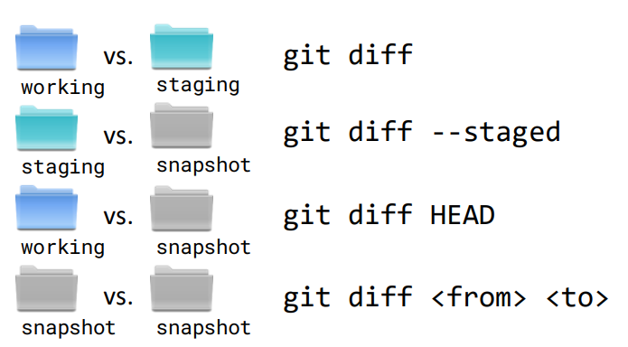

# Day 2: Version controll and Java fundamentals 版本控制和 Java 基础  

## Session 1: Version control  

### JAR 文件  
- 编译后的 Java 程序(即 .class 文件)可以打包到 .jar 文件中  
- 第三方库通常作为 .jar 文件分发（通过 Maven）  
    - 稍后，当我们开始自动化项目依赖关系管理时，我们会看到 Maven  
- 您还可以将自己的应用程序打包为可执行的 .jar  
    - 运行 .jar 文件  
      ```shell
      java - jar example.jar
      ```
- 更多信息：https://docs.oracle.com/javase/tutorial/deployment/jar/basicsindex.html  

### 版本控制  
- 版本控制为我们提供了撤销功能，这样我们就可以在安全网下进行更改  
- 版本控制有很多类型：  
    - 本地（如 RCS）  
    - 基于服务器的（如 Subversion）  
    - 分布式（如Git）  
- 在本课程中，我们专注于 Git  

### 什么是 Git ？  
- 一个开源的分布式版本控制系统  
    - 原作者 Linus Torvalds  
    - 为开发 Linux 内核而创建  
    - 当今最流行的版本控制系统  
    - 支持许多流行的服务提供商，如 github.com ， bitbucket.com 等  

### Git 快照（Snapshots）  
在 Git 中，快照是项目文件在特定时间点的状态记录  
  

### Git 操作区（areas of operation）  
Git 有三个操作区：工作目录、暂存区和 Git 目录（存储库）  
  
    - 工作目录：已修改、未提交的文件  
    - 暂存区：标记为进入提交快照的修改文件  
    - Git 目录：提交（Commit）意味着数据在存储库中  

### 分支、Merge 和冲突  
- 略  

### Git 命令  
#### 开始  
- 首先，告诉 Git 你是谁  
  ```shell
  git config --global user.name "My Name"
  git config --global user.email "my@email.address"
  ```
- 获取帮助  
  ```shell
  git <command> -h
  git help <command>
  ```
- 建立一个新的 Git 仓库  
  ```shell
  git init
  ```
#### Fetching, merging, pushing  
```shell
git remote add <name> <url>

git fetch <name>
git merge <name>/<branch>
# 或者从远程仓库拉取拉取
git pull

git clone <url> <project>
# 或者新建一个项目
git init <project>
cd <project>
git remote add origin <URL>
git fetch origin
git checkout master
```
#### 添加分支和标签  
```shell
git branch
git branch <branch>
# 创建一个名为 <branch> 的分支
git checkout [-b] <branch>
# 使用 -b 参数来新建一个分支并切换到它
# （就不需要 git branch 了）
git tag -l
git tag <tag>
```
#### 创建快照  
  
#### 冲突  
- 合并独立修改同一文件的两个分支将导致冲突  
- 如果两个人在同一个分支中独立地处理同一个文件，那么第二个人的提交就会产生冲突  
- 可以手动解决冲突  
- 通过定期拉取最近的更改来避免冲突  
  ```shell
  git pull <branch name>
  ```
#### 查询修改（不同）的命令  
  

### 关于 Git 的更多  
- Oh My Git!: https://ohmygit.org (a game about learning Git)  
- Git 首页: http://git-scm.com  
- Pro Git: http://git-scm.com/book  
- GitHub: http://github.com  
- Learn Git Branching: https://learngitbranching.js.org  
- Git Ready: http://gitready.com  
