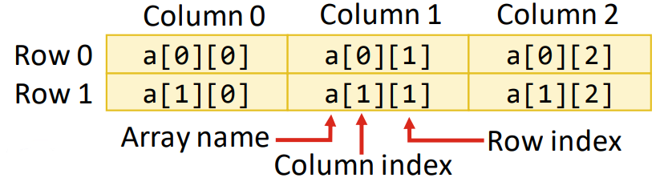

## Session 4: Arrays and array lists 数组和数组列表  
### 什么是数组？  
- 数组是一组变量（称为元素或组件），包含的值都具有相同的类型  
- 数组是对象 *（引用类型）*，而数组的元素可以是*原始类型*或*引用类型*（包括数组）  
    - 记住：boolean、byte、char、short、int、long、float 和
     double 是基本类型；所有其他类型都是引用类型  
- 数组创建后*长度不变*  

### 声明和创建数组  
- 数组对象  
    - 数组创建表达式中可以指定元素类型和元素个数，该表达式会返回一个可存储在数组变量中的引用  
- 由 12 个 int 元素组成的数组的声明和数组创建表达式  
  ```java
  int[] c = new int[12];
  ```
- 也可以拆分为两步来完成  
  ```java
  int[] c;          // declare the array variable
  c = new int[12];  // create the array
  ```

### 多维数组  
- Java 不直接支持多维数组  
    - 为了达到同样的效果，我们可以指定元素也是一维数组的一维数组，等等  
- 二维数组通常用于表示按行和列排列数据的数值表  
    - 有 m 行 n 列的数组称为 m-by-n 数组  
- 每个表元素都有两个索引  
    - 按照惯例，第一个索引是行，第二个索引是列  
      
- 多维数组的维度可以***大于***两个！  

### 数组例  
#### 一维数组，将数组元素初始化为默认值 0  
```java
public class InitArray1 {
    public static void main(String[] args) {
        // declare variable array and initialize it with an array object
        int[] array = new int[10]; // create the array object

        System.out.printf("%s%s%n", "Index", "Value"); // column headings

        // output each array element's value
        for (int counter = 0; counter < array.length; counter++) {
            System.out.printf("%5d%8d%n", counter, array[counter]);
        }
    }
}
```
#### 一维数组，用数组初始化器初始化数组元素  
```java
public class InitArray2 {
    public static void main(String[] args) {
        // initializer list specifies the initial value for each element
        int[] array = {32, 27, 64, 18, 95, 14, 90, 70, 60, 37};

        System.out.printf("%s%s\n", "Index", "Value"); // column headings

        // output each array element's value
        for (int counter = 0; counter < array.length; counter++) {
            System.out.printf("%5d%8d%n", counter, array[counter]);
        }
    }
}
```
#### 一维数组，对数组各元素求和  
```java
public class SumArray{
    public static void main(String[] args) {
        int[] array = {87, 68, 94, 100, 83, 78, 85, 91, 76, 87};
        int total = 0;

        // add each element's value to total
        for (int counter = 0; counter < array.length; counter++) {
            total += array[counter];
        }

        System.out.printf("Total of array elements: %d%n", total);
    }
}
```
#### 一维数组，维数组，向方法传递数组和单个数组元素  
```java
public class PassArray {
    // main creates array and calls modifyArray and modifyElement
    public static void main(String[] args) {
        int[] array = {1, 2, 3, 4, 5};

        System.out.printf(
            "Effects of passing reference to entire array:%n" +
            "The values of the original array are:%n"
        );

        // output original array elements
        for (int value : array) {
            System.out.printf(" %d", value);
        }

        modifyArray(array); // pass array reference
        System.out.printf("%n%nThe values of the modified array are:%n");

        // output modified array elements
        for (int value : array) {
            System.out.printf(" %d", value);
        }

        System.out.printf(
            "%n%nEffects of passing array element value:%n"+
            "array[3] before modifyElement %d%n", array[3]
        );
        
        modifyElement(array[3]); // attempt to modify array[3]
        System.out.printf(
            "array[3] after modifyElement: %d%n", array[3]
        );
    }

    // multiply each element of an array by 2
    public static void modifyArray(int[] array2) {
        for (int counter = 0; counter < array.length; counter++) {
            array2[counter] *= 2;
        }
    }

    // multiply argument by 2
    public static void modifyElement(int element) {
        element *= 2;
        System.out.printf(
            "Value of element in modifyElement: %d%n", element
        );
    }
}
```
输出：  
```shell
Effects of passing reference to entire array:
The values of the original array are:
1 2 3 4 5
The values of the modified array are:
2 4 6 8 10
Effects of passing array element value:
array[3] before modifyElement: 8
Value of element in modifyElement: 16
array[3] after modifyElement: 8
```
#### 初始化二维数组  
```java
public class InitArray {
    // create and output two-dimensional arrays
    public static void main (String[] args) {
        int[][] array1 = {{1, 2, 3}, {4, 5, 6}};
        int[][] array2 = {{1, 2}, {3}, {4, 5, 6}};

        System.out.println("Values in array 1 by row are");
        outputArray(array1); // displays array1 by row

        System.out.println("%nValues in array2 by row are%n");
        outputArray(array2); // displays array2 by row
    }

    // output rows and columns of a two-dimensional array
    public static void outputArray(int[][] array) {
        // loop through array's row
        for (int row = 0; row < array.length; row++) {
            // loop through columns of current row
            for (int column = 0; column < array[row].length; column++) {
                System.out.printf("%d ", array[row][column]);
            }

            System.out.printf("%d ", array[row][column]);
        }

        System.out.println();
    }
}
```
输出：  
```shell
Values in array1 by row are
1 2 3
4 5 6
Values in array2 by row are
1 2
3
4 5 6
```

### ArrayList 类  
- 数组在执行时不会改变大小以容纳更多元素  
    - 如果需要在执行过程中增加数组大小，则需要重新声明和初始化数组  
- 对于具有动态大小的数组，可以使用 java.util 包中的 `ArrayList<T>` 类  
    - 请注意，T 是存储在 ArrayList 对象中的元素类型的占位符。具有这种占位符、可用于任何类型的类称为*泛型类*（generic classes）；我们将在本课程的后面部分详细讨论泛型类  
#### ArrayList 方法  
| 方法 | 描述 |
| --- | --- |
| `add` | 在 ArrayList 的末尾或特定索引处添加一个元素 |
| `clear` | 删除 ArrayList 中的所有元素 |
| `contains` | 如果 ArrayList 包含指定元素，则返回 true，否则返回 false |
| `get` | 返回指定索引处的元素 |
| `indexOf` | 返回指定元素在 ArrayList 中首次出现的索引 |
| `remove` | 删除指定值的首次出现或指定索引处的元素 |
| `size` | 返回 ArrayList 中存储的元素个数 |
| `trimToSize` | 将 ArrayList 的容量缩减为当前大小 |
#### 通用 `ArrayList<E>` 使用例  
```java
import java.util.ArrayList;

public class ArrayListCollection {
    public static void main(String[] args) {
        // create a new ArrayList of String with an initial capacity of 10
        ArrayList<String> items = new ArrayList<String>();

        items.add("red"); // append an item to the list
        items.add(0, "yellow"); // insert "yellow" at index 0

        // header
        System.out.print(
            "Display list contents with counter-controlled loop:"
        );
        // display the colors in the list
        for (int i = 0; i < items.size(); i++) {
            System.out.printf(" %s", items.get(i));
        }

        // display colors using enhanced for in the display method
        System(items,
            "\nDisplay list contents with enhanced for statement:"
        );

        items.add("green"); // add "green" to the end of the list
        items.add("yellow"); // add "yellow" to the end of the list
        display(items, "List with two new elements:");

        items.remove("yellow"); // remove the first "yellow"
        display(items, "Remove first instance of yellow:");

        items.remove(1); // remove item at index 1
        display(items, "Remove second list element (green):");

        // check if a value is in the list
        System.out.printf("\"red\" is %sin the list\n",
            items.contains("red") ? "": "not"
        );

        // display number of elements in the list
        System.out.printf("Size: %s%n", items.size());
    }

    // display the ArrayList's elements on the console
    public static void display(ArrayList<String> items, String header) {
        System.out.printf(header); // display header

        // display each element in items
        for (String item : items) {
            System.out.printf(" %s", item);
        }
        System.out.println();
    }
}
```
输出：
```shell
Display list contents with counter-controlled loop: yellow red
Display list contents with enhanced for statement: yellow red
List with two new elements: yellow red green yellow
Remove first instance of yellow: red green yellow
Remove second list element (green): red yeallow
"red" is in the list
Size: 2
```