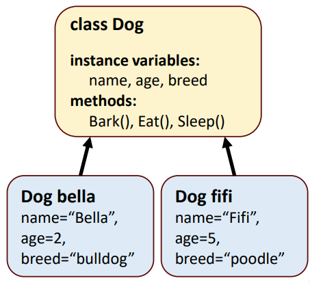

# Day 3: Basics of object oriented programming 面向对象编程基础  
- 今天，我们将介绍 Java 面向对象编程（OOP）的基础知识  
    - 类和对象的基本概念  
    - 实例变量、设置和获取方法  
    - 范围和访问修饰符  
    - 枚举类型  
    - 继承、组合和多态性  
- 目标  
    - 能解释类和对象的基本概念  
    - 能在 Java 程序中声明类和实例化对象  
    - 能为类选择适当的访问修饰符  
    - 能在 Java 程序中使用继承和组合  

## Session 1: Objects and classes 对象和类  
### 对象和类的概念  
- *类（Class）* 是一种数据结构，代表一类具有某些共同特征的对象  
    - 类可以包含定义其状态的实例变量以及实现其行为的方法  
- *对象（Object）* 是一个类的实例  
    - 例如，类“人”代表人，对象“约翰”是类“人”的一个实例，代表一个具体的人  
-   

### Java 中的对象和类  
- 在 Java 中，您可以根据需要声明新的类，这也是 Java 被称为_可扩展_（extensible）语言的原因之一  
- 创建的每个类都会成为一个新类型，可用于声明变量和创建对象  
    - 按照惯例，类名、方法名和变量名都是标识符，都使用驼峰字母命名法  
    - 此外，按照惯例，类名以大写字母开头，方法名和变量名以小写字母开头  
    - 请注意，Java 语法并*不*强制使用这些约定，但强烈建议遵循这些约定  

### Instance variables 实例变量  
- 对象的属性以实例变量的形式实现，并在其整个生命周期中随身携带  
- 该类的每个对象（实例）都有该类每个实例变量的副本  
- 实例变量在类声明中声明，但在类的方法声明体之外  
- 一个类通常包含一个或多个方法，用于操作属于该类特定对象的实例变量  

### Getter 和设置 Setter 方法  
- 按照惯例，我们使用 _set_ 和 _get_ 方法来存储/获取对象中的实例变量值（即属性）  
    - 如果变量被定义为私有（private），则无法直接访问  
    - 如果变量被定义为公有（public），则可以直接访问，但即使如此，最好还是使用 set 和 get 方法来修改变量  
- _Set_ 方法通常被称为*突变方法（mutator methods）*  
- _Get_ 方法通常称为*访问方法（accessor methods）*或*查询方法（query methods）*  
#### Get 和 Set 例  
- Account.java
  ```java
  public class Account {
      private String name; // instance variable

      // method to set the name
      public void setName(String name) {
          this.name = name;
      }
      // Setter 接收一个参数，返回为空（void）

      // method to retrieve the name
      public String getName() {
          return name; // return name value
      }
      // Getter 不接收参数，返回字符串（String）
  }
  ```
- AccountTest.java
  ```java
  import java.util.Scanner;
  public class AccountTest {
      public static void main(String[] args) {
          // create a Scanner object for input
          Scanner input = new Scanner(System.in);

          // create an Account object myAccount
          Account myAccount = new Account();

          // display initial value of name (null)
          System.out.printf("Initial name is: %s%n%n", myAccount.getName());

          //prompt for and read name
          System.out.println("Please enter the name:");
          String theName = input.nextLine();
          myAccount.setName(theName);
          System.out.println(); // output a blank line

          // display the name stored in object myAccount
          System.out.printf("Name in myAccount is: %n%s%n", myAccount.getName());
      }
  }
- 输出：  
  ```shell
  Initial name is: null

  Please enter the name:
  Jane Green

  Name in object myAccount is:
  Jane Green
  ```

### 访问修饰符（公有和私有）  
- 大多数实例变量声明前面都有关键字 `private`，这是一个访问修饰符  
- 使用访问修饰符 `private` 声明的变量或方法只能被声明它们的类中的方法访问  
- 使用访问修饰符 `private` 声明实例变量被称为*信息隐藏（information hiding）*
    - 当程序创建（或 instantiates 实例化）Account 类对象时，变量名被封装（encapsulated，或 hidden 隐藏）在对象中，只能通过对象类的方法访问  

### 方法的局部变量  
- 方法的参数是方法的*局部变量（local variable）*  
    - 在特定方法正文中声明的局部变量*只*能在该方法中使用  
    - 方法终止时，其局部变量的值将丢失  
    - 本地变量不会自动初始化  
- 如果方法包含同名的局部变量和实例变量，方法的主体将引用局部变量，而不是实例变量  
    - 局部变量会对方法主体中的实例变量产生*影响*  
    - 关键字 `this` 可用于明确引用阴影实例变量  
      ```java
      this.name = name;
      ```

### 关于关键字 _this_ 的更多信息  
- 每个对象都可以使用关键字 `this`（有时也称为 this 引用）访问自身的引用  
- 当调用某个对象的实例方法时，该方法的主体会隐式地使用关键字 `this` 来引用该对象的实例变量和其他方法  
    - 因此，类的代码知道应该操作哪个对象  
- 每个类的每个方法只有一个副本；同一类的每个对象共享该方法的代码  
- 另一方面，每个对象都有自己的类实例变量副本，非静态方法会隐式地使用该副本来确定要操作的特定对象  

### 实例化对象  
- 使用关键字 `new` 创建类实例（对象）  
- 构造函数类似于方法，但它是由 `new` 操作符隐式调用的，用于在创建对象时初始化对象的实例变量  
    - 如果一个类没有定义构造函数，编译器会提供一个不带参数的默认构造函数，该类的实例变量会被初始化为默认值  
    - 如果不指定初始值，每个实例变量都有一个默认初始值（Java 提供的值）  
    - 字符串类型实例变量的默认值为 null  

### 构造函数  
#### 构造函数示例  
- 在前面的示例中，实例变量 name 是通过构造函数（constructor）设置的，因此我们不需要在创建对象后调用 setName
    - Account.java（部分）
      ```java
      public Account(String name) {
          ...
      }
    - AccountTest.java
      ```java
      ...
      Account myAccount = new Account(theName);
      ...
      ```
    - 构造函数是一种与类同名的方法。当使用关键字 new 来实例化一个对象时，它就会被调用  
#### 构造函数重载示例
- 重载构造函数（overloaded constructors）允许以不同方式初始化对象——只有构造函数的参数不同  
    - Account.java  
      ```java
      public class Account {
          private String name; // instance variable
          // constructor with full name as input
          public Account(String name) { 
              this.name = name; 
          } 
          // constructor with first and last name
          // as input
          public Account(String first, String last) { 
              this.name = first + " " + name; 
          } 
      }
      ```
    - AccountTest.java
      ```java
      ...
      Account lisasAccount = new Account("Lisa Brown");
      Account bobsAccount = new Account("Bob", "Blue");
      ...
      ```
    - 创建 lisasAccount 时会调用带一个参数的构造函数，创建 bobsAccount 时会调用带两个参数的构造函数  

### UML 类图  
- UML 类图常用于说明类  
  