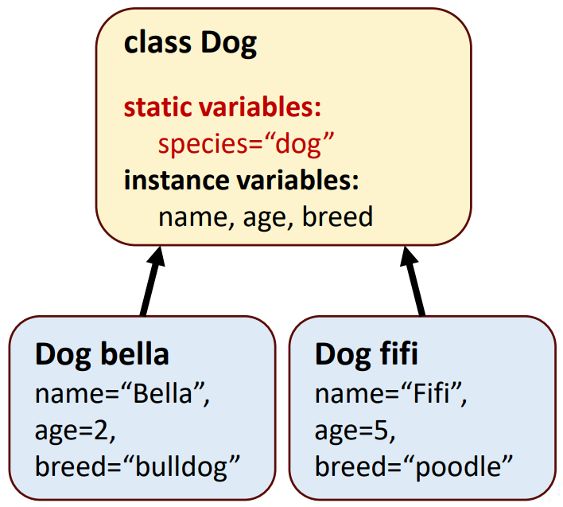

## Session 2: Enum types, static, and final 枚举类型、关键字 static 和 final  

### 什么是枚举类型？  
- 与类一样，所有枚举类型（enum types）都是引用类型  
- 基本枚举类型定义了一组以唯一标识符表示的常量  
- 编译器会为每个枚举生成静态方法 `values()`，该方法会返回一个枚举常量数组  
- 枚举常量可以在任何可以使用常量的地方使用，例如开关语句的大小写标签，以及控制增强语句  

### 枚举声明  
- 枚举类型通过*枚举声明*进行声明，枚举声明是一个*以逗号分隔*的枚举*常量*列表  
- 声明可选择包含传统类的其他组成部分，例如构造函数、字段和方法  
    - 枚举构造函数可以指定任意数量的参数，并且可以重载  
- 每个枚举声明都声明了一个枚举类，其限制如下  
    - 枚举常量是隐式最终和静态的（implicitly final and static）  
    - 任何使用操作符 new 创建枚举类型对象的尝试都会导致编译错误  
#### 枚举声明例  
```java
// Book.java
public enum Book {
    // declare constants of enum type
    JHTP("Java How to Program", "2018"),
    CHTP("C How to Program", "2016"),
    IW3HTP("Internet & World Wide Web How to Program", "2012"),
    CPPHTP("C++ How to Program", "2017")
    VBHTP("Visual Basic How to Program", "2014"),
    CSHARPHTP("Visual C# How to Program", "2017");

    // instance fields
    private final String title;
    private final String copyrigntYear;

    // enum constructor
    Book(String title, String copyrightYear) {
        this.title = title;
        this.copyrightYear = copyrightYear;
    }

    // accessor for field title
    public String getTitle() {
        return title;
    }

    public String getCopyrightYear() {
        return copyrightYear;
    }
}
```

### 枚举方法  
- 增强的 `for` 语句可用于 EnumSet，就像用于数组一样  
- 类 EnumSet（在 java.util 包中声明）的方法 `range()` 可用于访问枚举常量的范围  
    - 方法 range 需要两个参数：范围内的第一个和最后一个枚举常量  
    - 返回一个 EnumSet，其中包含这两个常量之间的所有常量（包括这两个常量）  
- 类 EnumSet 还提供了其他几个静态方法  
#### 枚举方法使用例  
```java
// EnumTest.java
import java.util.EnumSet;

public class EnumTest {
    public static void main(String[] args) {
        System.out.println("All books:");
        // print all books in enum Book
        for (Book book : Book.values()) {
            System.out.printf("%-10s%-45s%s%n",
                book, book.getTitle(), book.getcopyrightYear());
        }

        System.out.printf("%nDisplay a range of enum constants:%n");
        // print first four books
        foe (Book book : EnumSet.range(Book.JHTP, Book.CPPHTP)) {
            System.out.printf("%-10s%-45s%s%n",
                book, book.getTitle(), book.getCopyrightYear());
        }
    }
}
```
输出：  
```shell
All books:
JHTP      Java How to Program                         2018
CHTP      C How to Program                            2016
IW3HTP    Internet & World Wide Web How to Program    2012
CPPHTP    C++ How to Program                          2017
VBHTP     Visual Basic How to Program                 2014
CSHARPHTP Visual Basic How to Program                 2017

Display a range of enum constants:
JHTP      Java How to Program                         2018
CHTP      C How to Program                            2016
IW3HTP    Internet & World Wide Web How to Program    2012
CPPHTP    C++ How to Program                          2017
```

### 静态类（static class）成员  
- 静态字段（staitc field，称为 class variable 类变量）用于一个类的所有对象只共享一个特定变量副本的情况  
- 静态变量具有类作用域（class scope），它代表*整个类*的信息：该类的所有对象共享*同一段*数据，它也可以在该类的所有方法中使用  
- 静态变量的声明以关键字 `static` 开始  
- 例子：  
  
#### 静态类成员的特性  
- 静态类成员在类执行时加载到内存中后立即可用  
    - 声明为私有静态（`pravite static`）的类成员只能通过类的方法被客户端代码访问  
    - 声明为公共静态（`public static`）的类成员可以通过对该类任何对象的引用来访问，也可以用类名和点（`.`）来限定成员名，如 `Math.random()`  
- 当类中不存在对象时：  
    - 要访问公共静态（`public static`）成员，请在类名前加上点（.），如 `Math.PI`  
    - 要访问私有静态（`pravite static`）成员，请提供一个公共静态方法，并在调用该方法时在其名称前加上类名和一个点  
- 由于静态方法即使在没有实例化类对象的情况下也能被调用，因此静态方法不能访问类的实例变量和实例方法  
    - `this` 引用不能在静态方法中使用：`this` 引用必须指向一个特定的类对象，但当调用静态方法时，内存中可能没有该类的任何对象  
- 如果静态变量未被初始化，编译器会给它分配一个默认值（例如，`int` 类型的默认值为 0）  
#### 静态类成员例  
```java
// Employee.java
public class Employee {
    private static int count = 0;
    // 计数器变量 count 是 Employee 类所有实例共享的静态变量
    private String firstName;
    private String lastName;

    // Constructor
    public Employee (String firstName, String lastName) {
        this.firstName = firstName;
        this.lastName = lastName;
        ++count; // increment static count
        System.out.printf("Name: %s %s; count = %d%n", 
            firstName, lastName, count);
    }

    public String getFirstName() {
        return firstName;
    }

    public String getLastName() {
        return lastName;
    }

    public static int getCount() {
        return count;
    }
}
```
```java
// EmployeeTest.java
public class EmployeeTest {
    public static void main(String[] args) {
        System.out.printf("Employee before: %d\n", Employee.getcount());

        // create two Employees; count should be 2
        Employee e1 = new Employee("Susan", "Baker");
        Employee e2 = new Employee("Bob", "Blue");

        // show that count is now 2
        System.out.printf("\nEmployees after:\n");
        System.out.printf("via e1.getCount(): %d\n", e1.getCount());
        System.out.printf("via e2.getCount(): %d\n", e2.getCount());
        System.out.printf("via Employee.getCount(): %d\n", Employee.getCount());

        // get names of Employees
        System.out.printf("\nEmployee 1: %s %s",
            e1.getFirstName(), e1.getLastName());
        System.out.printf("\nEmployee 2: %s %s%n",
            e2.getFirstName(), e2.getLastName());
    }
}
```
输出：  
```shell
Employees before: 0
Name: Susan Baker; count = 1
Name: Bob Blue; count = 2
Employees after:
via e1.getCount(): 2
via e2.getCount(): 2
via Employee.getCount(): 2
Employee 1: Susan Baker
Employee 2: Bob Blue
```

### Static import 静态导入  
- 静态导入声明可以导入类或接口的静态成员，这样你就可以通过类中未限定的名称来访问它们  
- 静态导入的两种形式：  
    - 导入一个特定静态成员（称为单个静态导入）  
    - 导入一个类的所有静态成员（称为按需静态导入）  
#### 静态导入语法  
- 以下语法导入了一个特定的静态成员：  
  ```java
  import static packageName.ClassName.staticMemberName;
  ```
    - 其中，packageName 是类的包，ClassName 是类的名称，staticMemberName 是静态字段或方法的名称  
- 以下语法导入了类的所有静态成员：  
  ```java
  import static packageName.ClassName.*;
  ```
    - 通配符 `*` 表示应导入指定类的所有静态成员  
- 请注意，静态导入声明只导入静态类成员：应使用常规导入声明来指定程序中使用的类  
#### 静态导入例  
```java
// Static import of Math class methods.
import static java.lang.Math.*;

public class StaticImportTest {
    public static void main(String[] args) {
        System.out.printf("sqrt(900.0) = %.1f\n", sqrt(900.0));
        System.out.printf("ceil(-9.8) = %.1f\n", ceil(-9.8);); // 向上取整，返回 double 类型
        System.out.printf("E = %f\n", E);
        System.out.printf("PI = %f\n", PI);
    }
}
```
输出：  
```shell
sqrt(900.0) = 30.0
ceil(-9.8) = -9.0
E = 2.718282
PI = 3.141593
```

### Final instance variables 最终实例变量  
- 关键字 `final` 表示变量不可修改（即它是一个常量），任何修改它的尝试都会导致错误  
    - 最终变量在初始化后不能通过赋值修改  
    - 例如，要声明一个 int 类型的最终（常量）实例变量 INCREMENT：  
      ```java
      private final int INCREMENT;
      ```
    - 如果在类的不同构造函数中用不同的值初始化了最终变量，那么类的不同对象可能会有不同的最终变量值  
#### 为什么要使用最终变量？  
- *最小特权原则*是良好软件工程的基础  
    - 只应授予代码完成其指定任务所需的权限和访问量，不得超出这一范围  
    - 这一原则可防止代码意外（或恶意）修改变量值和调用不应访问的方法，从而使程序更加稳健（robust）  