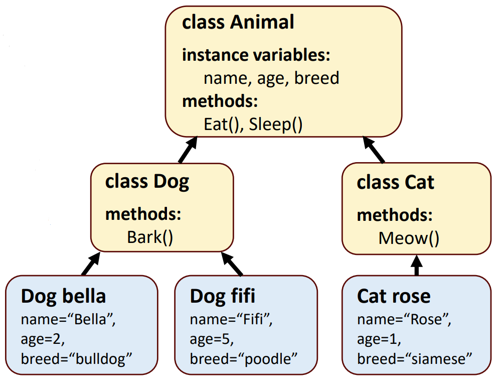
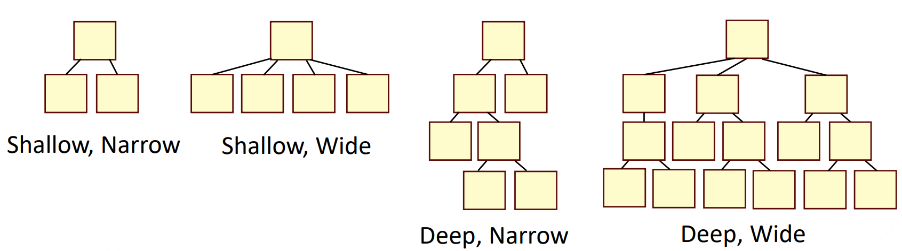

## Session 3: Class inheritance and access modifiers 类继承和访问修饰符  

### Class inheritance 类继承  
- 通过类继承，我们可以声明从更高级类继承共同结构的类  
    - 继承类的对象可以使用其继承类的成员变量和方法  
    -   
#### 类继承的优点  
- DRI: don't repeat yourself 不要重复  
    - 通过继承，我们可以将共同的结构和信息传递给类似的对象  
- 类继承允许“重复使用”对象的某些部分  
    - 我们可以将共同属性提取出来，并将其上移到更高层次的对象中，然后在较低层次上对其进行区分  
    - 减少重复，简化代码维护和可重用性  
#### Superclasses and subclasses 超类和子类  
- 继承自另一个类的类是子类（child）  
    - Java 不直接支持多重继承：只能从一个类继承  
- 被继承的类是超类（parent）  
    - 扩展共同超类的所有类的对象都可被视为该超类的对象/成员  
- 使用 `extends` 关键字从一个类继承，如：
  ```java
  class Dog extends Animal {...}
  ```
#### 类继承例  
```java
// Vehicle.java
class Vehicle {
    protected String brand = "Ford";
    public void honk() {
        System.out.println("Tuut tuut!");
    }
}
```
```java
// Car.java
class Car extends Vehicle {
    private String modelName = "Mustang";
    public static void main(String[] args) {
        Car myCar = new Car();
        myCar.honk();
        System.out.println(myCar.brand + " " + myCar.model)
    }
}
```
输出：  
```shell
$ javac Car.java
$ java Car
Tuut tuut!
Ford Mustang
$
```

### Inheritance hierarchies 继承等级  
- 可通过继承构建不同的类层次结构  
    - 深层次的层次结构非常复杂，而且往往会随着时间的推移而变得越来越宽，从而使其更难维护和使用  
    - 为简单起见，更推荐使用浅层次结构  
  

### 使用子类的构造函数  
- 子类构造函数的首要任务是显式或隐式调用直接超类的构造函数  
    - 确保从超类继承的实例变量被正确初始化  
- 如果代码中没有明确调用超类的构造函数，Java 会隐式调用超类的默认或无参数构造函数  
#### 构造函数例  
```java
// TestCar.java
class Vehicle() {
    public Vehicle() {
        System.out.println("this is the Vehicle constructor");
    }
}

class Car extends Vehicle {
    public Car() {
        System.out.println("this is the Car constructor");
    }
}

public class TestCar {
    public static void main(String[] arg) {
        Car ford = new Car();
    }
}
```
输出：  
```shell
$ javac TestCar.java
$ java TestCar
this is Vehicle constructor
this is Car constructor
$
```

### 重新定义（覆写）方法  
- 即使超类方法适合子类，子类也经常需要定制版本的方法  
- 子类可以覆盖（即重新定义）超类方法，并采用适当的实现方式  
    - 在 Java 中，可以使用可选的 `@Override` 注解来告诉编译器该方法应该覆盖另一个方法；这有助于在编译时发现错误  
- 如果某个方法使用了关键字 `final`，则该方法不能被重写；如果试图重写 final 方法，则会出现编译错误  
#### 覆写例  
```java
// TestEngines.java
class Vehicle {
    void engine() {
        System.out.println("this is vehicle engine");
    }
}

class Car extends Vehicle {
    void engine() {
        System.out.println("this is car engine");
    }
}

class MotorBike extends Vehicle {
    void engine() {
        System.out.println("this is motorbike engine");
    }
}

public class TestEngines {
    public static void main(String[] arg) {
        MotorBike honda = new MotorBike ();
        honda.engine();
        Car ford = new Car ();
        ford.engine();
    }
}
```
输出：  
```shell
$ javac TestEngines.java
$ java TestEngines
this is motorbike engine
this is car engine
$
```
#### 使用 `@override` 的覆写例  
```java
// TestEngines.java
...

class Car extends Vehicle {
    @override
    void engne() { // @Override 注解揭示了方法名称中的一个拼写错误
        System.out.println("this is car engine");
    }
}

...
```
输出：  
```shell
$ javac TestEngines.java
error: method does not override or implement a method from a supertype
  @Override
  ^
1 error
$
```
#### 使用`final` 的覆写例  
```java
// TestEngines.java
class Vehicle {
    final void engine() { // 不能覆盖定义为 final 的方法
        System.out.println("this is vehicle engine");
    }
}

class Car extends Vehicle {
    @override
    void engine() {
        System.out.println("this is car engine");
    }
}

...
```
输出：  
```shell
$ javac TestEngines.java
error: engine() in Car cannot override engine() in Vehicle
  void engine() {
       ^
  overridden method is final
1 error
$
```

### 方法继承  
- 在 Java 中，每个类都是 Object 类的子类，即使没有明确定义 `extends Object`  
- 有些方法，如 toString，是从 Object 继承而来，因此每个类都定义了这些方法  
    - 在必须将对象转换为字符串表示时隐式调用  
    - 默认的 toString 方法返回一个字符串，其中包含对象的类名  
    - 可以通过覆盖 toString 来指定更合适的字符串表示法  
    - 覆写 `toString()` 方法例  
      ```java
      class Vehicle {
      }
      
      class Car extends Vehicle {
          @override
          public String toString() {
              return "Hello, this is car!";
          }
      }

      class MotorBike extends Vehicle {
      }

      public class TestEngines {
          public static void main(String[] arg) {
              MotorBike honda = new MotorBike ();
              Car ford = new Car();
              System.out.println(honda.toString());
              System.out.println(ford.toString())
          }
      }
      ```
      输出：  
      ```shell
      $ javac TestEngines.java
      // 默认 toString() 输出：
      MotorBike@5acf9800
      // 覆写 toString() 输出：
      Hello, this is car! 
      $
      ```

### Access modifiers 访问修饰符  
- 只要程序引用了一个类或其子类的对象，就可以访问该类的公共成员  
- 类的私有成员只能在类内部访问  
- 为了让子类能够直接访问超类的实例变量，我们可以在超类中将这些成员声明为受保护（protected）成员  
    - 受保护的访问是介于公共访问和私有访问之间的访问级别  
    - 所有公共和受保护的超类成员在成为子类成员后，仍保留原有的访问修饰符  
#### 访问修饰符 `protected`  
- 超类的受保护成员可以被该超类、其子类和同一包中的其他类的成员访问（受保护成员也有包访问权限）  
    - 只需使用成员名称，子类方法就可以引用从超类继承的公共成员和受保护成员  
- 超类的私有成员对子类是隐藏的  
    - 只能通过从超类继承的公共或受保护方法访问它们  
    - 在许多情况下，最好使用私有实例变量，以鼓励适当的软件工程  
#### 受保护变量的缺点  
- 使用受保护的实例变量时，如果超类的实现发生变化，我们可能需要修改超类的所有子类  
    - 这样的类被称为脆弱类（fragile / brittle），因为超类中的一个微小变化就会 "破坏 "子类的实现  
    - 你应该能够更改超类的实现，同时仍能为子类提供相同的服务  
- 一个类的受保护成员对与包含受保护成员的类在同一包中的所有类都是可见的——这并不总是可取的（最小权限原则）  

### 访问修饰符小结  
| Assess to 访问 | default 默认 | private 私有 | protected 受保护 | public 公共 |
| --- | :---: | :---: | :---: | :---: |
| Same class 相同类 | ✔️ | ✔️ | ✔️ | ✔️ |
| Same package subclass 相同包的子类 | ✔️ | ❌ | ✔️ | ✔️ |
| Same package non-subclass 相同包的非子类 | ✔️ | ❌ | ✔️ | ✔️ |
| Different package subclass 不同包的子类 | ❌ | ❌ | ✔️ | ✔️ |
| Different package non-subclass 不同包的非子类 | ❌ | ❌ | ❌ | ✔️ |
- 访问修饰符允许封装（encapsulation，从其他类中隐藏数据），这是 OOP 的基本概念之一  

### 调用超类构造函数  
- 每个子类的构造函数都必须隐式或显式地调用一个超类的构造函数，以初始化从超类继承的实例变量  
    - 调用超类构造函数的语法：`super(arguments)`  
    - 必须是构造函数主体中的第一条语句  
    - 这让你可以指定如何实例化对象  
- 如果子类构造函数没有明确调用超类的构造函数，编译器会尝试插入对超类默认或无参数构造函数的调用  
    - 也可以显式地使用 `super()` 调用超类的无参数或默认构造函数，但通常不会这样做  
#### 超类构造函数例  
```java
class Vehicle {
    private String type;

    public Vehicle() {
        this.type = "undifined";
    }

    public Vehicle(String type) {
        this.type = type;
    }
}

class Car extends Vehicle {
    private Engine engine;
    public Car() {
        super("car"); // 带参数调用超类的构造函数。请注意，变量类型是私有的，因此不能在超类 Vehicle 之外直接访问
    }
}

public class TestEngines {
    public static void main(String[] arg) {
        Car ford = new Car();
        System.out.print("Type: ");
        ford.printType();
    }
}
```
输出：  
```java
$ javac TestEngines.java
Type: car 
$
```

### 访问超类方法  
- 当子类方法覆盖了一个继承的超类方法时，只要在超类方法名称前加上关键字 `super` 和点（.）分隔符，就可以从子类访问该方法的超类版本  
  ```java
  class Vehicle {
      public void engine() {
          System.out.println("this is vehicle engine");
      }
  }

  class Car extends Vehicle {
      public void engine() {
          super.engine()
          System.out.println("this is car engine");
      }
  }

  public class TestEngines {
      public static void main(String[] args) {
          Car ford = new Car();
          ford.engine();
      }
  }
  ```