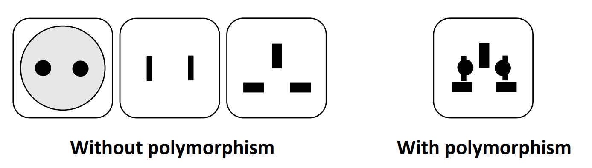
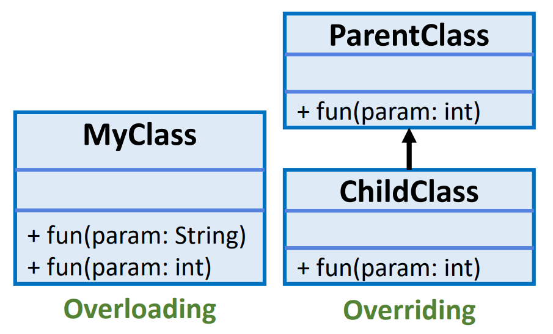

## Session 4: Composition and polymorphism 组成和多态性  

### 类关系  
- 继承关系基本上是 ***“是”（is-a）*** 关系  
    - 汽车（子类）*是*交通工具（超类）  
    - 狗（子类）*是*哺乳动物（超类）  
- 但是，有些类的关系是 ***“有”（has-a）*** 关系  
    - 例：  
        - 汽车有发动机  
        - 狗有尾巴  
        - 人有名字  
    - Has-a 关系应通过现有类的*组合*而不是继承来创建  

### Composition 组成  
- 一个类的成员可以引用其他类的对象  
    - 这就是所谓的构成，有时也称为 has-a 关系  
- 通过组合，我们可以创建依赖性更少的对象，从而降低复杂性  
    - 示例：AlarmClock 对象需要知道当前时间和应该发出报警声的时间，因此在 AlarmClock 对象中包含两个对时间对象的引用是合理的  
#### 组合例  
**Car *has an* engine.**
```java
// Car.java
public class Car {
    private Engine engine;

    public Car() {
        this.engine = new Engine();
    }

    public void startCar() {
        engine.makeNoise();
    }
}
```
```java
// Engine.java
public class Engine {
    public void makeNoise() {
        System.out.println("Wrroom!");
    }
}
```

### 组合还是继承？  
- 软件工程界对组合和继承的相对优点进行了大量讨论  
    - 每种方法都有自己的用武之地，但继承往往被过度使用，在许多情况下，组合更为合适  
- 组合和继承往往是最好的方法  
    - 最好想一想，is-a 还是 has-a 关系更自然地代表你的情况  

### 组合 vs. 继承  
| Composition 组成 | Inheritance 继承 |
| --- | --- |
| 组合和聚合形成“has-a”关系，总和大于部分 | 当信息授权在层级内自由进行时的继承 |
| 对象是独立的，因此开发成本较高：可重复使用的内置依赖性较少 | 更易于开发，但依赖性更强：改变超类中的某些内容，很容易就会影响到所有子类，从而造成破坏 |

### Nested classes 嵌套类  
- Java 允许在类内声明类（嵌套类）  
    - 要实例化嵌套（内部）类，首先需要实例化外层（外部）类  
    - 非静态内部类可以访问外部类的其他成员，即使已声明为 `private`  
- 嵌套类可视为一种 "组合"，因为外层类 "拥有 "内层类  
    - 但是，组合的一些优点也会丧失，例如多态行为和可重用性：只有在绝对确定其他地方不需要嵌套类时，才使用嵌套类！  
#### 嵌套类例  
```java
public class Car {
    // 嵌套类在这里被定义
    private class Engine {
        public void makeNoise() {
            System.out.println("Wrroom!");
        }
    }

    private Engine engine;
    
    public Car() {
        this.engine = new Engine();
    }

    public void startCar() {
        engine.makeNoise();
    }

    public static void main(String[] args) {
        Car car = new Car();
        car.startCar();
    }
}
```
输出：  
```shell
$ java Car
Wrroom!
$
```

### Anonymous classes 匿名类  
- 在 Java 中，您可以声明匿名类  
    - 匿名类与本地类类似，只是它们没有名称  
    - 当只需要在一个地方使用本地类时，可以使用它们  
- 匿名类在实例化时在初始化语句中定义  
    - 使用以下语法声明匿名类：  
      ```java
      SuperClass myClass = new SuperClass() {
          // override methods here as needed
      };
      ```
#### 匿名类例  
```java
// Car.java
class Engine {
    public void makeNoise() {
        System.out.println("Put put put!");
    }
}

public class Car {
    private Engine engine;

    // Engine 的匿名子类在这里被定义
    public Car() {
        this.engine = new Engine() {
            public void makeNoise() {
                System.out.println("Wrroom!");
            }
        };
    }

    public void startCar() {
        engine.makeNoise();
    }

    public static void main(String[] args) {
        Car car = new Car();
        car.startCar();
    }
}
```
输出：  
```
$ java Car
Wrrooom!
$
```

### Polymorphism 多态性  
- *多态性*允许你定义一个接口并有多个实现  
    - “poly”意为“许多”，“morphs”意为“形式”：多态性意为“许多形式”  
-   

### 方法重载和覆盖  
- 在 Java 中，多态性主要分为两种：  
    - 编译时多态性（compile-time polymorphis，通过***方法重载***实现静态多态性）  
    - 运行时多态性（runtime polymorphism，通过***方法重载***实现动态方法调度）  
-   
#### 重载例  
- 我们已经讨论过构造函数的重载，但其他方法也可以重载  
  ```java
  class Helper {
      static int Multiply(int a, int b) {return a * b;}
      static double Multiply(double a, double b) {return a * b;}

      public static void main(String[] args) {
          System.out.println(Helper.Multiply(2, 4));
          System.out.println(Helper.Multiply(4.2, 3.8));
      }
  }
  ```
  输出：  
  ```shell
  $ java Helper
  8
  15.540000000000001
  ```
- 不同版本的方法在参数类型或参数数量上可能有所不同  
  ```java
  class Helper {
      static int Multiply(int a, int b) {return a * b;}
      static double Multiply(int a, int b, int c) {return a * b * c;}

      public static void main(String[] args) {
          System.out.println(Helper.Multiply(2, 4));
          System.out.println(Helper.Multiply(2, 4, 8));
      }
  }
  ```
  输出：  
  ```shell
  $ java Helper
  8
  64
  ```
#### 运行时覆盖例  
```java
class Vehicle {
    public void printType() {               // <--
        System.out.println("undefined");
    }
}

class Car extends Vehicle {
    public void printType() {               // <--
        System.out.println("car"); 
    }
}

class MotorBike extends Vehicle {
    public void printType() {               // <--
        System.out.println("motorbike")
    }
}

public class TestEngines {
    public static void main(String[] arg) {
        Vehicle vehicle = new MotorBike();          // <==
        System.out.print("Vehicle type 1: ");
        vehicle.printType();
        vehicle = new Car();                        // <==
        System.out.print("Vehicle type 2: ");
        vehicle.printType();
    }
}
```
输出：  
```shell
$ java TestEngines
Vehicle type 1: motorbike
Vehicle type 2: car 
$
```

### 覆写数据成员  
- 请注意，覆写适用于方法，但不适用于数据成员（data members）！  
    - 运行时多态性无法通过继承变量实现  

```java
class Vehicle {
    int maxSpeed = 50;
}

class Car extends Vehicle {
    int maxSpeed = 150;
}

public class TestEngines {
    public static void main(String[] arg) {
        Car ford = new Car();
        System.out.printf("Max speed: ", ford.maxSpeed);
    }
}
```
输出：  
```
$ javac TestEngines.java
Max speed: 50
$
```