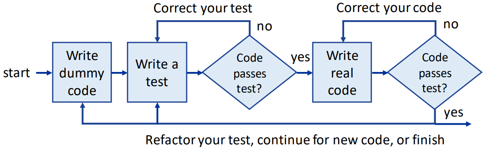
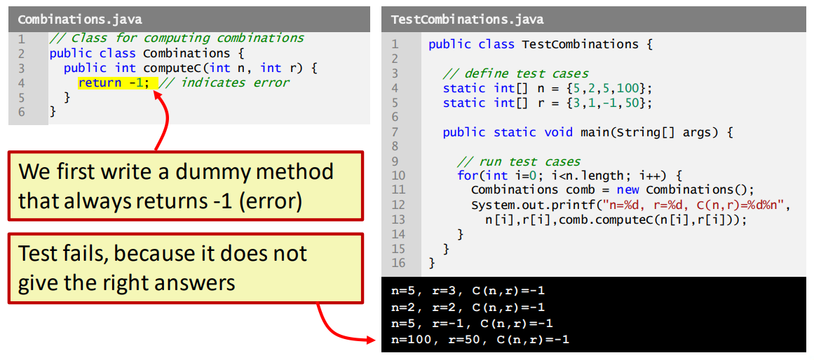
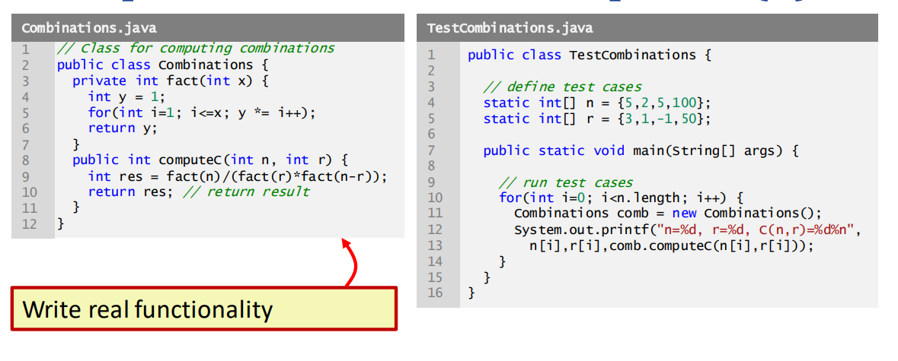
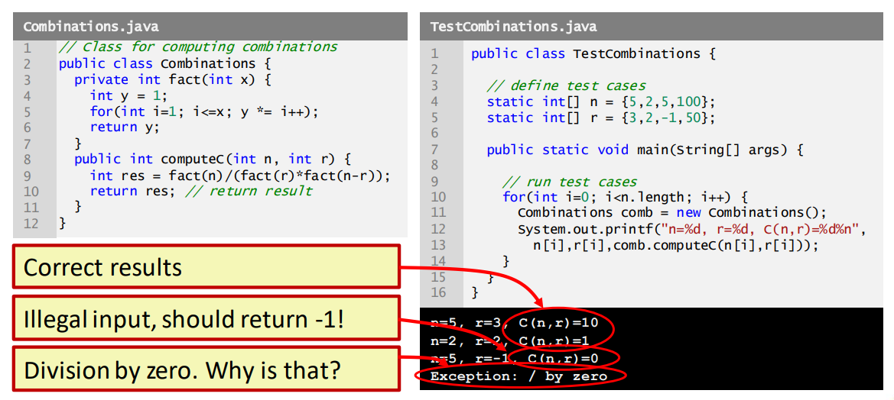
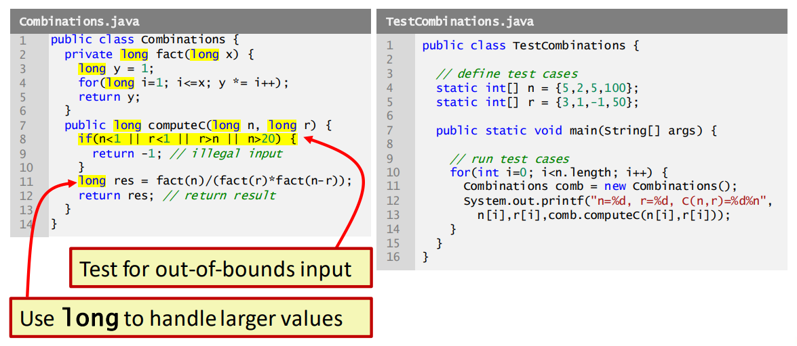
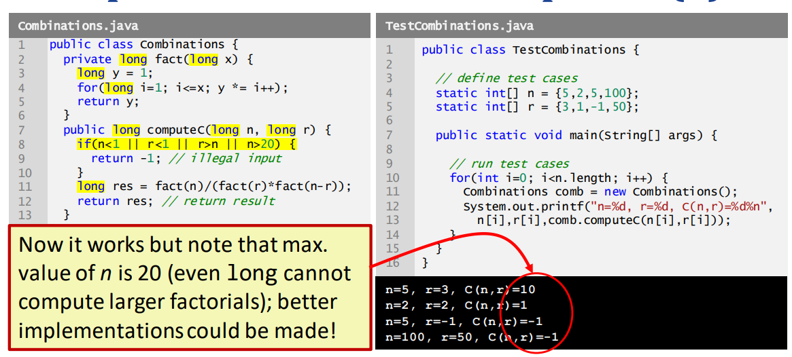
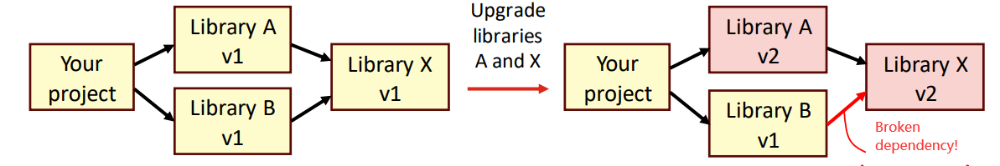

# Day 5: Testing and dependency management  

- 目标：  
    - 能解释软件开发中测试的目的  
    - 能在项目中遵循测试驱动的软件开发流程  
    - 能在 Maven 中实施简单的自动测试  
    - 管理项目中的依赖关系  

## Session 1: Introduction to testing and dependency management 测试和依赖性管理简介  

### 良好的代码实践  
- 遵循良好的代码实践有助于避免错误，并更容易发现可能存在的错误  
    - 正确缩进代码，统一使用括号和大括号  
    - 合理、一致地命名类和变量  
    - 确保变量始终正确初始化  
    -使 用注释和可选注解（如 `@Override`）来澄清程序代码中可能存在的任何混淆之处  
    - <u>***严格测试代码！***</u>  

### 软件测试  
- 软件测试是验证代码是否正常运行并产生预期输出的过程  
- 测试是软件开发生命周期的重要组成部分  
    - 测试确保程序按预期运行  
    - 测试有助于在开发过程中尽早发现错误和问题，减少后期修复的成本和时间  
    - 测试有助于保持软件设计的模块化，以便对单元进行有意义的测试；如果不能对类进行适当的测试，那么你的类设计可能就不合适  

### 软件测试的层级（Level）  
- 软件可在不同层面进行测试，需要不同的测试方法  
    - **单元测试（Unit testing）**：对单元（类或方法等）进行隔离测试  
    - **集成测试（Integration testing）**：同时测试两个或多个单元  
    - **功能测试（Functional testing）**：测试应用程序的特定功能  
    - **系统测试（System testing）**：从最终用户角度测试界面和功能  
    - **系统集成测试（System integration testing）**：测试协作应用程序  
- 在本课程中，我们将重点讨论*单元测试*  

### 其他类型的软件测试  
- 在本课程中，我们将重点测试代码，以确保它能提供预期的输出，程序不会意外崩溃等  
    - **性能测试（Performance testing）**：测试处理器和网络负载、处理吞吐量、内存等  
    - **安全测试（Security testing）**：测试应用程序对安全漏洞的防御能力和数据处理的安全性  
    - **可用性测试（Usability testing）**：测试应用程序是否便于最终用户使用，是否符合逻辑  
    - ……  

### 编写单元测试  
- 开发人员创建的测试用例涵盖特定代码单元所有可能的输入和输出  
    - 测试用例应包括典型输入、边缘情况、意外行为以及错误和异常处理  
    - 这可能会耗费大量时间，而且可能需要开发人员付出大量努力！  
- 单元测试通常使用 Maven 等测试框架实现自动化  
    - 尽管自动化测试的初始设置需要更多时间，但从长远来看，它能节省时间  
    - 在某些情况下，手动运行单元测试仍是最佳选择  

### 自动测试的优点  
- 自动测试有助于减少测试软件应用程序所需的时间和精力，因为相同的测试可多次运行，无需人工干预  
    - 自动测试运行速度更快  
    - 自动测试可以更频繁地运行  
    - 自动测试可以解放测试人员，让他们专注于更复杂或探索性的测试任务  
    - 自动测试不会忘记还有哪些测试  
    - 自动测试不会厌烦！  
- 我们将在下一节讨论使用 Maven 进行自动测试的问题  

### Test-driven development 测试驱动开发  
- 使用测试驱动代码的执行  
    
#### 测试驱动开发的例子  
- 编写计算组合数（即 $C(n, k)=\frac{n!}{r!(n-r)!}$）的方法  
-   
-   
-   
-   
-   

## Dependency management 依赖性管理  
- 大型软件项目通常会使用不同的第三方库  
    - 库与库之间存在不同的（有时是复杂的）**依赖关系**：某些库可能会使用另一个库的特定版本  
    - 升级到新版本时，依赖关系可能会被破坏
        
- 妥善维护依赖关系需要依赖*关系管理*  

### 依赖性管理基础  
- 升级第三方库时，可能需要对使用该库的代码进行一些更改  
    - 请参阅该库的 API 文档  
- 如果出现与依赖相关的错误，你需要找到产生错误的库  
    - 错误信息通常会显示出现问题的位置，例如  
      ```shell
      java.lang.NoClassDefFoundError: ch/qos/logback/core/status/WarnStatus
      ```
    - 在线工具 [Serfish](https://serfish.com/jar/) 可以帮助查找缺失类的 .jar 包  
    - 建议使用依赖关系管理工具，如 Maven  