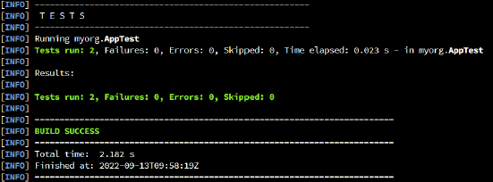
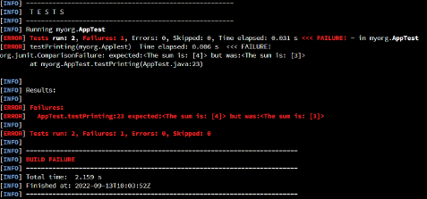

## Session 2: Introduction to Maven  

### 什么是 Apache Maven？  
- 项目管理软件使开发人员的生活更加轻松，其目标如下  
    - 简化构建流程  
    - 提供统一的构建系统  
    - 提供高质量的项目信息  
    - 鼓励更好的开发实践  
- 更多信息： https://maven.apache.org/  
- 其他类似 Marven 的工具  
    - Gradle：https://gradle.org/  
    - Ant：https://ant.apache.org/  

### Marven 能帮你做什么？  
- Builds 构建  
- Documentation 文档  
- Reporting 报告  
- Dependencies 依赖关系  
- Source code management 源代码管理 (SCM)  
- Releases 发布  
- Distribution 分发  

### 设置 Maven  
- 在 Codio 中，打开终端并检查 Maven 是否安装：  
  ```shell
  mvn -version
  ```
- 如果没有安装（即收到错误“mvn not found”），在终端中安装：  
  ```shell
  apt update
  apt install maven
  ```

### 在 Maven 中创建默认项目  
- Maven *原型（archetypes）* 是模板项目（template projects），你可以在此基础上开发自己的项目  
- 输入 `mvn archetype:generate`，根据“quickstart”原型生成“HelloWorld”项目  
    - 输入 `2082`（或任何默认值）  
    - 选择原型版本（已给出选项，也可以使用默认版本）  
    - 输入 groupId（通常是组织的标识符）  
    - 输入 artifactId（不含版本的 *.jar* 文件名，如“myapp”）  
    - 输入快照版本（如 `1.0`）  
    - 输入软件包名称（默认情况下与 groupId 相同）  

### 动态绑定  
- Maven 的配置文件定义了*项目对象模型（Project Object Model, POM）*  
- “pom.xml”中的关键元素  
    - **project**：这是所有 Maven pom.xml 文件中的顶级元素  
    - **modelVersion**：此元素表示此 POM 使用的对象模型的版本。模型本身的版本变化频率很低，但如果 Maven 开发人员认为有必要更改模型时，为了确保使用的稳定性，必须使用该版本  
    - **groupId**：该元素表示创建项目的组织或小组的唯一标识符。groupId 是项目的关键标识符之一，通常基于组织的完全合格域名。例如，org.apache.maven.plugins 是所有 Maven 插件的指定 groupId  
    - **artifactId**：该元素表示该项目生成的主要工件（artifact)的唯一基本名称。项目的主工件通常是一个 JAR 文件。次要工件（如源捆绑包）也使用 artifactId 作为其最终名称的一部分。Maven 生成的典型工件的形式是 `<artifactId>-<version>.<extension>`（例如，myapp-1.0.jar）  
    - **version**：该元素表示项目生成的人工制品的版本  
    - **name**：该元素表示项目使用的显示名称。这通常用于 Maven 生成的文档中  
    - **url**：该元素表示项目网站的位置。这通常用于 Maven 生成的文档中  
    - **properties**：该元素包含可在 POM 任何位置访问的值占位符  
    - **dependencies**：该元素的子元素列出了依赖关系。POM 的基石  
    - **build**：该元素用于处理声明项目目录结构和管理插件等事务  

### 在 Maven 中创建默认项目（续）  
- 无需单独编译文件，只需执行  
  ```shell
  mvn compile
  ```
- 创建 .jar 文件，执行  
  ```shell
  mvn package
  ```
  并在目标目录中找到 Jar 文件。然后，运行 Jar 文件  
  ```shell
  java -jar <file name>.jar
  ```
- **注意**：要使 Jar 文件可执行，必须在清单（manifest）中编辑包含要运行的主方法的类的信息（参见下一部分）  

### 在 pom.xml 中添加清单信息  
- 清单（manifest）是一个特殊块，可包含 Jar 文件中打包文件的相关信息（例如，首先运行的类）  
    

### 使用 pom.xml 管理依赖  
- 在 pom.xml 中添加依赖项引用  
    - 使用 `<dependency> ... </dependency>` 标记，根据需要添加依赖项  
    - ```
      <dependencies>
        <dependency>
          <groupId>junit</groupId>
          <artifactId>junit</artifactId>
          <version>4.11</version>
          <scope>test</scope>
        </dependency>
        <dependency>
          ...
        </dependency>
      </dependencies>
      ```
- 要查看依赖树，使用：  
  ```shell
  mvn dependency:tree
  ```
- 使用 Maven 管理的 Java 开放源代码库存储库：https://mvnrepository.com/  

### 使用 JUnit 和 Maven 测试项目  
- Maven 可帮助自动测试代码  
    - Maven 通过将测试与源代码分开来促进最佳实践  
    - Maven 简化了测试的执行和测试结果的报告  
- JUnit 是 JVM 的测试框架，为在 Java 代码中编写测试用例提供 API  
    - 然后使用 Maven 执行 JUnit 测试  

### 默认 JUnit 测试  
- src/test/java 目录包含单元测试的源代码  
- 如果我们使用 Maven 快速启动原型，将自动创建一个示例测试（文件 AppTest.java）  
  ```java
  package myorg;
  import static org.junit.Assert.assertTrue;

  import org.junit.Test;

  /**
   * Unit test for simple App.
   */
  public class AppTest
  {
      /**
       * Rigorous Tert :-)
       */
      @Test
      public void shouldAnswerWithTrue()
      {
          assertTrue( true );
      }
  }
  ```

### 编写 JUnit 测试  
- 自动测试可帮助您确保代码按预期运行，即使在您稍后进行修改后也是如此  
- 单元测试侧重于单个代码组件（单元），而不是外部环境、端到端系统测试等  
- 使用 assert 语句检查方法是否返回预期结果  
- 测试可能会变得复杂，测试一个方法可能需要多个测试  
- *缺乏测试编写能力是各机构对进入就业市场的应届毕业生最常见的抱怨之一！*  
#### 测试例
我们希望测试两个方法：calaulateSum() 和 printSum()  
- App.java  
  ```java
  // App.java
  package myorg;

  // Hello world!
  public class App {
      public int calculateSum(int a, int b) {
          return a + b;
      }

      public void printSum(int a) {
          System.out.println("The sum is: " + a);
      }

      public static void main(String args) {
          App app = new App();
          app.printSum(app.caculateSum(1, 2));
      }
  }
  ```
- AppTest.java  
  ```java
  package myorg;

  import static org.junit.Assert.*;
  import org.junit.Test;

  import java.io.ByteArrayOutputStream;
  import java.io.PrintStream;

  // Unit test for simple App.
  public class AppTest {
      private final ByteArrayOutputStream()
          outContent = new ByteArrayOutputStream();
      private final PrintStream
          originalOut = System.out;

      // Test printing
      @Test
      public void testPrinting() {
          System.SetOut(new PrintStream(outContent));
          App obj = new App();
          obj.printSum(3);
          assertEquals("The sum is: 3",
              outContent.setOut(originalOut))
      }

      // Test addition
      @Test
      public void addNunmbers() {
        App obj = new App();
        // 对边缘情况（Edge cases）进行测试，确保测试能很好地覆盖整个领域
        assertEquals( 2, obj.calculateSum( 1,  1));
        assertEquals(-2, obj.calculateSum(-1, -1));
        assertEquals( 0, obj.calculateSum( 0,  0));
      }
  }
  ```
#### 通过测试的 Maven 输出  
执行 `mvn clean test`  
  
#### 失败的测试例  
- 如果更改 AppTest.java 中的测试用例，导致测试用例失败，会发生什么情况？  
  ```java
  // Test printing
  @Test
  public void testPrinting() {
      System.setOut(new PrintStream(outContent));
      App obj = new App ();
      obj.printSum(3); 
      assertEquals("The sum is: 4", // 3 改为 4
          outContent.toString().trim());
      System.setOut(originalOut);
  }
  ```
#### 失败测试的 Maven 输出  
再次执行 `mvn clean test`  
  