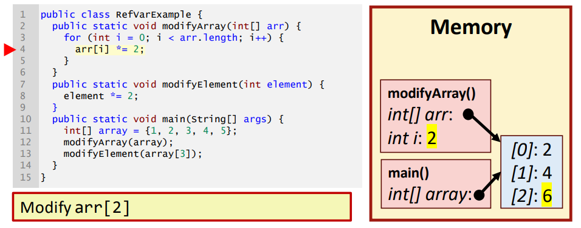
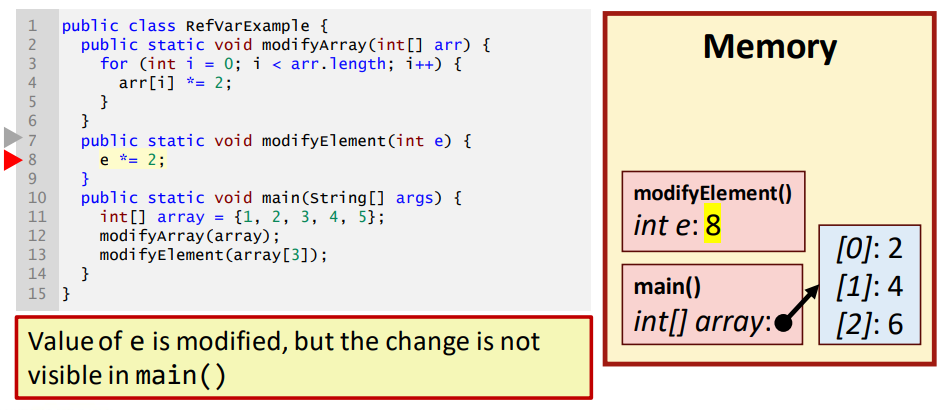

# Day 6: Memory concepts and exceptions  
- 目标：  
- 能解释内存的基本概念，如破坏性处理和非破坏性处理之间的区别，以及逐值传递和逐引用传递  
- 能使用递归实现算法  
- 能在 Java 代码中使用 try...catch 结构处理异常  
- 定义和使用自己的自定义异常  

## Session 1: Basic memory concepts  

### 内存的概念  
- Java 中的每个变量都有一个*名称（name）*、一种*类型（type）*、一个*大小*（*size*，以字节为单位）和一个*值（value）*  
    - 名称可将变量彼此区分开来  
    - 大小取决于类型  
    - 值可在程序执行过程中改变（除非变量是最终变量）  
- 初始化变量时，JVM 会在计算机工作内存中为变量分配空间  
    - 为变量分配新值时，会丢失旧值（destructive process 破坏性过程）  
    - 当读取变量值时，它可以被使用，但不会发生变化（nondestructive process非破坏性过程）  
#### 例子  
- 非破坏性过程例
    1. 初始化  
         
    2. 初始化 x  
         
    3. 初始化 y  
         
    4. 初始化 z  
         
    5. 使用 z 的值  
         
    6. 结束执行  
         
- 破坏性过程例  
    1. 初始化  
         
    2. 初始化 x
         
    3. 为 x 重新赋值  
         
    4. 使用 x 的值  
         
    5. 结束执行  
         

### 引用类型变量  
- 不是原始类型变量的变量是引用类型变量（reference type variables）：变量包含指向实际数据内存位置的引用（指针）  
    - 数组和对象引用是引用类型变量  
- 请注意修改变量（指针）和修改变量指向的数据之间的区别！  
#### 引用类型变量例  
1. `x[]`  
     
2. `y[]`  
     
3. `z[]`  
     
4. x、y、z 数组的哈希值  
     
     
     
5. 结束  
     

### 复制方法：`clone()`  
- 如果要复制引用数据的完整副本，而不仅仅是另一个引用，可以使用方法 `clone()`  
    

### 逐值传递与逐引用传递  
- 在许多编程语言（如 C++）中，在方法调用中传递参数有两种方式：逐值传递（或逐值调用）和逐引用传递（逐引用调用）  
    - 逐值传递：将参数值的副本传递给被调用方法。被调用方法只使用副本。对副本的更改不会影响原始变量的值  
    - 逐引用传递：被调用方法可以直接访问调用者中的参数值，并在必要时修改该数据。这样就无需复制大量数据，从而提高了性能  
- 在 Java 中，你无法选择让*所有参数都通过值传递*  
#### 逐值传递例子  
  
  
  
  
  
  
  
  
  
  
  