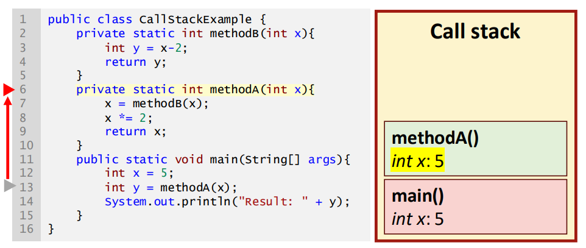
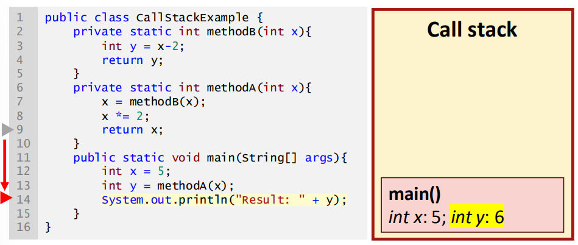

## Session 2: Call stack and recursion 调用堆栈和递归  

### 调用堆栈  
- 堆栈是一种数据结构，数据元素堆叠在一起（如纸牌堆）  
    - 基本操作是推（push）和弹出（pop），前者是在顶部添加一个元素，后者是从顶部移除最近添加的元素  
        
- 在 JVM 中，调用堆栈（call stack）用于跟踪内存中的方法调用  
    - 调用方法时，方法的局部变量和其他数据会被推入调用堆栈  
    - 当程序从一个方法返回时，信息会从堆栈中移除  
#### 理解调用堆栈  
  
  
  
  
  
  
  

### 使用阴影类属性（shadowed class attributes）  
- 方法参数仅在方法作用域内可见  
- 如果类属性和方法参数同名，Java 将使用方法参数  
- 如果需要访问类属性，请使用关键字 `this`  
#### 使用关键字 `this`：实例化（instantiate）类  
  
  
  
  
  
  

### 递归（Recursion）  
-  
- 递归方法会返回对自身的调用，直到达到基例为止  
  ```java
  methodX(param) {
      if (...) {
          methodX(newParam);
      }
    ...
  }
  ```
- 方法属性存储在调用栈中：深度递归会导致内存消耗过多  

### 递归的注意事项  
- 省略基例或错误编写递归步骤等错误会导致无限递归  
- 递归程序可能导致指数级方法调用  
- 每个递归方法都可以用循环来重写  
- 只有当问题是自然递归的（即为了加深理解），或者有性能上的好处，或者你需要在求职面试中给人留下深刻印象时，才使用递归方法 ☺  
#### 斐波那契数列例  
- 斐波那契数列前两个数字是 0 和 1，之后的每个数字都是前两个数字之和  
  | $F_0$ | $F_1$ | $F_2$ | $F_3$ | $F_4$ | $F_5$ | $F_6$ | $F_7$ | $F_8$ | $F_9$ | $F_{10}$ | ... |
  | --- | --- | --- | --- | --- | --- | --- | --- | --- | --- | --- | --- |
  | 0 | 1 | 1 | 2 | 3 | 5 | 8 | 13 | 21 | 34 | 55 | ... |
- 生成斐波那契数列是一个自然递归问题  
- 使用 Java 递归方法：  
  ```java
  public class FibonacciRecursion {
      public static int fibonacci(int f1, int f2, int cnt) {
          if (cnt == 2) {
              return f1 + f2;
          } else {
              return fibonacci(f2, f1+f2, cnt-1);
          }
      }
      public static void main(String[] args) {
          System.out.println("Result: " + fibonacci(0, 1, 19));
      }
  }
  ```
  输出：
  ```shell
  $ java FibonacciRecursion
  Result: 4181
  ```