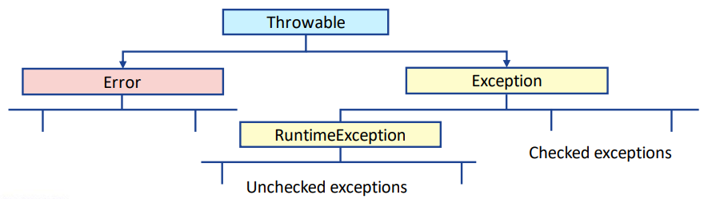
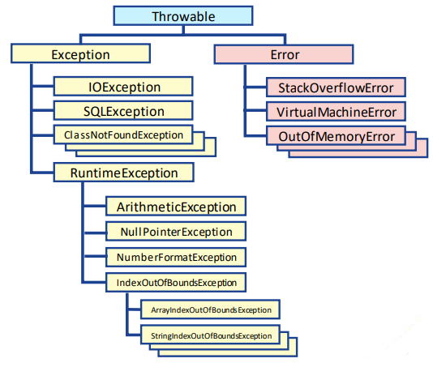

## Session 3: Exception handling in Java 异常处理  

### 异常处理  
- *异常（exception）*是指在程序执行过程中发生的事件，它扰乱了程序指令的正常流程  
- ***异常处理程序（exception handler）*** 是可以处理异常的代码块  
    - Java 允许将异常处理代码与正常代码分开，以提高可读性  
    - 在找到异常处理程序之前，异常会在调用栈中传播，因此开发人员可以选择在哪一级处理异常  
    - 对于如何编写和处理异常，每个组织都有自己的风格  
- 在 Throwable 类之下，还有 Error 和 Exception 子类  
- Error 和 Exception 类又分为更多子类  
    
#### 错误例（无限递归）  
```java
public class SimpleRecursion2 {
    public static void recursiveLoop(int i, int max) {
        System.out.println(i + " ");
        if (i < max) {
            recursiveLoop(i, max);
            // 索引变量 i 没有变化，所以最终堆栈溢出！
        }
    }

    public static void main(String args[]) {
        recursiveLoop(1, 10);
        System.out.println();
    }
}
```
输出：  
```shell
1 1 1 1 1 1 1 1 1 1 1 1 1 1 1 1 1 1 1 1 1 1 1 1 1 1 1 1 1 1 1 1 1 1 1 1 1 1 1 1 1 1 1 1 1 1 1 1 1 1 1 1 1 1 1 1 1 1 1 1 1 
Exception in thread "main" java.lang.StackOverflowError
```

### 异常的类别  
-   
- 预定义的异常几乎涵盖了实际 Java 程序中所有可能出现的错误情况  
- 也可以通过子类化现有的类来创建自定义异常  
    - 例外情况的等级并不固定  

### 已检查/未检查的异常  
- 检查过的异常都是 Exception 的子类（除 RuntimeException 子类是未检查的异常）  
    - 未检查的异常通常是编程问题造成的  
    - 许多程序员反对捕获未检查的异常，因为这些异常是无法预测的，如果发生了，就说明代码设计有问题，应该加以修正，防止错误发生  
- 已检查的异常必须用 `throws` 关键字声明，否则编译器将返回错误信息  
#### 已检查异常的例子  
```java
import java.io.*;
public class ExceptionTest1 {
    public static void main(String args[]) {
        FileInputStream inputStream = null;
        inputStream = new FileInputStream("file.txt");
        // 这里可能会抛出 FileNotFoundException 异常！

        int m;
        while((m = inputStream.read()) != -1) {
            System.out.println((char) m);
        }

        inputStream.close();
    }
}
```
输出（无法通过编译）：  
```shell
$ javac ExceptionTest1.java
ExceptionTest1.java:5: error: unreported exception FileNotFoundException; 
must be caught or declared to be thrown
$
```
#### 使用 `throws` 关键字的已检查异常例  
```java
import java.io.*;
public class ExceptionTest1 {
    public static void main(String args[] throws IOException) {
    // 这样就可以编译代码
        FileInputStream inputStream = null;
        inputStream = new FileInputStream("file.txt");

        int m;
        while((m = inputStream.read()) != -1) {
            System.out.println((char) m);
        }

        inputStream.close();
    }
}
```
输出：  
```
$ javac ExceptionTest2.java
$ java ExceptionTest2
Exception in thread "main" java.io.FileNotFoundException: file.txt (No such file or directory) 
$
```
#### 未检查的异常例  
```java
import java.util.*;
public class ExceptionTest3 {
    public static void main(Stringp[] args) {
        Scanner input = new Scanner(System.in);
        Scanner input = new Scanner(System.in);
        System.out.print("Give x: "); int x = input.nextInt();
        System.out.print("Give y: "); int y = input.nextInt();
        System.out.println("x / y = " + x / y);
        // 如果除数为 0 的话，这里会抛出异常（division by zero）
    }
}
```
输出：  
```shell
$ javac ExceptionTest3.java
$ java ExceptionTest3
Give x: 10
Give y: 0
Exception in thread "main" java.lang.ArithmeticException: / by zero
$
```

### 使用 try ... catch 处理异常  
- 默认情况下，程序会在抛出异常时停止运行  
- 然而，可以使用 `try ... catch` 结构来处理异常  
  ```java
  try {
      // do somthing that can cause an exception
  }
  catch (Exception e) {
      // do this if there was an exception
      // 只有出现异常时才会执行这里的语句
  }
  // continue the program here normally
  // 无论是否有异常，程序都会继续执行之后的语句
  ```
#### `try ... catch` 使用例  
```java
import java.util.*;
public class TryCatchTest {
    public static void main(String[] args) {
        Scanner input = new Scanner(System.in);
        System.out.print("Give x: "); int x = input.nextInt();
        System.out.print("Give y: "); int y = input.nextInt();
        try {
            System.out.println("x / y = ", x / y);
        }
        catch (Exception e) {
            System.out.println("y can't be zero!");
        }
    }
}
```
输出：  
```
Give x: 10
Give y: 0
y can’t be zero!
```

### 使用 throw 关键字  
- 前面的示例中，异常是由 JVM 抛出的  
- 你也可以使用 throw 关键字在方法中抛出一个新定义的异常类  
  ```java
  public class Person {
      protected int age
      public void setAge(int age) {
          if (age < 0) {
              throw new IllegalArgumentException("Age can't be negative!");
          }

          this.age = age;
      }
  }
  ```

### 使用 finally 关键字  
- finally 代码块通常用来释放 try 代码块中获取的资源（如数据库连接、打开的文件）  
- 除非 try 代码块或 catch 代码块调用 `System.exit()`，停止 Java 解释器，否则 finally 代码块一定会执行  
- 避免将可能产生异常的代码放在 finally 代码块中  
- 如果需要这样的代码，将代码括在 try ... catch 块中  

### 处理多个异常  
- 可以在 try 代码块后使用多个 catch 代码块来捕获不同的异常
  ```java
  try {
      setAge(age);
      openFile(filename);
  }
  catch (IllegalArgumentException e) {
      System.out.println("Unchecked exception!");
      System.err.println(e);
  }
  catch (IOException e) {
      System.out.println("Checked exception!");
      System.err.println(e);
  }
  finally {
      System.out.println("Print this anyways.")
  }
  ```

### 嵌套的 try ... catch 代码块  
- 使用*嵌套的（nested）* 代码块是可行的  
    - 通常情况下，最好避免使用，并尝试寻找其他解决方案  
- ```java
  import java.util.*;
  public class TryCatchTest2 {
      public static void divide() {
          Scanner input = new Scanner(System.ln);
          System.out.print("Give x: ");
          int x = input.nextInt();
          System.out.print("Give y: ");
          int y = input.nextInt();
          System.out.println("x / y = " + x / y);
      }

      public static void main(String[] args) {
          try {
              divide();
          }
          catch (Exception e1) {
              System.out.println("y can't be zero!");
              System.out.println("Try again.");
              // 嵌套的 try ... catch
              try {
                  divide();
              }
              catch (Exception e2) {
                  System.out.println("y still can't be zero!");
                  System.out.println("I give up.");
              }
          }
      }
  }
  ```