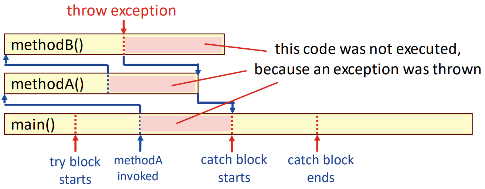

## Session 4: User-defined exceptions 用户定义的异常  

### 为什么用户可以定义异常？  
- 内置异常涵盖了编程中几乎所有的常规异常类型  
- 不过，在某些情况下，自定义异常也是有益的：  
    - 捕获现有 Java 异常的特定子集  
    - 处理与程序错误无关的 "业务逻辑异常"，例如应用程序特有的数据错误  
    - 自定义异常允许在程序的特定级别进行处理  
- 用户定义的异常只需继承现有异常即可创建  
#### 使用用户定义异常的例子  
```java
import java.util.*;

// 用户定义的异常。注意：构造函数和对 super() 的调用不是必须的，但它有助于实现默认功能
class IntOverflowException extends Exception {
    public IntOverflowException(String str) {
        super(str);
    }
}

public class TestCustomException {
    // 你需要使用关键字 throws 来指明哪些方法会抛出自定义异常。或者，您也可以从 RuntimeException 继承异常
    static int face(int x) throws IntOverflowException {
        int y = 1;
        for (int i = 1; i <= x; y *= i++) {
            // 如果变量 y（int）在下一轮将溢出，则抛出异常
            if (i < x && (long)y*(long)i > Integer.MAX_VALUE) {
                throw new IntOverflowException("integer overflow");
            }
        }
        return y;
    }

    static int computeC(int n, int r) throws IntOverflowException {
        int res = fact(n) / (fact(r) * fact(n - r));
        return res;
    }

    public static void main(String[] args) {
        // 我们的 try...catch 块。根据经验，我们知道计算 C(50,10) 会导致 int 溢出
        try {
            compute(50, 10); // compute C(n,k)
        }
        catch (IntOverflowException ex) {
            System.out.println(ex.getMessage());
        }
        System.out.println("continue..")
    }
}
```
输出：  
```shell
$ java TestCustomException
integer overflow
continue...
$
```
#### 自定义未检查的异常例  
```java
import java.util.*;

// 继承自 RuntimeException 、无构造函数的简化类
class IntOverflowException extends RuntimeException {
}

public class TestCustonException2 {
    // 未检查的异常不需要关键字 throws
    static int fact(int x) {
        int y = 1;
        for (int i = 1; i <=x; y *= i++) {
            if (i < x && (long)y * (long)i > Integer.MAX_VALUE) {
                throw new IntOverflowException();
            }
        }
        return y;
    }
    
    static int computeC(int n, int r) {
        int res = fact(n) / (fact(r) * fact(n - r));
        return res;
    }

    public static void main(String args[]) {
        try {
            computeC(50, 10);
        }
        catch (IntOverflowException ex) {
            System.out.println("int overflow..");
        }
        System.out.println("continue...");
    }
}
```
输出：  
```shell
$ java TestCustomException2
int overflow
continue...
$
```

### 由于异常导致的代码忽略  
- 请注意，当异常抛出时，它会在调用堆栈中传播，直到异常得到处理：有些数据可能没有被正确初始化  
    

### 未分配有效数据的变量  
```java
class IntOverflowException extends RuntimeException {
}

public class TestCustonException3 {
    ...

    static int C;
    public static void main(String args[]) {
        try {
            C = computeC(10, 5);
        }
        catch (IntOverflowException ex) {
            System.out.println("int overflow");
        }
        // 因为抛出了异常，所以 int C 没有有效值
        System.out.println("C = " + C);
    }
}
```
输出：  
```shell
$ java TestCustomException3
int overflow
C = 0
```

### 通用异常处理程序（generic exception handlers）的注意事项  
- 捕捉 Exception 超类的通用异常处理程序可能会提供有关潜在问题的误导信息  
    - 你不应该期望异常总是出于同样的原因被抛出！  
- 有时，在代码捕获标准异常后会抛出自定义异常  
    - 您应该提供一个构造函数，以保留标准异常中的错误细节  
#### 错误的异常  
```java
import java.util.*;

public class TryCatchTest2 {
    public static void divide() {
        Scanner input = new Scanner(System.in);
        System.out.print("Give x: "); 
        int x = input.nextInt();
        System.out.print("Give y: "); 
        int y = input.nextInt();
        System.out.println("x / y = " + x/y);
    }

    public static void main(String[] args) {
        try {
            divide();
        }
        catch(Exception e1) {
            System.out.println("y can't be zero!");
        }
    }
}
```
输出：  
```shell
Give x: 5
Give y: abc
y can't be zero!
```
- 在这种情况下，输入不是数字，抛出的异常是输入不匹配异常（InputMismatchException），而不是算术异常（ArithmeticException）  
#### 带原因的自定义异常例  
```java
import java.util.*;

class DivisionException extends Exception {
    // 定义构造函数，以保留异常的起因（捕获的原始常规异常）
    public DivisionException(String msg, Throwable cause) {
        super(msg + cause.toString());
    }
}

public class CustomExceptionTest4 {
    public static void divide() throws DivisionException {
        // 捕捉一般异常并抛出自定义（或 business）异常  
        try {
            Scanner input = new Scanner(System.in);
            System.out.print("Give x: "); int x = input.nextInt();
            System.out.print("Give y: "); int y = input.nextInt();
            System.out.println("x / y = " + x/y);
        } 
        catch(Exception e) {
            throw new DivisionException("division() failed due to ", e);
        }
    }

    public static void main(String[] args) {
        // 捕捉自定义（业务）异常并打印出异常的根本原因
        try {
            divide();
        }
        catch(DivisionException e) {
            System.out.println(e.getMessage());
        }
    }
}
```
输出：  
```shell
$ java CustomExceptionTest4
Give x: 56
Give y: 0
division() failed due to java.lang.ArithmeticException: / by zero
$ java CustomExceptionTest4
Give x: abc
division() failed due to java.util.InputMismatchException
```