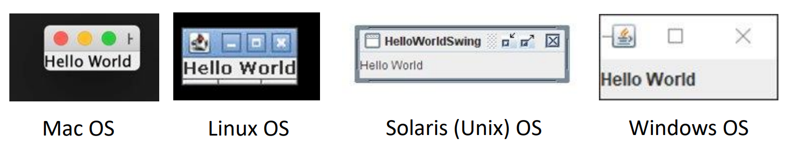
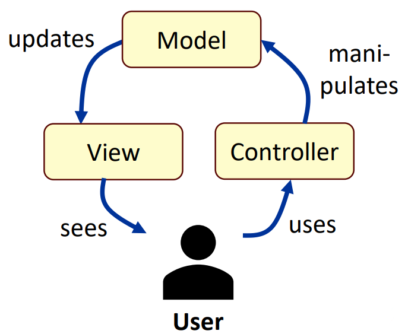
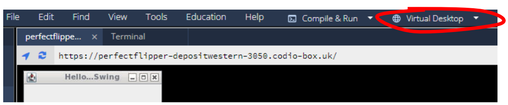
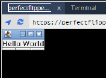
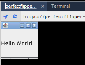

# Day 7: Graphical user interfaces 图形用户界面  

## Session 1: Introduction to graphical user interfaces 简介  

### Graphical user interfaces 图形用户界面  
- 图形用户界面（GUI）是一种用户友好型机制，用于与应用程序进行交互  
    - GUI（发音为 "GOO-ee"）赋予应用程序独特的*外观和感觉（look-and-feel）*  
    - 图形用户界面为应用程序提供一致、直观的用户界面组件，让用户即使在使用新的应用程序时也有一种熟悉感  
- 图形用户界面由图形*用户界面组件构建*而成，这些组件也称为*控件*或*小工具*（*widgets*，window gadgets 窗口小工具的简称）  
    - 图形用户界面组件是用户通过鼠标、键盘或其他输入方式（如语音识别）与之交互的对象  

### 不同平台的 Java GUI  
- Java 代码与平台无关：Java 图形用户界面使用底层平台提供的图形用户界面组件  
    - 不同的平台有不同的*外观和感觉*
    -   

### Java GUI 库  
- Java 有不同的图形用户界面库  
    - **抽象窗口工具包（Abstract Window Toolkit，AWT）** 是 Java 最初的图形用户界面库（在所有 Java 图形用户界面中历史最悠久）  
        - AWT 是重量级（heavyweight）的，依赖于平台（platform dependent）  
    - **Swing** 在 Java SE 1.2 中被添加到平台中  
        - 直到最近，Swing 仍是主要的 Java 图形用户界面技术  
        - 更轻便、不依赖平台、纯粹用于桌面端  
    - **JavaFX** 于 2007 年宣布并于 2008 年发布，是 Adobe Flash 和 Microsoft Silverlight 的竞争对手  
        - 组件数量更少，与现代设备的集成度更高  

### Java Swing 库  
- 在本课程中，我们主要使用 Swing 来制作图形用户界面  
    - Swing 仍被广泛使用并受到关注  
    - Swing 在桌面应用程序中承担“重任”  
    - Swing 使用常见的模型—视图—控制器 (model-view-controller，MVC) 设计模式  
    - Swing 跨平台（与一般 Java 一样），具有合适的外观和手感  
    - Swing 内容广泛，从 Swing 学到的知识将来很容易迁移到 JavaFX 中  

### 模型—视图—控制器（model-view-controller，MVC）  
-   
- 一般来说，视觉组件（visual component）由三个不同方面组成  
    - 组件在屏幕上呈现的样子 *（view 视图）*  
    - 组件对用户做出反应的方式 *（controller 控制器）*  
    - 与组件相关的状态信息 *（model 模型）*  
- 多年来，事实证明 MVC 架构异常有效  

### Java 基础类 (Java foundation classes，JFC) 和 Swing  
- JFC 包含一组功能，用于构建图形用户界面并为 Java 应用程序添加丰富的图形功能和交互性  
- JFC 包含以下功能：
    - Swing 图形用户界面组件  
    - 可插拔的外观和感觉支持  
    - 辅助功能 API  
    - Java 2D API  
    - 国际化  

### Swing 组件  
- 在 Swing 中，图形用户界面由图形组件组成  
    - 图形组件是类，要使用它们，必须声明它们的对象  
    - 通常，图形用户界面建立在 JFrame 组件上，它是图形用户界面的窗口或容器  
    - 其他常用组件包括 JLabel（可包含静态文本或图像）和 JButton（实现可按下的按钮）等  
#### 在 Codio 中运行 Swing  
- 要使用图形用户界面运行 Java，底层平台必须支持图形用户界面  
- 在 Codio 中，您可以使用虚拟桌面运行图形用户界面  
    - 参阅[文档](https://docs.codio.com/common/develop/ide/boxes/installsw/gui.html)来安装  
    - 注意，在使用虚拟桌面之前，需要重新启动 Codio  
    - 然后就可以在 Codio 中打开“虚拟桌面”选项卡了  
        
#### 使用 JFrame 的例子  
```java
import javax.swing.*; // 导入 Swing 类

public class FrameTest {
    private static void createAndShowGUI() {
        JFrame frame = new JFrame("HelloWorldString"); // 创建 JFrame 组件
        frame.setDefaultCloseOperation(JFrame.EXIT_ON_CLOSE);

        JLabel label = new JLabel("Hello world"); // 创建 JLabel 组件
        frame.getContentPane().add(label);

        frame.pack();
        frame.setVisible(true);
    }

    public static void main(String[] args) {
        // 运行 Swing 图形用户界面应用程序的标准代码：
        javax.swing.SwingUtilities.invokeLater(new Runnable() {
            public void run() {
                createAndShowGUI();
            }
        });
    }
}
```
控制台（console）：  
```shell
$ javac FrameTest.java
$ java FrameTest
```
Codio 虚拟桌面：  
  
- 可以使用鼠标调整窗口大小  

### 设置窗口尺寸  
- 你需要确定窗口的大小  
    - 你可以使用 frame.pack() 将决定权交给应用程序  
    - pack 方法确定框架的尺寸，使其所有内容物都达到或超过其首选尺寸  
    - 除了 pack() 之外，还可以通过调用 setSize() 或 setBounds()（同时设置窗口的位置）来明确确定窗口的大小  
    - 一般来说，使用 pack() 比调用 setSize() 更为可取，因为 pack() 布局管理器善于根据平台依赖性和其他影响组件大小的因素进行调整  
#### 使用 `setSize` 的例子  
```java
import javax.swing.*;

public class SetSizeTest {
    private static void createAndShowGUI {
        ...

        frame.setSize(100, 100); // 使用 setSize（而不是 pack）来设置窗口大小
        frame.setVisible(true);
    }

    ...
}
```
Codio 虚拟桌面：  
  