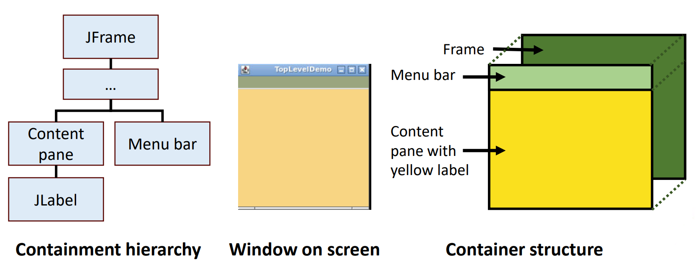

## Session 2: 在 Swing 中使用顶层容器  

### 顶层容器（top-level container）类  
- Swing 提供了两个常用的顶层容器类：JFrame 和 JDialog  
    - 每个使用 Swing 组件的程序都至少有一个顶层容器，它是*包含层次结构（containment hierarchy）* 的根  
    - 要在屏幕上显示，每个图形用户界面组件都必须是*包含层次结构*的一部分  
    - 每个图形用户界面组件只能被包含一次；如果一个组件已经在一个容器中，而你试图将它添加到另一个容器中，该组件将从第一个容器中移除，然后再添加到第二个容器中  

### 顶层容器类的内容窗格（content pane）  
- 每个顶层容器都有一个内容窗格，其中（直接或间接）包含该顶层容器图形用户界面中的可见组件  
- 你可以选择在顶层容器中添加*菜单栏（menu bar）*  
    - 按照惯例，菜单栏位于顶层容器内，但在内容窗格之外  
    - 有些界面（如 macOS）允许你选择将菜单栏放在其他更适合该界面的位置，如屏幕顶部  

### JFrame 的顶层容器  
  
#### 顶层容器例  
```java
// 必要的导入
import java.awt.*;
import java.awt.event.*;
import javax.swing.*;

public class TopLevelDemo {
    private static void createAndShowGUI() {
        // 创建并设置窗口（JFrame）
        JFrame frame = new JFrame("TopLevelDemo");
        frame.setDefaultCloseOperation(JFrame.EXIT_ON_CLOSE);

        // 创建大小为 (200, 20) 的绿色背景菜单栏
        JMenuBar greenMenuBar = new JMenuBar();
        greenMenuBar.setOpaque(true);
        greenMenuBar.setBackground(new Color(154, 165, 127));
        greenMenuBar.setPreferredSize(new Dimension(200, 20));

        // 创建黄色背景的标签
        JLabel yellowLabel = new JLabel();
        yellowLabel.setOpaque(true);
        yellowLabel.setBackground(new Color(248, 213, 131));
        yellowLabel.setPreferredSize(new Dimension(200, 180));

        // 在框架中添加菜单栏和标签
        frame.setJMenuBar(greenMenuBar);
        frame.getContentPane().add(yellowLabel, BorderLayout.CENTER);

        frame.pack();
        frame.setVisible(true);
    }

    // 以下是标准内容，所以之后的例子中，将会省略这部分
    public static void main(String[] args) {
        javax.swing.SwingUtilities.invokeLater((new Runnable() {
            public void run() { createAndShowGUI(); }
        }));
    }
}
```
Codio 虚拟桌面：  
  

### 根窗格（root pane）  
- 每个顶层容器都依赖于一个被称为根窗格的隐性中间容器  
    - 根窗格管理内容窗格和菜单栏，以及其他几个容器，如内容和玻璃窗格  
    - 分层窗格（layered pane）包含菜单栏和内容窗格  
    - 玻璃窗格（glass pane）通常用于拦截顶层容器上的输入事件，也可用于涂抹其他组件  
- 根窗格为框架提供的组件列表：  
    

### 对话框（dialog）  
- 对话框是一个独立的子窗口（sub window，或 pop-up window 弹出式窗口），除主应用程序窗口外，还承载通知功能  
    - 大多数对话框会向用户显示错误信息或警告，但对话框也可以显示图像、目录树等。  
    - 如果对话框在关闭前阻止用户输入程序中所有其他窗口的内容，则该对话框为*模式（modal）* 对话框  
- 在 Swing 中，JDialog 类用于实例化对话框的顶级容器  
    - JOptionPane 类提供了简单的标准模式对话框，但要创建非模式对话框，必须直接使用 JDialog 类  
#### 通过 JOptionPane 创建对话框的简单例子  
```java
import javax.swing.*;

public class OptionPaneExample {
    JFrame f;
    OptionPaneExample() {
        f = new JFrame();
        JOptionPane.showMessageDialog(f, "Hello, Welcome to JC2002.");
    }

    public static void main(String[] args) {
        new OptionPaneExample();
    }
}
```
Codio 虚拟桌面：  
  

#### 使用 JDialog 创建非模式对话框的例子  
```java
import javax.swing.*;
import java.awt.*;
import java.awt.event.*;

public class DialogExample {
    private static JDialog d;

    DialogExample() {
        // 创建包含对话框的 JFrame 对象
        JFrame f = new JFrame();

        // 创建 JDialog 对象
        d = new JDialog(f, "Dialog Example", true);
        d.setLayout(new FlowLayout()); // 之后介绍布局和动作监听器

        // 创建 JButton 对象
        JButton b = new JButton("OK");

        b.addActionListener (new ActionListener() {
            public void actionPerformed(ActionEvent e) {
                DialogExample.d.setVisible(false);
            }
        }); // 之后介绍布局和动作监听器

        // 添加标签、按钮并使对话框可见
        d.add(new JLabel ("Click button to continue."));
        d.add(b);
        d.setSize(300, 300);
        d.setVisible(true);
    }

    public static void main(String args[]) {
        new DialogExample();
    }
}
```
Codio 虚拟桌面：  
  