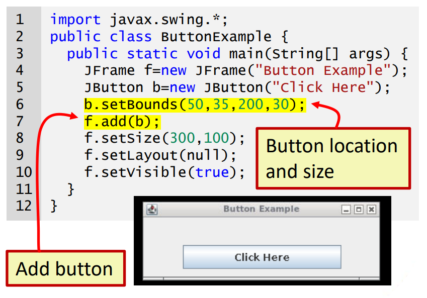
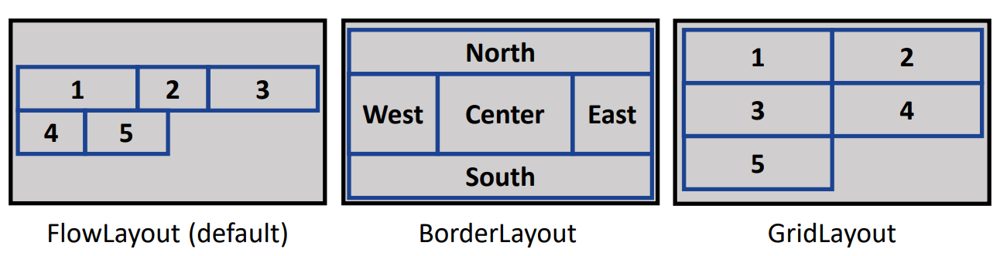
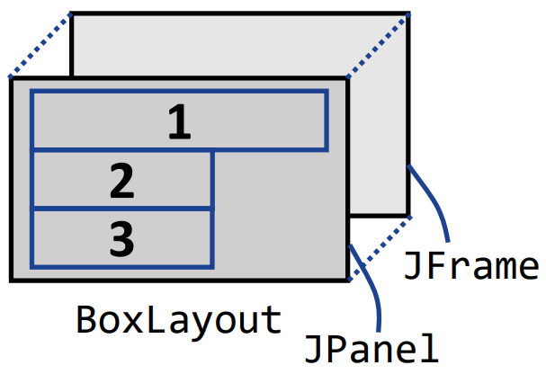
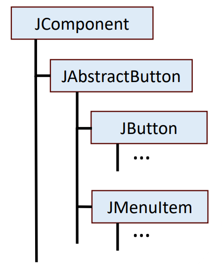
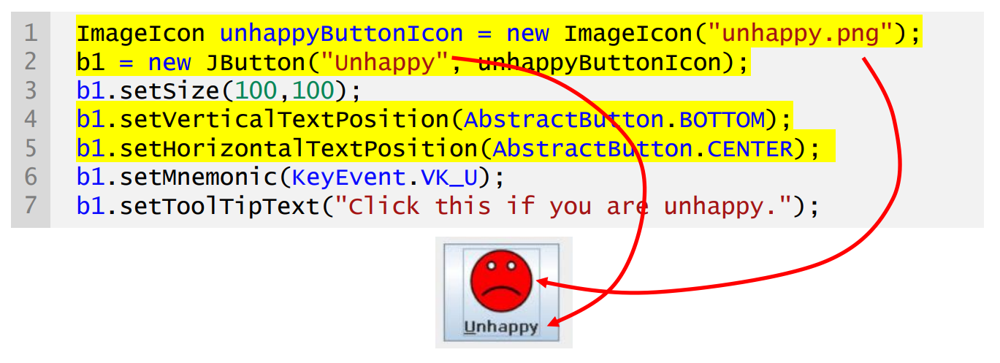
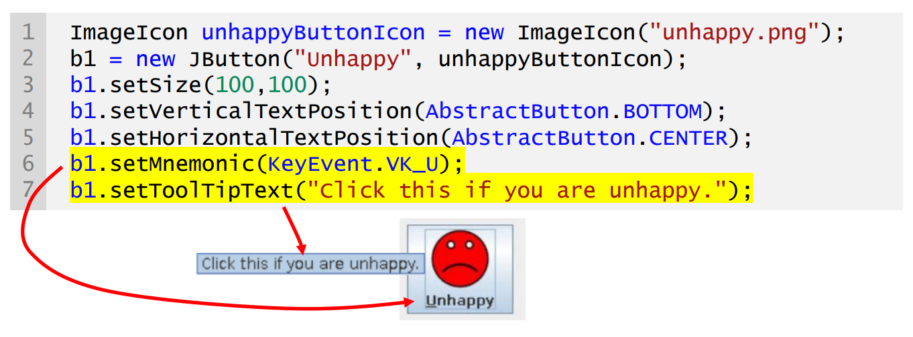
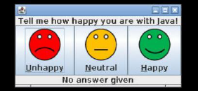
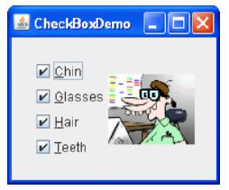
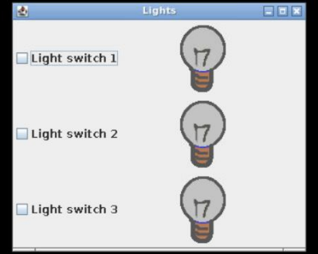

## Session 3: Using layouts and buttons in Swing 在 Swing 中使用布局和按钮  

### 加入 JComponents  
- 不同的 GUI 组件（按钮、图像、文本字段等）由 JComponent 的子类表示  
- 使用 add() 方法将 GUI 组件添加到容器中，并将添加的 JComponent 子类对象作为参数  
    

### Layout managers 布局管理器  
- 如果不知道目标平台的屏幕分辨率，为组件设置绝对位置和大小可能会很糟糕  
- 一些 Swing 和 AWT 类提供了布局管理器，用于根据不同的特定规则动态分配图形用户界面组件  
    
  *流式布局（默认） | 边框布局 | 网格布局*  

### JPanel 上的布局  
- 某些布局（如 FlowLayout）可直接在 JFrame 上使用  
- 某些布局（如 GridLayout 和 BoxLayout [盒布局]）需要在 JFrame 和组件之间创建 JPanel 对象  
-   


### 按钮：JButton 类  
- 按钮是使用最广泛的 GUI 组件之一  
    - 多种子类型：单选按钮（radio buttons）、菜单项（menu items）、复选框（check boxes）等  
- Swing 的 JButton 类可同时显示文字和图像  
    - 按钮文本中的下划线字母表示该按钮的助记符（mnemonic，键盘快捷键）  
        - 通常情况下，用户按 Alt 键并使用助记符点击按钮  
    - 可定义工具提示来解释按钮的含义  
-   
#### 初始化 JButton 对象  
- 带图标和文字的按钮示例（两者均为可选）  
  ```java
  ImageIcon unhappyButtonIcon = new ImageIcon("unhappy.png");
  b1 = new JButton("Unhappy", unhappyButtonIcon);
  b1.setSize(100, 100);
  b1.setVerticalTextPosition(AbstractButton.BOTTOM);
  b1.setHorizontalTextPosition(AbstractButton.CENTER);
  b1.setMnemonic(keyEvent.VK_U);
  b1.setToolTipText("Click this if you are unhappy.");
  ```
- 定义图标（图像文件）和文本  
    
- 定义助记符和工具提示文本  
    
#### 按钮例  
  

```java
import javax.swing.*;
import javax.swing.border.*;
import java.awt.BorderLayout;
import java.awt.event.*;

public class ButtonExample1 {
    public static void main(String[] args) {
        JButton b1, b2, b3;
        JLabel questionLabel, responseLabel;
        JFrame frame = new JFrame();
        questionLabel = new JLabel("Tell me how happy you are with Java!\n", SwingConstants.CENTER);
        responseLabel = new JLabel("No answer given", SwingConstants.CENTER);

        // Creare button icons
        ImageIcon unhappyButtonIcon = new ImageIcon("unhappy.png");
        ImageIcon neutralButtonIcon = new ImageIcon("neutral.png");
        ImageIcon happyButtonIcon = new ImageIcon("happy.png");

        // Define unhappy button
        b1 = new JButton("Unhappy", unhappyButtonIcon);
        b1.setVerticalTextPosition(AbstractButton.BOTTOM);
        b1.setHorizontalTextPosition(AbstractButton.CENTER);
        b1.setMnemonic(KeyEvent.VK_U);
        b1.setToolTipText("Click this if you are unhappy.");
        // Define neutral button
        b2 = new JButton("Neutral", neutralButtonIcon);
        b2.setVerticalTextPosition(AbstractButton.BOTTOM);
        b2.setHorizontalTextPosition(AbstractButton.CENTER);
        b2.setMnemonic(KeyEvent.VK_N);
        b2.setToolTipText("Click this if you feel neutral.");
        // Define happy button
        b3 = new JButton("Happy", happyButtonIcon);
        b3.setVerticalTextPosition(AbstractButton.BOTTOM);
        b3.setHorizontalTextPosition(AbstractButton.CENTER);
        b3.setMnemonic(KeyEvent.VK_H);
        b3.setToolTipText("Click this if you are happy.");

        // Add Components to the frame (Using BorderLayout)
        frame.add(questionLabel, BorderLayout.PAGE_START);
        frame.add(b1, BorderLayout.LINE_START);
        frame.add(b2, BorderLayout.CENTER);
        frame.add(b3, BorderLayout.LINE_END);
        frame.add(responseLabel, BorderLayout.PAGE_END);

        frame.pack();
        frame.setVisible(true);
    }
}
```

### 复选框：JCheckBox 类  
- JCheckBox 类支持复选框按钮  
- 对于菜单中的复选框，使用 JCheckBoxMenuItem 类  
- JCheckbox 继承了 JAbstractButton；因此，它具有按钮的常规特性和可用方法  
-   
#### 使用 GridLayout 的复选框例  
```java
import javax.swing.*;
import java.awt.*;

public class CheckBoxExample1 {
    public static void main(String[] args) {
        JFrame frame = new JFrame("Lights");
        frame.setDefaultCloseOperation(JFrame.EXIT_ON_CLOSE);

        ImageIcon lightOffIcon = new ImageIcon("light_off.png");
        ImageIcon lightOnIcon = new ImageIcon("light_on.png");
        
        JLabel lights[] = new JLabel[3];
        JCheckBox cb[] = new JCheckBox[3]; // 定义复选框

        // 使用 GridLayout
        JPanel panel = new JPanel();
        GridLayout gridlayout = new GridLayout(3, 2);
        panel.setLayout(gridlayout); // 注意，label 应包含一张图像（图标）而不是文本！  

        for (int i = 0; i < 3; i++) {
            lights[i] = new JLabel();
            cb[i] = new JCheckBox("Light switch " + (i+1));
            lights[i].setIcon(lightOffIcon);
            panel.add(cb[i]); // 向复选框添加元素
            panel.add(lights[i]);
        }

        frame.add(panel);
        frame.setSize(500, 500);
        frame.setVisible(true);
    }
}
```
  

### 单选按钮：JRadioButton 类  
- **JRadioButton** 类支持复选框按钮  
- 对于菜单中的复选框，使用 **JRadioButtonMenuItem** 类  
- **JRadioButton** 也继承自 **JAbstractButton**，因此它具有按钮的常规特性和可用方法  
- 使用 **ButtonGroup** 确保每次只选中一个按钮  
#### 单选按钮例  
```java
import javax.swing.*;

public class RadioButtonExample1 {
    public static void main(String[] args) {
        JFrame frame = new JFrame("Quiz");
        frame.setDefaultCloseOperation(JFrame.EXIT_ON_CLOSE);

        // 使用 BoxLayout
        JPanel panel = new JPanel();
        BoxLayout boxlayout = new BoxLayout(panel, BoxLayout.Y_AXIS);
        panel.setLayout(boxlayout);
        
        JLabel question = new JLabel("What is the capital of China?");
        JButton submit  = new JButton("Submit your answer");

        // 一个 ButtonGroup 中同时只能有一个单选按钮被按下！
        ButtonGroup group = new ButtonGroup();
        JRadioButton rb[] = new JRadioButton[4];
        rb[0] = new JRadioButton("Shanghai");
        rb[1] = new JRadioButton("Beijing");
        rb[2] = new JRadioButton("Guangzhou");
        rb[3] = new JRadioButton("Chongqing");

        submit.setEnabled(false);
        panel.add(question);
        for (int i = 0; i < 4; i++) {
            group.add(rb[i]);
            panel.add(rb[i]);
        }
        panel.add(submit);

        frame.add(panel);
        frame.pack();
        frame.setVisible(true);
    }
}
```