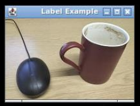
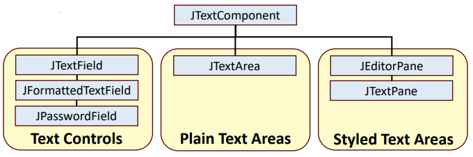
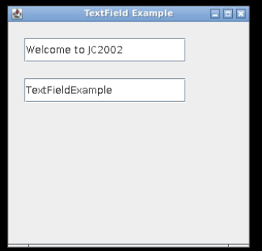
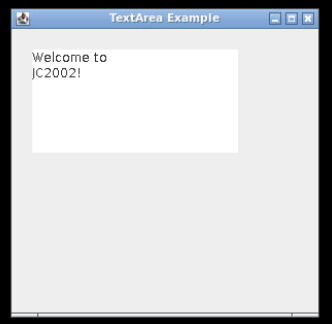
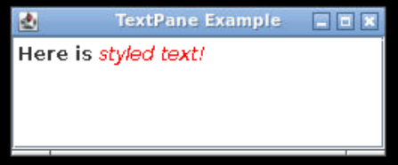
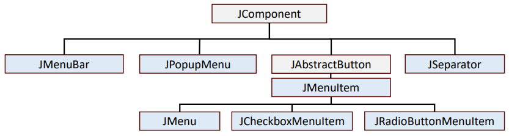
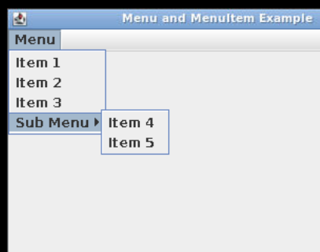

## Session 4: 更多 JComponents 组件  

### JComponents 的选择  
- 从 JComponent 类继承的 GUI 组件种类繁多，用途各异  
    - 在本课中，我们将只介绍最重要的类  
    - 不同的组件有不同的方法来定制外观、调整绝对大小和位置、设置和获取内部状态等  

### 使用 JLabel 展示图片  
- JLabel 直接继承自 JComponent，它不会对任何用户输入做出反应  
    - 我们已经使用 JLabel 显示了文本，但使用其 setIcon() 方法还可以显示图像  
    - ```java
      import javax.swing.*;

      class LabelExample {
          public static void main(String args[]) {
              JFrame f = new JFrame("Label example");

              ImageIcon icon = new ImageIcon("image.png");
              JLabel label = new JLabel();
              label.setIcon(icon);

              f.add(label);
              f.setSize(200, 150);
              f.setVisible(true);
          }
      }
      ```
        

### 文本组件  
- Swing 提供了六个文本组件以及支持类和接口，用于显示和编辑文本  
    - 所有 Swing 文本组件都继承自 JTextComponent，它为文本操作提供了一个高度可配置且功能强大的基础  
    -   
#### JTextField 例  
- 使用 JTextField 类创建一个可编辑单行文本的组件  
- ```java
  import javax.swing.*;

  class TextFieldExample {
      public static void main(String args[]) {
          JFrame f = new JFrame("TextField example");

          JTextField t1, t2;
          t1 = new JTextField("Welcome to JC2002");
          t1.setBounds(20, 20, 200, 30);
          f.add(t1); f.add(t2);

          f.setSize(300, 300);
          f.setLayout(null);
          f.setVisible(true);
      }
  }
  ```
-   
#### JTextArea 例  
- 使用 JTextArea 类创建可编辑多行文本的组件  
- ```java
  import javax.swing.*;

  class TextAreaExample {
      public static void main(String args[]) {
          JFrame f = new JFrame("TextArea example");

          JTextArea t1;
          t1 = new JTextField("Welcome to \n JC 2002!");
          t1.setBounds(20, 20, 200, 100);
          f.add(t1);

          f.setSize(300, 300);
          f.setLayout(null);
          f.setVisible(true);
      }
  }
  ```
-   
#### JTextPane 例  
- 使用 JTextPane 类编辑或显示样式文本（甚至 HTML）  
- ```java
  ... // Imports not shown here

  public class TextPaneExample {
      public static void main(String args[]) {
          JFrame frame = new JFrame("TextPane example");
          frame.setDefaultCloseOperation(JFrame.EXIT_ON_CLOSE);

          Container cp = frame.getContentPane();
          JTextPane pane = new JTextPane();

          // 可为文本定义不同的样式（颜色、斜体、粗体等）
          SimpleAttributeSet attributeSet = new SimpleAttributeSet();
          StyleConstants.setBold(attributeSet, true);
          pane.setCharacterAttributes(attributeSet, true);
          pane.setText("Here is ");

          attributeSet = new SimpleAttributeSet();
          StyleConstants.setItalic(attributeSet, true);
          StyleConstants.setForeground(attributeSet, Color.red);
          Document doc = pane.getStyledDocument();
          doc.insertString(doc.getLength(), "styled text!", attributeSet);

          JScrollPane scrollPane = new JScrollPane(pane);
          cp.add(scrollPane, BorderLayout.CENTER);
          frame.setSize(400, 300);
          frame.setVisible(true);
      }
  }
  ```
    
- 更多信息，参见：https://docs.oracle.com/javase/tutorial/uiswing/components/editorpane.html  

### 菜单组件  
- 有几个菜单组件为在狭小空间内执行菜单提供了多种选择  
- 菜单项 (JMenuItem) 是显示标签的各种特殊按钮  
    -   
### 菜单组件例  
创建带子菜单的菜单栏：  
```java
import javax.swing.*;

public class MenuExample {
    JMenu menu, submenu;
    JMenuItem i1, i2, i3, i4, i5;

    MenuExample() {
        JFrame f = new JFrame("Menu and MenuItem Example");

        // 初始化菜单栏、菜单和子菜单
        JMenuBar mb = new JMenuBar();
        menu = new JMenu("Menu");
        submenu = new JMenu("Sub Menu");

        // 创建五个 JMenuItem 类菜单项对象
        i1 = new JMenuItem("Item 1");
        i2 = new JMenuItem("Item 2");
        i3 = new JMenuItem("Item 3");
        i4 = new JMenuItem("Item 4");
        i5 = new JMenuItem("Item 5");

        // 在主菜单中添加前三个菜单项
        menu.add(i1);
        menu.add(i2);
        menu.add(i3);

        // 在子菜单中添加最后两个菜单项
        submenu.add(i4);
        submenu.add(i5);

        // 在主菜单上添加子菜单，在菜单栏上添加主菜单
        menu.add(submenu);
        mb.add(menu);

        // 使用 setJMenuBar() 方法为框架添加菜单栏
        f.setJMenuBar(mb);

        f.setSize(400, 400);
        f.setLayout(null);
        f.setVisible(true);
    }

    public static void main(String[] args) {
        new MenuExample();
    }
}
```
  

#### 使用 JSeparator 的例子  
使用 JSeparator 实例分隔菜单项组  
```java
import javax.swing.*;

public class MenuExample {
    JMenu menu, submenu;
    JMenuItem i1, i2, i3, i4, i5;

    MenuExample() {
        JFrame f = new JFrame("Menu and MenuItem Example");
        JMenuBar mb = new JMenuBar();
        JSeparator s; // <--

        menu = new JMenu("Menu");
        submenu = new JMenu("Sub Menu");
        i1 = new JMenuItem("Item 1");
        i2 = new JMenuItem("Item 2");
        i3 = new JMenuItem("Item 3");
        i4 = new JMenuItem("Item 4");
        i5 = new JMenuItem("Item 5");
        s = new JSeparator(); // <--

        menu.add(i1);
        menu.add(i2);
        menu.add(s); // <--
        menu.add(i3);
        submenu.add(i4);
        submenu.add(i5);
        menu.add(submenu);
        mb.add(menu);

        f.setJMenuBar(mb);
        f.setSize(400, 400);
        f.setLayout(null);
        f.setVisible(true);
    }

    public static void main(String[] args) {
        new MenuExample();
    }
}
```