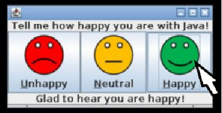
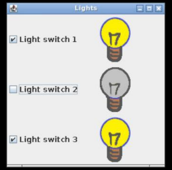
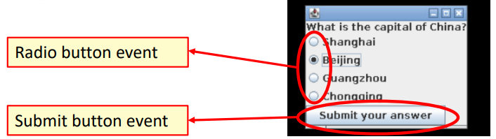
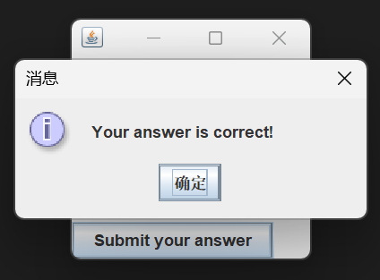

# Day 8: Event-driven programming 事件驱动编程  

## Session 1: Event listeners and event handlers 事件侦听器和事件处理程序  
- 目标：  
    - 能解释 Java 中事件驱动编程的概念  
    - 使用事件侦听器实现交互式图形用户界面元素  
    - 为不同的应用程序选择适当的事件监听器  

### Event listeners 事件侦听器  
- Java API 提供了多个事件监听器，可用于响应 Swing 组件等触发的事件，如  
    - **ActionListener 事件监听器**：监听由可点击组件（如按钮、组合框、菜单项、切换按钮等）触发的事件  
    - **ItemListener 项目监听器**：监听由实现 ItemSelectable 接口（如复选框、复选菜单项、组合框等）的组件触发的事件  
    - **WindowListener 窗口监听器**：监听某些窗口活动后触发的事件，如打开或关闭窗口、聚焦或散焦窗口、最大化窗口等  

### Action listeners 动作监听器  
- 每当用户执行一个操作（如点击按钮），就会发生一个操作事件  
- 要创建动作监听器对象，需要声明一个实现 ActionListener 接口的类或扩展一个实现 ActionListener 接口的类  
    - 通常使用组件的 `addActionListener()` 方法将动作监听器分配给图形用户界面组件；但是，实现细节取决于组件类  
    - 当动作事件发生时，程序会执行动作监听器的方法 `actionPerformed()`：你可以在该方法中实现所需的功能  
#### 使用动作监听器的按钮例  
基于 [Day 7 Session 3 - 按钮：JButton 类](07-3-Using_layouts_and_buttons_in_Swing.md#按钮jbutton-类) 中的示例代码  
```java
import javax.swing.*;
import javax.swing.border.*;
import java.awt.BorderLayout;
import java.awt.event.*;

public class ButtonExample2 {
    protected static JButton b1, b2, b3;
    protected static JLabel questionLabel, responseLabel;

    static class ActionHandler implements ActionListener {
        // 嵌套类（类内类）用于处理事件
        public void actionPerformed(ActionEvent e){
            // 执行指定动作
            if (e.getActionCommand().equals("happy")) {
                responseLabel.setText("Glad to hear you are happy!");
            } else if (e.getActionCommand().equals("neutral")) {
                responseLabel.setText("Thank you for your feedback!");
            } else if (e.getActionCommand().equals("unhappy")) {
                responseLabel.setText("Sorry to hear you are not happy.");
            }
        }
    }

    public static void main(String[] args) {
        ...
        responseLabel = ...
        ActionHandler actionHandler = new ActionHandler();
        ...
        // 设置动作命令并将动作监听器对象分配给按钮
        b1.setActionCommand("unhappy");
        b1.addActionListener(actionHandler);
        b2.setActionCommand("neutral");
        b2.addActionListener(actionHandler);
        b3.setActionCommand("happy");
        b3.addActionListener(actionHandler);
        ...
    }
}
```
  

### Item listener 项目监听器  
- 点击复选框时会发生项目事件  
- 要创建一个项目监听器对象，需要声明一个实现 ItemListener 接口的类或扩展一个实现 ItemListener 接口的类  
    - 项目事件发生时，程序会执行方法 `itemStateChanged(ItemEvent e)`  
    - 你可以通过调用 ItemEvent 方法 `getStateChange()` 来测试项目是否已选中或取消选中，该方法可以是 `ItemEvent.SELECTED` 或 `ItemEvent.DESELECTED`  
    - 你可以使用 `getSource()` 方法获取事件源按钮  
#### 使用项目监听器的复选框例  
基于 [Day 7 Session 3 - 复选框：JCheckBox 类](07-3-Using_layouts_and_buttons_in_Swing.md#复选框jcheckbox-类) 中的示例代码  
```java
...
import java.awt.event.*;

public class CheckBoxExample2 {
    public static void main(String[] args) {
        ...
        panel.setLayout(gridlayout);

        // 实现 itemStateChanged() 的匿名类，定义为项目监听器
        ItemListener itemHandler = new ItemListener() {
            public void itemStateChanged(ItemEvent e) {
                for (int i = 0; i < 3; i++) {
                    if (e.getSource() == cb[i]) {
                        if(e.getStateChange() == ItemEvent.SELECTED) {
                            lights[i].setIcon(lightOnIcon);
                        } else {
                            lights[i].setIcon(lightOffIcon);
                        }
                    }
                }
            }
        };

        for (int i = 0; i < 3; i++) {
            ...
            cb[i].addItemListener(itemHandler);
        }

        ...
    }
}
```
  

### 多个事件监听器  
- 在前面的示例中，我们使用了一个嵌套类或匿名类作为事件监听器  
    - 只有功能简单时才能正常工作  
- 还可以为不同组件实现多个事件监听器
    -   
#### 使用多个事件监听器的单选框例  
基于[Day 7 Session 3 - 单选按钮：JRadioButton 类](07-3-Using_layouts_and_buttons_in_Swing.md#单选按钮jradiobutton-类)中的示例代码  
```java
import javax.swing.*;
import java.awt.event.*;

public class RadioButtonExample2 {

    // 组件移至此处，以便事件监听器可以访问它们
    protected static JLabel question;
    protected static JButton submit;
    protected static JRadioButton rb[];
    protected static JFrame frame;
    protected static JPanel panel;
    protected static ButtonGroup group;

    // 单选按钮的 ActionListener（仅启用提交按钮，以防该按钮尚未启用）
    protected static class RadioListener implements ActionListener {
        public void actionPerformed(ActionEvent e) {
            submit.setEnabled(true);
        }
    }

    // 提交按钮的 ActionListener（检查答案是否正确）
    protected static class SubmitListener implements ActionListener {
        public void actionPerformed(ActionEvent e) {
            if (rb[1].isSelected()) {
                JOptionPane.showMessageDialog(frame, "Your answer is correct!");
            } else {
                JOptionPane.showMessageDialog(frame, "Your answer is incorrect!");
            }
            // 显示信息对话框后关闭框架并退出程序
            frame.dispatchEvent(new WindowEvent(frame, WindowEvent.WINDOW_CLOSING));
        }   
    }

    protected static SubmitListener submitListener;
    protected static RadioListener radioListener;

    public static void main(String[] args) {
        // 初始化窗口和布局
        frame = new JFrame();
        frame.setDefaultCloseOperation(JFrame.EXIT_ON_CLOSE);
        panel = new JPanel();
        BoxLayout boxlayout = new BoxLayout(panel, BoxLayout.Y_AXIS);
        panel.setLayout(boxlayout);

        question = new JLabel("What is the capital of China?");
        panel.add(question);

        // 初始化提交按钮并分配给动作监听器
        submit  = new JButton("Submit your answer");
        submit.setEnabled(false);
        submitListener = new SubmitListener();
        submit.addActionListener(submitListener);

        // 创建单选按钮
        rb = new JRadioButton[4];
        rb[0] = new JRadioButton("Shanghai");
        rb[1] = new JRadioButton("Beijing");
        rb[2] = new JRadioButton("Guangzhou");
        rb[3] = new JRadioButton("Chongqing");

        group = new ButtonGroup();
        radioListener = new RadioListener();
        for (int i = 0; i < 4; i++) {
            group.add(rb[i]); // 为按钮组指定单选按钮
            panel.add(rb[i]);
            rb[i].addActionListener(radioListener); // 将单选按钮分配给动作监听器
        }

        // 在面板上添加单选按钮并最终确定视图
        panel.add(submit);
        frame.add(panel);
        frame.pack();
        frame.setVisible(true);
    }
}
```
  