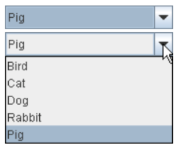
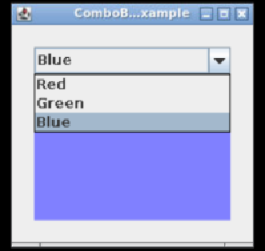
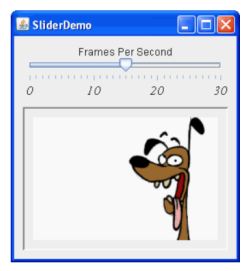
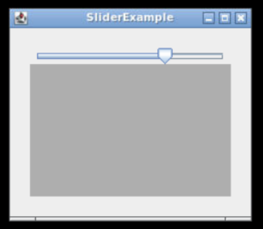
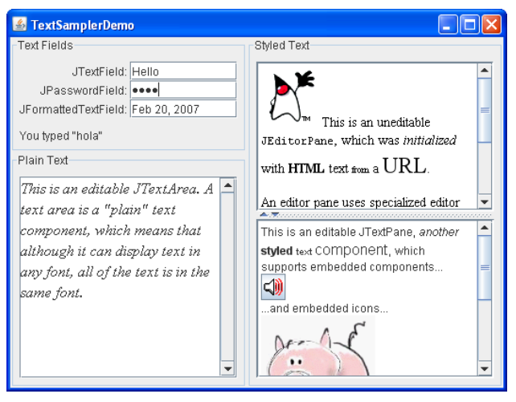
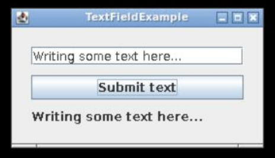
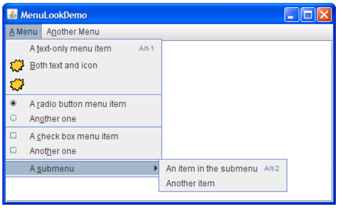
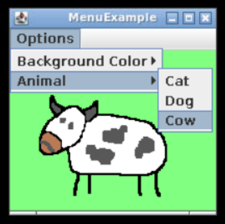

## Session 2: More examples of event handlers 更多事件处理程序的例子  

### Combo boxes 组合框：JComboBox  
- 组合框可让用户从下拉列表中选择多个选项之一  
    -   
    - 在 Swing 中，使用 **JComboBox** 组件创建组合框  
    - 组合框事件是 **ActionEvents**  
- 组合框的两种主要形式：不可编辑和可编辑  
- 参考：https://docs.oracle.com/javase/tutorial/uiswing/components/combobox.html  
#### 组合框例  
```java
import java.awt.*;
import java.awt.event.*;
import javax.swing.*;

public class ComboBoxExample extends JPanel 
                             implements ActionListener {
    // 视图初始化
    JLabel picture;
    public ComboBoxExample() {
        super(new BorderLayout());
        String[] colorStrings = {"Red", "Green", "Blue"};

        JComboBox<String> colorList = new JComboBox<>(colorStrings);
        colorList.setSelectedIndex(0);
        colorList.addActionListener(this);

        picture = new JLabel();
        picture.setOpaque(true);
        picture.setBackground(new Color(255, 128, 128));
        picture.setBorder(BorderFactory.createEmptyBorder(10, 0, 0, 0));
        picture.setPreferredSize(new Dimension(177, 122+10));

        add(colorList, BorderLayout.PAGE_START);
        add(picture, BorderLayout.PAGE_END);
        setBorder(BorderFactory.createEmptyBorder(20, 20, 20, 20));
    }

    // 事件监听器
    // - 组合框事件监听器
    // - 修改标签的颜色
    public void actionPerformed(ActionEvent e) {
        JComboBox cb = (JComboBox)e.getSource();
        String colorName = (String)cb.getSelectedItem();

        if (colorName.equals("Red"))
            picture.setBackground(new Color(255, 128, 128));
        else if (colorName.equals("Green"))
            picture.setBackground(new Color(128, 255, 128));
        else if (colorName.equals("Blue"))
            picture.setBackground(new Color(128, 128, 255));
    }

    // 入口点
    private static void createAndShowGUI() {
        JFrame frame = new JFrame("ComboBoxExample");
        frame.setDefaultCloseOperation(JFrame.EXIT_ON_CLOSE);
        JComponent newContentPane = new ComboBoxExample();
        newContentPane.setOpaque(true);
        frame.setContentPane(newContentPane);
        frame.pack();
        frame.setVisible(true);
    }

    public static void main(String[] args) {
        javax.swing.SwingUtilities.invokeLater(new Runnable() {
            public void run() {
                createAndShowGUI();
            }
        });
    }
}
```
  

### Sliders 滑块：JSlider  
- 滑块可用于提供有最小值和最大值限制的数值输入  
    - 在 Swing 中，使用 JSlider 组件创建滑块  
    - JSlider 事件是 ChangeListener 监听的 ChangeEvent 对象  
-   
#### 滑块例  
```java
import java.awt.*;
import javax.swing.event.*;
import javax.swing.*;

public class SliderExample extends JPanel
                           implements ChangeListener {
    JLabel picture;

    // 视图初始化  
    public SliderExample() {
        super(new BorderLayout());

        JSlider brightness = new JSlider(JSlider.HORIZONTAL, 0, 255, 128);
        brightness.addChangeListener(this);

        picture = new JLabel();
        picture.setOpaque(true);
        picture.setBackground(new Color(128, 128, 128));
        picture.setBorder(BorderFactory.createEmptyBorder(10, 0, 0, 0));
        picture.setPreferredSize(new Dimension(177, 122+10));

        add(brightness, BorderLayout.PAGE_START);
        add(picture, BorderLayout.PAGE_END);
        setBorder(BorderFactory.createEmptyBorder(20, 20, 20, 20));
    }

    // 事件监听器
    // - 滑块事件（ChangeEvent）的监听器
    // - 改变标签的亮度
    public void stateChanged(ChangeEvent e) {
        JSlider slider = (JSlider)e.getSource();
        int value = (int)slider.getValue();
        picture.setBackground(new Color(value, value, value));
    }

    ...
}
```
  

### Text fields 文本字段  
- 文本组件（如 JTextArea 和 JTextPane）可以编辑  
    - 必要时，可使用方法 getText() 获取编辑过的文本  
    - 您可以为文本组件添加 actionListener，但通常没有必要  
-   
- 参考：  
    - https://docs.oracle.com/javase/tutorial/uiswing/components/textfield.html  
    - https://docs.oracle.com/javase/tutorial/uiswing/components/editorpane.html  
#### 带交互的文本字段例  
```java
...

public class TextFieldExample extends JPane;
                              implements ActionListener {
    JTextField textField;
    JButton submitButton;
    JLabel output;

    public TextFieldExample() {
        super(new BorderLayout(10, 10));
        textField = new JTextField(30);
        submitButton = new JButton("Submit text");
        submitButton.addActionListener(this);
        output = new JLabel(" ");

        add(textField, BorderLayout.PAGE_START);
        add(submitButton, BorderLayout.CENTER);
        add(output, BorderLayout.PAGE_END);
        setBorder(BorderFactory.createEmptyBorder(20, 20, 20, 20));
    }

    // 输出文本字段中写入的文本
    public void actionPerformed(ActionEvent e) {
        output.setText(textField.getText());
    }

    ...
}
```
  

### 为菜单项添加功能  
- [Day 7 Session 4 - 菜单组件](07-4-More_JComponents.md#菜单组件)中，我们演示了如何在菜单栏中添加项目  
    - 还可以在菜单中使用图标、单选按钮和复选框
    -   
- 我们可以使用 ActionListener 来处理来自菜单项的事件，就像来自按钮的事件一样  
#### 菜单例  
```java
import javax.swing.*;
import java.awt.*;
import java.awt.event.*;

public class MenuExample2 implements ActionListener{
    // 视图初始化
    JMenu menu, submenu1, submenu2;
    JMenuItem i1, i2, i3, i4, i5;
    JLabel label;
    ImageIcon catIcon, dogIcon, cowIcon;

    MenuExample2() {
        JFrame f = new JFrame("MenuExample");
        f.setDefaultCloseOperation(JFrame.EXIT_ON_CLOSE);

        // 初始化菜单和子菜单
        JMenuBar mb = new JMenuBar();
        menu = new JMenu("Options");
        submenu1 = new JMenu("Background Color");
        submenu2 = new JMenu("Animal");

        // 创建菜单项
        i1 = new JMenuItem("Yellow");
        i2 = new JMenuItem("Green");
        i3 = new JMenuItem("Cat");
        i4 = new JMenuItem("Dog");
        i5 = new JMenuItem("Cow");

        // 菜单中的“Background Color”部分
        submenu1.add(i1);
        submenu1.add(i2);
        // 菜单中的“Animal”部分
        submenu2.add(i3);
        submenu2.add(i4);
        submenu2.add(i5);

        menu.add(submenu1);
        menu.add(submenu2);
        mb.add(menu);
        f.setJMenuBar(mb);

        // 最终确定视图（finalise view）
        label = new JLabel();
        catIcon = new ImageIcon("cat.png");
        dogIcon = new ImageIcon("dog.png");
        cowIcon = new ImageIcon("cow.png");
        label.setOpaque(true);
        label.setBackground(new Color(255, 255, 255));
        label.setPreferredSize(new Dimension(200, 200));
        label.setIcon(catIcon);
        f.getContentPane().add(label, BorderLayout.CENTER);

        // 为菜单项指定动作监听器
        i1.addActionListener(this);
        i2.addActionListener(this);
        i3.addActionListener(this);
        i4.addActionListener(this);
        i5.addActionListener(this);

        f.setSize(200, 200);
        f.setVisible(true);
    }

    // 事件监听器
    public void actionPerformed(ActionEvent e) {
        // 子菜单 1：更改背景颜色
        if ((JMenuItem)e.getSource() == i1)
            label.setBackground(new Color(255, 255, 128));
        else if ((JMenuItem)e.getSource() == i2)
            label.setBackground(new Color(128, 255, 128));
        // 子菜单 2：更改动物图标
        else if ((JMenuItem)e.getSource() == i3)
            label.setIcon(catIcon);
        else if ((JMenuItem)e.getSource() == i4)
            label.setIcon(dogIcon);
        else if ((JMenuItem)e.getSource() == i5)
            label.setIcon(cowIcon);
    }

    public static void main(String[] args) {
        new MenuExample2();
    }
}
```
  

### 延伸阅读  
- Swing 中定义了大量的 GUI 组件和布局等，我们只介绍了其中最重要的几种  
- 有关更多示例，参阅 Java 官方文档：
    - Components 组件：https://docs.oracle.com/javase/tutorial/uiswing/components/index  
    - Event listeners 事件监听器：https://docs.oracle.com/javase/tutorial/uiswing/events/index.html  