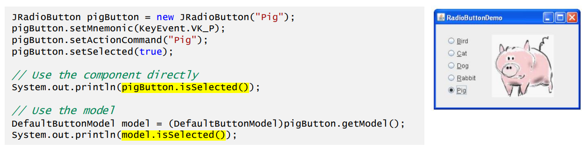
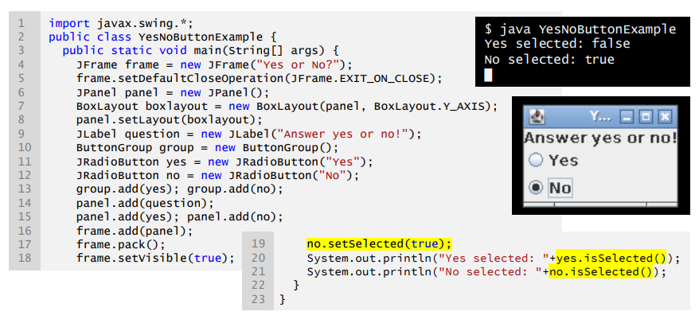
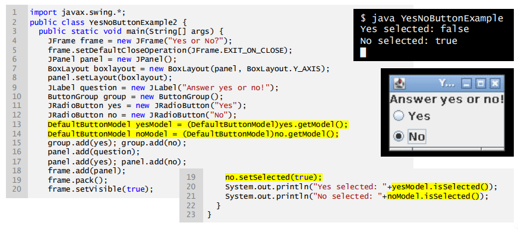
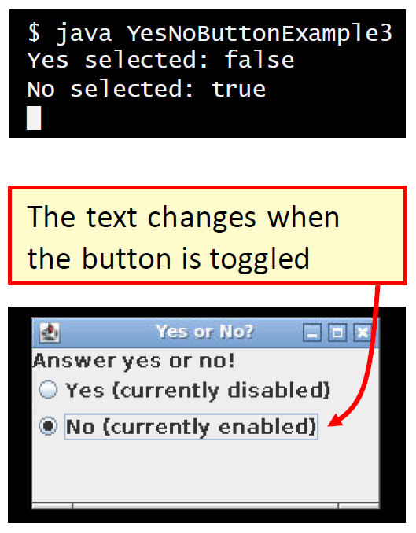
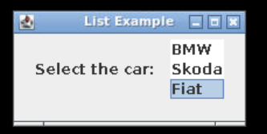

# Day 9: Advanced Swing  
- 目标  
    - 能在 Java GUI 实施中使用 Swing 模型  
    - 能在 JList 和 JTable 组件中实现自定义功能  

## Session 1: Models in Swing | Swing 中的模型  

### Swing 模型  
- 模型存储组件的状态（如助记符\[mnemonics\]、是否启用、是否选中等）和数据（如列表中显示的项目）  
    - 大多数 Swing 组件都有预定义的模型  
- 某些组件（如列表）有多种模型  
    - 例如，JList 使用 ListModel 和 ListSelectionModel  
- 对于简单的组件（如按钮），你通常会直接与组件交互，而对于更复杂的组件（如列表和表格），与模型交互是更好的选择  

### 为什么使用模型？
- 如果采用 MVC 模式，模型可将数据从视图和控制器中分离出来  
- 可对默认模型进行扩展，从而在决定如何存储和检索数据时提供自定义功能和灵活性  
- 模型会自动向所有已注册的监听器传播更改，从而更新视图（即 GUI）  

### 使用模型 vs. 直接使用组件  
- 在 Java 中，有不同的方法可以实现相同的结果  
    -   
- 大多数从 JComponent 继承而来的组件类默认都有一个模型，可以使用 getModel() 方法访问该模型  
#### 直接与单选按钮交互  
  
#### 通过模型与按钮交互  
  

### 定义和使用自定义模型  
#### 定义  
```java
import javax.swing.*;

// 自定义单选按钮模型应继承切换按钮模型
class CustomButtonModel extends JToggleButton.ToggleButtonModel {
    private AbstractButton button;
    private String text;

    CustomButtonModel(AbstractButton button) {
        this.button = button;
        text = button.getText();
    }

    // 增加功能的新方法
    public void printStatus() {
        System.out.println(text + " selected: " + isSelected());
    }

    // 覆盖方法可实现额外功能
    @override
    public void setSelected(boolean b) {
        if (b) {
            button.setText(text + " (currently enabled)");
        } else {
            button.setText(text + " (cuurently disabled)");
        }

        super.setSelected(b);
    }
}

// 下一部分继续…
```  
#### 使用  
```java
// 接上一部分…

public class YesNoButtonExample2 {
    public static void main(String[] args) {
        ...

        JRadioButton yes = new JRadioButton("Yes");
        JRadioButton no = new JRadioButton("No");

        // 实例化自定义模型并分配给单选按钮对象
        CustomButtonModel yesModel = new CustomButtonModel(yes);
        CustomButtonModel noModel = new CustomButtonModel(no);
        yes.setModel(yesModel);
        no.setModel(noModel);

        ...

        yes.setSelected(false);
        no.setSelected(true);

        // 使用自定义模型 printStatus()
        yesModel.printStatus();
        noModel.printStatus;
    }
}
```
  

### 使用模型进行复杂交互  
- 在 JButton 等简单组件中使用模型的好处通常有限，但在复杂组件中，模型是必不可少的  
    - 通过 JList 和 JTable 等组件，模型可实现更复杂的功能和交互  
    - 模型还有利于组件之间的互动  
#### 直接使用 JList 的简单例  
JList 实例向用户展示一组项目，显示在一列或多列中，供用户选择  
```java
import java.awt.event.*;
import java.awt.*;
import javax.swing.*;

class SimpleListExample {
    public static void main(String[] args) {
        JFrame frame = new JFrame("List Example");
        JPanel panel = new JPanel();
        JLabel label = new JLabel("Select the car: ");

        String cars[] = {"BMW", "Skoda", "Fiat"};
        // 注意，你需要定义 JList 中项的类型（本例中为字符串）
        JList<String> list = new JList<>(cars);
        list.setSelectedIndex(2);

        panel.add(label);
        panel.add(list);
        frame.add(panel);
        frame.setSize(300, 200);
        frame.setVisible(true);
    }
}
```
  

#### 在自己的类中直接使用 JList  
你可以在 JList 中存储自己类的实例，但需要覆盖 toString() 方法，以控制项目的显示方式  
```java
...

class Car {
    private String make;
    public Car(String make) { this.make = make; }

    // 覆盖 toString() 方法
    @override
    public String toString() { return make; }
}

...

        Car cars[] = { new Car("BMW"),
                       new Car("Skoda"),
                       new Car("Fiat") };
        JList<Car> list = new JList<>(Cars);

...
```
  