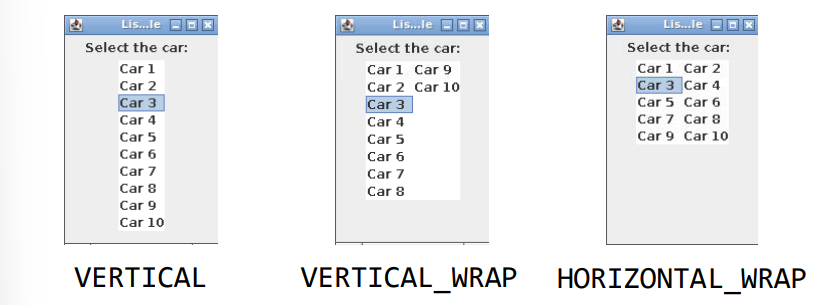
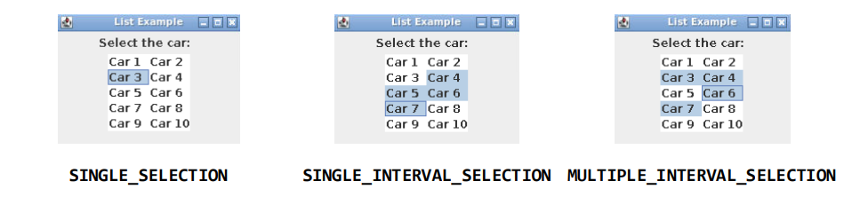
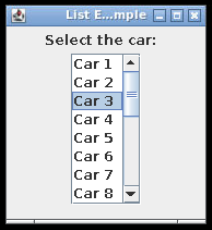
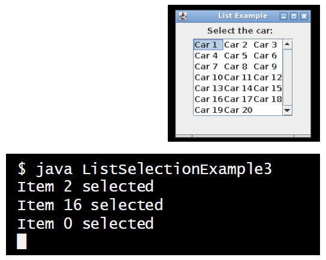
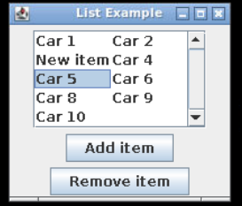
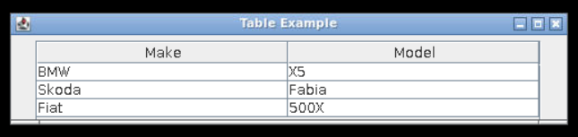
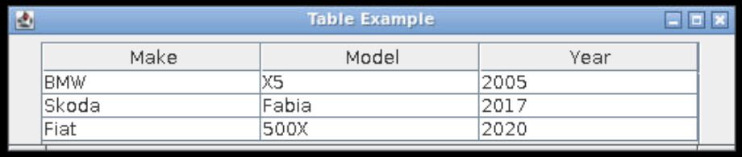
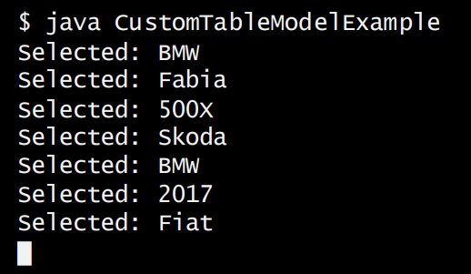
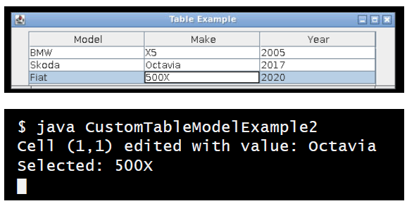

## Session 2: Using JList and JTable with models 在 JList 和 JTable 中使用模型  

### JList 的模型  
- JList 有不同的预定义模型  
    - **ListModel**：存储有关列表中显示的数据项和列表状态的信息。要初始化 ListModel，你必须  
        - 使用 **DefaultListModel** 类 - 一切都会安排妥当  
        - 扩展 **AbstractListModel** 类 - 管理数据并调用 fire 方法
            - 必须实现从 ListModel 接口继承的 `getSize()` 和 `getElementAt()` 方法  
        - 实现 **ListModel** 接口 - 由你管理一切  
    - **ListSelectionModel**: 管理列表数据项的选择  
#### 使用 DefaultListModel 初始化 JList  
你可以使用 DefaultListModel 添加项目并初始化 JList  
```java
...

class Car {
    private String make;

    public Car (String make) { this.make = make; }

    @override
    public String toString() { return make; }
}

...

        DefaultListModel<Car> cars = new DefaultListModel<>();
        cars.addElement(new Car ("BMW"));
        cars.addElement(new Car ("Skoda"));
        cars.addElement(new Car ("Fiat"));
        JList<Car> list = new JList<>(cars);

...
```

### 使用不同的 JList 布局  
- 使用方法 setLayoutOrientation() 可以为 JList 选择不同的布局  
    
#### 垂直（Vertical） JList 布局例  
- `JList.VERTICAL` 指定单列垂直布局（默认布局）  
- ```java
  ...

      DefaultListModel<Car> cars = new DefaultListModel<>();

      for (int i = 0; i < 10; i++) {
          cars.addElement(new Car("Car " + (i + 1)));
      }

      JList<Car> list = new JList<>(cars);
      list.setLayoutOrientation(JList.VERTICAL);

  ...
  ```
#### Vertical wrap JList 布局例  
- `JList.VERTICAL_WRAP` 类似“报纸风格”布局，单元格先是垂直排列，然后水平排列  
- ```java
  list.setLayoutOrientation(JList.VERTICAL);
  ```
#### Horizontal wrap JList 布局例  
- `JList.HORIZONTAL_WARP` 单元格先是水平排列，然后垂直排列  
- ```java
  list.setLayoutOrientation(JList.HORIZONTAL_WRAP);
  ```

### 使用不同 JList 选择模式  
- 使用方法 setSelectionMode() 可以为 JList 选择不同的选择模式  
-   
  *单个选择 | 单区间选择（一次选择连续多行） | 多区间选择（一次选择任意多行）*  
#### 单个选择例  
- `ListSelectionModel.SINGLE_SELECTION` 表示一次只能选择一个项目  
- ```java
  ...

      DefaultListModel<Car> cars = new DefaultListModel<>();

      for (int i = 0; i < 10; i++) {
          cars.addElement(new Car("Car " + (i + 1)));
      }

      JList<Car> list = new JList<>(cars);

      list.setLayoutOrientation(
          ListSelectionModel.SINGLE_SELECTION
      );

  ...
  ```
#### 单区间选择例  
- `ListSelectionModel.SINGLE_INTERVAL_SELECTION` 表示每次只能选择一个连续的区间  
- ```java
  list.setLayoutOrientation(
      ListSelectionModel.SINGLE_INTERVAL_SELECTION
  );
  ```
#### 多区间选择例  
- `ListSelectionModel.MULTIPLE_INTERVAL_SELECTION` 表示可以自由选择项目（默认模式）  
- ```java
  list.setLayoutOrientation(
      ListSelectionModel.MULTIPLE_INTERVAL_SELECTION
  );
  ```

### 在列表中使用滚动条  
- 某些元素（如 JLists）可能有很多项目，因此可能无法在为其预留的可见区域中显示  
    - 将该组件添加到滚动窗格中，即可启用滚动条  
- JScrollPane 对象提供了组件的可滚动视图  
    - 你可以将 JList 对象（或任何其他 JComponent）作为参数传递给构造函数，从而将其添加到 JScrollPane 对象中  
    - 附加参数可用于进一步控制滚动条的行为（例如，滚动条是始终可见，还是仅在内容不适合可见区域时才可见）  
#### 带有滚动条的列表例  
- 只需创建一个以列表为参数的滚动窗格，并将其添加到面板中即可  
    - ```java
      ...

          DefaultListModel<Car> cars = new DefaultListModel<>();

          for (int i = 0; i < 20; i++) {
              cars.addElement(new Car("Car " + (i + 1)));
          }

          JList<Car> list = new JList<>(cars);
          JScrollPane listPane = new JScrollPane(list);

          panel.add(label);
          panel.add(listPane);

      ...
      ```
    -   
- 使用另一个带有垂直和水平滚动条参数的构造函数，强制垂直滚动条始终可见  
    - ```java
      JScrollPane listPane = new JScrollPane(list,
          ScrollPaneConstants.VERTICAL_SCROLLBAR_ALWAYS,
          ScrollPaneConstants.HORIZONTAL_SCROLLBAR_AS_NEEDED);
      ```

### 添加列表选择监听器  
- 要处理列表选择事件，使用 ListSelectionModel 注册 ListSelectionListener  
    - 检查事件的 getValueIsAdjusting() 值，确保监听器不会对错误类型的事件做出反应  
- ```java
  ...

      ListSelectionModel lsModel = list.getSelectionModel();
      lsModel.addListSelectionListener(new ListSelectionListener() {
          @override
          public void valueChanged(ListSelectionEvent e) {
              if (e.getValueIsAdjusting() == false) {
                  System.out.println("Item " + list.getSelectedIndex() + " selected.");
              }
          }
      });

  ...
  ```
    

### 添加和移除列表项  
- 可使用 ListModel 对象的 remove(index) 和 insertElementAt(item,index) 方法动态删除和添加列表项  
    - 注意，这些方法不会检查索引是否有效：你需要确保您没有从空列表中移除索引，或在列表末尾之外添加索引！  
#### 添加/移除项目例  
```java
...

    JButton removeButton = new JButton("Remove item");
    JButton addButton = new JButton("Add item");

    // 注意，如果在未选择任何项目的情况下试图删除该项目，则会出现异常 
    removeButton.addActionListener(new ActionListener() {
        @override
        public void actionPerformed(ActionEvent e) {
            cars.remove(list.getSelectedIndex());
        }
    });

    addButton.addActionListener(new ActionListener() {
        cars.insertElementAt(new Car("New item"), list.getSelectedIndex());
    });
```
  

### 使用 JTable 组件  
- 通过 JTable 类，你可以创建数据的表格视图  
    - 一个 JTable 实例向用户展示了一组以表格形式排列的项目，其中有行和列  
    - 用户也可选择编辑表格数据  
    - 表格可能会很复杂，我们将只讨论基本问题  
- 通过向 JTable 构造函数传递列名和数据，可以直接初始化表格  
    - 所有单元格均可编辑，数据将被视为字符串  
    - 这种方法只适用于事先已掌握数据的情况  
#### 直接使用 JTable 的简单例  
```java
import java.awt.event.*;
import java.awt.*;
import javax.swing.*;

class SimpleTableExample {
    public static void main(String[] args) {
        JFrame frame = new JFrame("Table Example");
        JPanel panel = new JPanel();

        String cols[] = {"Make", "Model"};
        String cars[][] = { {"BMW", "X5"},
                            {"Skoda", "Fabia"},
                            {"Fiat", "500x"} };
        JTable table = new JTable(cars, cols);
        JScrollPane sp = new JScrollPane(table);

        panel.add(sp);
        frame.add(panel);
        frame.setSize(500, 100);
        frame.setVisible(true);
    }
}
```
  

### JTable 的模型  
- 与 JList 一样：要使用表格模型，必须  
    - 使用 **DefaultTableModel** 类 - 一切都会安排妥当  
        - 扩展 **AbstractTableModel** 类 - 管理数据并调用 fire 方法
            - 必须实现从 TableModelinterface 继承的 getRowCount()、getColumnCount() 和 getValueAt() 方法。  
        - 实现 **TableModel** 接口 - 由你管理一切  
#### 通过自定义表格模型使用 JTable  
```java
import javax.swing.*;
import javax.swing.table.AbstractTableModel;

class MyTableModel extends AbstractTableModel {
    private String[] columnNames = {"Model", "Make", "Year"};
    private Object[][] data = {{"BMW", "X5", Integer.valueOf(2005)},
                               {"Skoda", "Fabia", Integer.valueOf(2017)},
                               {"Fiat", "500x", Integer.valueOf(2020)}};

    public int getRowCount() {
        return data.length;
    }
    public int getColumnCount() {
        return columnNames.length;
    }
    public String getColumnName(int col) {
        return columnNames[col];
    }
    public Object getValueAt(int row, int col) {
        return data[row][col];
    }
}

public class CustomTableModelExample {
    public static void main(String[] args) {
        JFrame frame = new JFrame("Table Example");
        JPanel panel = new JPanel();

        MyTableModel model = new MyTableModel();
        JTable table = new JTable(model);

        JScrollPane sp = new JScrollPane(table);

        panel.add(sp);
        frame.add(panel);
        frame.setSize(500, 100);
        frame.setVisible(true);
    }
}
```
  

#### 在表格中使用选择监听器  
`ListSelectionListener` 接口可用于监听选择事件，如用户选择单元格  
```java
...
import javax.swing.event.ListSelectionEvent;
import javax.swing.event.ListSelectionListener;

...

    public static void main(String[] args) {
        ...

        ListSelectionModel lsModel = table.getSelectionModel();
        lsModel.addListSelectionListener(new ListSelectionListener() {
            public void valueChanged(ListSelectionEvent e) {
                if (e.getValueIsAdjusting) {
                    System.out.println("Selected: " + table.getValueAt(
                        table.getSelectedRows()[0],
                        table.getSelectedColumns()[0]).toString());
                }
            }
        });

        ...
    }
```
  

#### 使用自定义模型的可编辑单元格  
要使用从 AbstractTableModel 扩展的模型编辑单元格，需要实现 `isCellEditable()` 和 `setValueAt()` 方法  
```java
...

class MyTableModel extends AbstractTableModel {
    ...

    public boolean isCellEditable(int row, int col) {
        return True;
    }

    public void setValueAt(Object value, int row, int col) {
        data[row][col] = value;
        fireTableCellUpdated(row, col);
        System.out.println("Cell (" + row + ", " + col + ") edited with value: " + value.toString());
    }
}
```
  