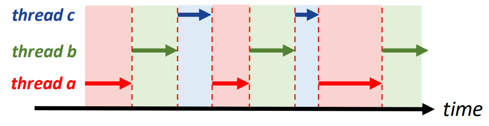
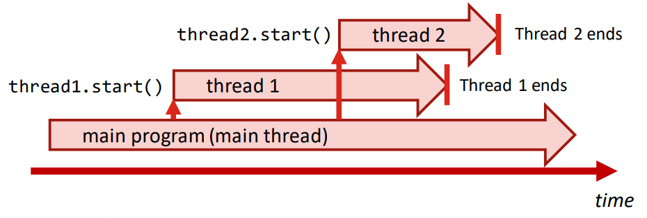
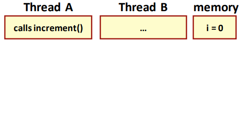
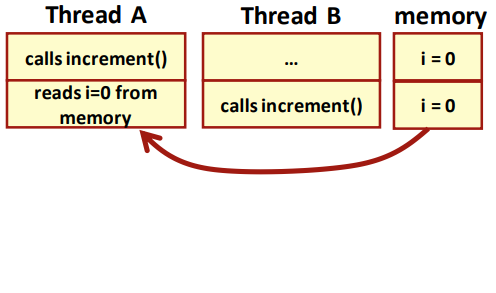
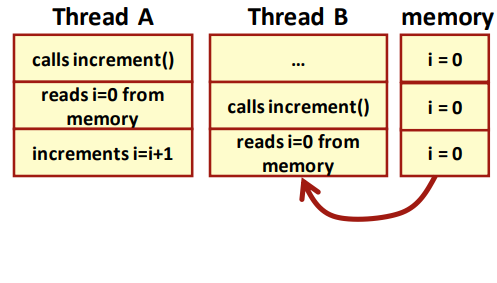
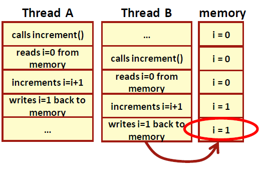
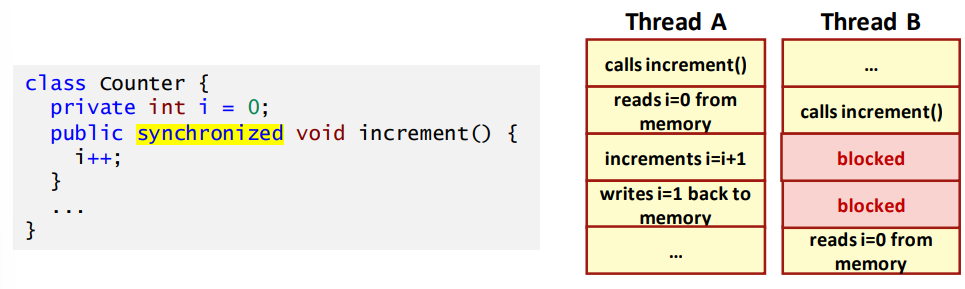
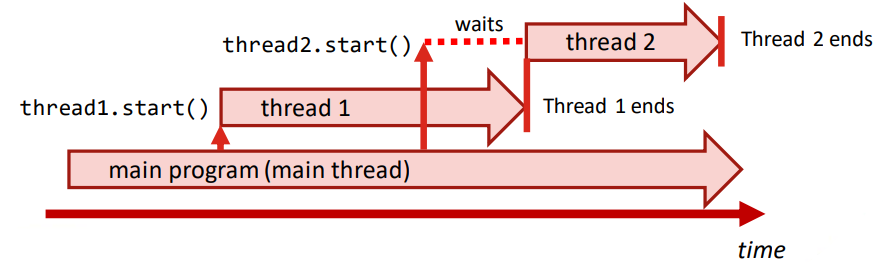

# Day 10: Concurrency and multithreading 并发和多线程  
- 目标  
    - 能解释并发和多线程的概念  
    - 能使用 Thread 超类在 Java 中定义和使用线程  
    - 能使用 Swing API 在 Swing 应用程序中实现多线程  
    - 能在多线程应用程序中实现避免线程干扰和死锁的基本技术  

## Session 1: Basics of concurrency 并发基础知识  

### Concurrent programming 并行编程  
- 在并发编程中，程序代码块（如方法）在重叠的时间段内同时执行  
- 并发编程中有两个基本执行单元  
    - **进程（Processes）**：每个进程都有一个自足的执行环境（完整、私有的运行时资源集，即自己的内存空间）  
    - **线程（Threads）**：每个线程都存在于进程中（每个进程至少有一个线程），因此线程共享进程的资源，包括内存和打开的文件  
    - 在 Java 编程中，我们主要关注线程

### Context switching 上下文切换
- 在操作系统中，多线程通常是通过上下文切换来实现的  
    - 线程以循环方式使用短时段运行（每个线程轮流运行），造成 CPU 多任务处理的假象  
    -   

### Java 中的多线程（multithreading）  
- 在 Java 中，可以通过扩展类 Thread 来使用线程  
    - 要执行的代码在重载（即覆盖 overridden）方法 `run()` 中实现  
    - 使用方法 `start()` 启动线程  
-   
#### 多线程的简单例子  
```java
public class TestThreads {
    static void printList(int n) {
        for (int i = 1; i <= 5; i++) {
            System.out.print(i * n + " ");
        }
        System.out.println();
    }

    public static void main(String[] args) {
        Thread thread1 = new Thread() {
            // 通过覆盖类线程中的 run() 方法来实现线程
            public void run() {
                // 打印数字 1、2、3、4、5
                TestThreads.printList(1);
            }
        };

        Thread thread2 = new Thread() {
            public void run() {
                // 打印数字 10、20、30、40、50
                TestThreads.printList(10);
            }
        };

        // 使用 start() 方法启动线程
        thread1.start();
        thread2.start();
    }
}
```
输出：  
```shell
$ java TestThreads
10 20 1 30 2 40 3 50 
4 5
$
```

### Thread interference 线程干扰  
- 线程同时访问相同数据时可能会相互干扰，导致内存不一致  
    - ```java
      class Counter {
          private int i = 0;
          public void increment() {
              i++;
          }
      }
      ```
    1.   
    2.   
    3. 
    4. 
#### 解决方案：synchronisation 同步  
- 同步是线程干扰的一种解决方案  
  

### 同步线程  
- 当多个线程独立运行时，事情可能会以意想不到的顺序发生  
    - 使用关键字 synchronized 会“锁定”方法的执行，并强制其他线程等待执行完成  
    -   
#### 同步多线程  
```java
public class TestThreads {
    // 加入关键字 synchronized
    synchronized static void printList(int n) {
        ...
    }

    public static void main(String[] args) {
        ...

        thread1.start();
        thread2.start(); // thread2 会等待 thread1 结束后再启动
    }
}
```
输出：  
```shell
$ java TestThreads2
1 2 3 4 5
10 20 30 40 50 
$
```

### 带有 `sleep()` 的线程  
```java
public class TestThreads3 {
    static void countDown() {
        System.out.print("Seconds to launch: ");
        for (int i = 10; i > 0; i--) {
            System.out.print(i + " ");
            try {
                // Thread 类的静态方法 sleep() 会暂时停止线程，并在参数设置的时间（毫秒）过后继续运行
                Thread.sleep(1000);
            } catch (Exception e) {}
        }
        System.out.println("WHOOOSSH!");
    }

    public static void main(String[] args) {
        Thread thread1 = new Thread() {
            public void run() {
                TestThreads3.countDown();
            }
        };

        thread1.start();
    }
}
```
输出：  
```shell
$ java TestThreads3
Seconds to launch: 10 9 8 7 6 5 4 3 2 1 WHOOOSSH! # 数字将以一秒为间隔显示！
$
```

### 线程生命周期  
- 线程可以处于不同状态；终止后，线程无法再次启动（但可以创建新线程）  
    -   

### 多线程中的中断  
- 当 Java 线程处于等待状态时，例如在调用 sleep() 方法后，另一个线程可以尝试通过调用 `interrupt()` 方法来中断它：在这种情况下，会抛出 ***InterruptedException*** 异常  
    - *InterruptedException* 是一种经过检查的异常，因此在调用 `sleep()` 时需要使用异常处理程序（try...catch 结构）  
#### InterruptedException 例  
```java
public class TestThreads4 {
    static void countDown() {
        System.out.print("Seconds to launch: ");
        for (int i = 10; i > 0; i--) {
            System.out.print(i + " ");
            try {
                Thread.sleep(1000);
            } catch (InterruptedException e) {
                // 在本例中，线程在处理完中断异常后继续正常运行
                System.out.print("interrupt ");
                // 而如果换成 return ，线程会在中断异常后停止运行
            }
        }
        System.out.println("WHOOOSSH!");
    }

    public static void main(String[] args) {
        Thread thread1 = new Thread() {
            public void run() {
                TestThreads4.countDown();
            }
        };

        thread1.start();
        thread1.interrupt();
    }
}
```
输出：  
```
$ java TestThreads3
Seconds to launch: 10 interrupt 9 8 7 6 5 4 3 2 1 WHOOOSSH!
$
```