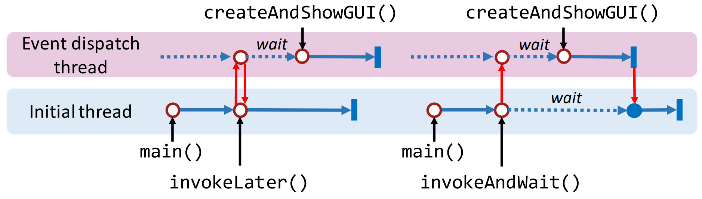
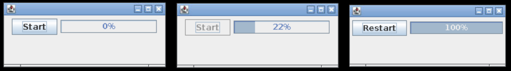

## Session 2: Concurrency with Swing | Swing 的并发性  

### Swing 的并发性  
- 编写精良的 Swing 程序可利用并发功能创建永不“冻结”的用户界面，即程序始终对用户交互做出响应  
    - 注意，Swing 类中的大多数方法都不是“线程安全”（thread safe）的：你需要确保在同一线程中处理对这些方法的所有调用，以避免出现内存一致性错误（memory consistency errors）  
- Swing 程序员需要处理三种不同的线程  
    - *初始线程（initial threads）*，执行初始应用代码  
    - *事件调度线程（event dispatch threads）*，用于执行处理事件的代码  
    - *工作线程（worker threads）*，执行耗时的后台任务  
#### Initial threads 初始线程  
- 在 Swing 程序中，初始线程通常只是创建一个实现 Runnable 接口的对象，用于初始化图形用户界面，并安排该对象在事件派发线程上执行  
    - 通过调用 SwingUtilities 软件包的 `invokeLater()` 或 `invokeAndWait()` 方法来安排图形用户界面创建任务  
    - 这两种方法都只接受一个参数，即定义新任务的 Runnable 对象  
    - 这两种方法的不同之处在于，`invokeLater()` 只是调度任务并返回，而 `invokeAndWait()` 则是等待调度的任务完成后才返回  
- InvokeLater 例：  
  ```java
  import java.awt.event.*;
  import javax.swing.*;

  public class InvokeLaterExample {
      private static void CreateAndShowGUI() {
          System.out.println("Creating GUI...");

          try {
              Thread.sleep(1000); // 假设创建 GUI 需要一秒钟
          } catch (Exception e) {
              e.printStackTrace();
          }

          System.out.println("GUI created!");
      }

      public static void main(String[] args) {
          javax.swing.SwingUtilities.invokeLater(new Runnable() {
              public void run() {
                  CreateAndShowGUI();
              }
          });

          System.out.println("invokeLater() completed!");
      }
  }
  ```
  输出：  
  ```shell
  $ java InvokeLaterExample
  invokeLater() completed!  # 在调度新 Runnable 执行后，InvokeLater() 立即返回
  Creating GUI...
  GUI created!              # 一秒后 createAndShowGUI() 执行完毕
  ```
- InvokeAndWait 例  
  ```java
  ...

  public static void main(String[] args) {
    try {
        javax.swing.SwingUtilities.invokeAndWait(new Runnable() { ... });
    } catch (Exception e) { ... }

    System.out.println("invokeAndWait() completed!");
  }
  ```
  输出：  
  ```shell
  $ java InvokeLaterExample
  Creating GUI...
  GUI created!
  invokeAndWait() completed!    # 在 createAndShowGUI() 完成之前，InvokeAndWait() 不会返回
  $
  ```
#### 小结：invokeLater 和 invokeAndWait  
- 方法 invokeLater() 是*异步的*（asynchronous，即 non-blocking 非阻塞），而 invokeAndWait() 是*同步的*（synchronous，即 blocking 阻塞）  
-   

### Event dispatch threads 事件分派线程  
- 由于大多数 Swing 对象方法都不是“线程安全”的，因此从多个线程调用这些方法会导致线程干扰的风险  
    - 在 API 规范中，一些 Swing 组件方法被标注为“线程安全”，可以从任何线程安全地调用它们  
    - 所有其他 Swing 组件方法都必须从*事件分派线程*调用  
        - 忽略这一规则的程序可能会在大多数时间内正常运行，但很容易出现难以跟踪和重现的不可预测的错误  
        - 事件分派线程上的任务必须快速完成；否则，未处理的事件就会倒流，用户界面也会变得反应迟钝  
#### 事件分派线程例  
```java
import java.awt.event.*;
import javax.swing.*;

public class EventDispatcherExample {
    private static void createAndShowGUI() {
        System.out.println("Creating GUI in " + 
            Thread.currentThread()); // 静态方法 currentThread() 可以获取当前线程的信息
        System.out.println("Is event dispatch thread: " + 
            SwingUtilities.isEventDispatchThread());
            // 静态方法 isEventDispatchThread() 可以确定当前是否处于事件派发线程中

        JFrame frame = new JFrame("Event Dispatch Demo");
        frame.setDefaultCloseOperation(JFrame.EXIT_ON_CLOSE);

        JButton button = new JButton("Press Me!");
        button.addActionListener(new ActionListener() {
            public void actionPerformed(ActionEvent e) {
                System.out.println("Button event in " + Thread.currentThread());
                System.out.println("Is event dispatch thread: " + SwingUtilities.isEventDispatchThread());
            }
        });

        frame.add(button);
        frame.pack();
        frame.setVisible(true);
    }

    ...
}
```
  

输出：  
```shell
$ java EventDispatcherExample
Creating GUI in Thread[AWT-EventQueue-0,6,main]
Is event dispatch thread: true
Button event in Thread[AWT-EventQueue-0,6,main]
Is event dispatch thread: true
$
```

### 工作线程和 SwingWorker  
- 当 Swing 程序需要执行一个长期运行的任务时，它通常会使用一个*工作线程 worker thread*，也称为*后台线程 background thread*  
    - 在工作线程上运行的每个任务都由抽象类 **SwingWorker** 的子类实例表示  
- SwingWorker 的生命周期涉及三个线程  
    - 当前线程（通常是事件派发线程）：调用 `execute()` 方法来安排 SwingWorker 的执行时间  
    - 工作线程：调用 `doInBackground()` 方法，所有后台活动都应在此进行  
    - 事件派发线程：SwingWorker 在该线程上调用 `process()` 和 `done()` 方法  
#### SwingWorker 例  
```java
import javax.swing.*;
import javax.swing.SwingUtilities.*;
import javax.swing.SwingWorker.*;
import java.awt.*;
import java.awt.event.*;
import java.beans.*;

public class SwingWorkerExample {
    private static SwingWorker createrWorker() {
        return new SwingWorker() {
            // 对于 SwingWorker 对象，你需要重载 doInBackground() 方法，以执行要执行的后台任务
            @Override
            protected Boolean doInBackground() throws Exception {
                setProgress(0);
                // 在这个示例中，唯一的任务是增加一个计数器，并每秒更新进度两次
                for (int i = 0; i <= 100; i++) {
                    Thread.sleep(500);
                    setProgress(i);
                }
                return false;
            }
        };
    }

    private static void createAndShowGUI() {
        JFrame frame = new JFrame();
        JPanel panel = new JPanel();

        // 创建带有按钮和进度条的用户界面
        JButton button = new JButton("Start");
        JProgressBar progBar = new JProgressBar(0, 100);
        progBar.setValue(0);
        progBar.setStringPainted(true);

        panel.add(button);
        panel.add(progBar);

        frame.add(panel);
        frame.setDefaultCloseOperation(JFrame.EXIT_ON_CLOSE);
        frame.setLocationRelativeTo(null);
        frame.setSize(250, 100);
        frame.setVisible(true);

        // 供稍后使用的 worker 对象变量
        SwingWorker worker;

        // 为按钮添加 ActionListener，以便在按下按钮时创建并执行 SwingWorker 对象
        button.addActionListener(new ActionListener() {
            @Override
            public void actionPerformed(ActionEvent e) {
                button.setEnabled(false);
                progBar.setValue(0);
                SwingWorker worker = createrWorker();

                // 为 worker 添加 PropertyChangeListener，以处理来自 worker 线程的进度和状态更新
                worker.addPropertyChangeListener(new PropertyChangeListener() {
                    public void propertyChange(PropertyChangeEvent e) {
                        if ("progress".equals(e.getPropertyName())) {
                            // 当工作线程调用 setProgress() 方法时更新进度条
                            progBar.setValue((Integer)e.getNewValue());
                        }
                        else if ("state".equals(e.getPropertyName())) {
                            if (e.getNewValue() == StateValue.DONE) {
                                // 工作线程完成后重新初始化按钮
                                button.setText("Restart");
                                button.setEnabled(true);
                            }
                        }
                    }
                });
                worker.execute();
            }
        });
    }

    // main() 方法调用 invokeLater() 创建 GUI 并启动应用程序
    public static void main(String[] args) {
        SwingUtilities.invokeLater(new Runnable() {
            public void run() {
                createAndShowGUI();
            }
        });
    }
}
```
  