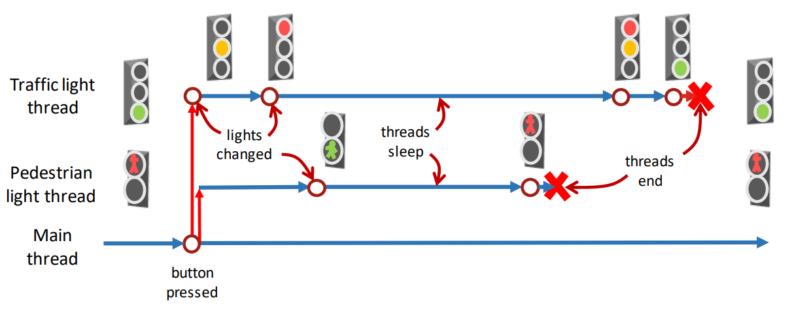

## Session 3: Timed events and synchronisation 定时事件和同步  

### 定时实践的多线程处理  
- 线程可用于执行定时事件  
#### 例：交通信号灯
- 行人按下按钮即可请求绿灯并启动信号灯周期  
- 我们可以将行人和交通信号灯周期作为两个线程来实施  
    
- 代码：  
  ```java
  import javax.swing.*;
  import java.awt.*;
  import java.awt.event.*;

  // 汽车红绿灯
  class TrafficLights extends JPanel {
      JLabel topLight, middleLight, bottomLight;
      ImageIcon off, red, yellow, green;

      TrafficLights() {
          off = new ImageIcon("traffic_off.png");
          red = new ImageIcon("traffic_red.png");
          yellow = new ImageIcon("traffic_yellow.png");
          green = new ImageIcon("traffic_green.png");

          // 默认状态：绿灯
          topLight = new JLabel();
          topLight.setIcon(off);
          middleLight = new JLabel();
          middleLight.setIcon(off);
          bottomLight = new JLabel();
          bottomLight.setIcon(green);

          GridLayout gridLayout = new GridLayout(3, 1);
          setLayout(gridLayout);
          add(topLight);
          add(middleLight);
          add(bottomLight);
      }

      // 设置绿灯
      public void setGreen() {
          topLight.setIcon(off);
          middleLight.setIcon(off);
          bottomLight.setIcon(green);
      }

      // 设置黄灯
      public void setYellow() {
          topLight.setIcon(off);
          middleLight.setIcon(yellow);
          bottomLight.setIcon(off);
      }

      // 设置红灯
      public void setRed() {
          topLight.setIcon(red);
          middleLight.setIcon(off);
          bottomLight.setIcon(off);
      }

      // 设置红灯+黄灯
      public void setRedAndYellow() {
          topLight.setIcon(red);
          middleLight.setIcon(yellow);
          bottomLight.setIcon(off);
      }
  }

  // 行人红绿灯
  class PedestrianLights extends JPanel implements ActionListener {
      JLabel topLight, bottomLight;
      JButton button;
      ImageIcon off, wait, go;
      String status;
      TrafficLights trafficLights;

      PedestrianLights(TrafficLights t1) {
          trafficLights = t1;
          status = new String("wait");
          off = new ImageIcon("traffic_off.png");
          wait = new ImageIcon("traffic_wait.png");
          go = new ImageIcon("traffic_go.png");

          // 默认状态：等待（红灯）
          topLight = new JLabel();
          topLight.setIcon(wait);
          bottomLight = new JLabel();
          bottomLight.setIcon(off);
          button = new JButton("Press");

          GridLayout gridLayout = new GridLayout(3, 1);
          setLayout(gridLayout);
          add(topLight);
          add(bottomLight);
          add(button);

          button.addActionListener(this);
      }

      // 设置通行（绿灯）
      public void setGo() {
          topLight.setIcon(off);
          bottomLight.setIcon(go);
          status = new String("go");
      }

      // 设置等待（红灯）
      public void setWait() {
          topLight.setIcon(wait);
          bottomLight.setIcon(off);
          status = new String("wait");
      }

      public void startCycle() {
          // 汽车红绿灯运行周期
          // -> 黄灯 -> 红灯 -> 红灯+黄灯 -> 绿灯
          Thread trafficThread = new Thread(new Runnable() {
              @Override
              public void run() {
                  try {
                      trafficLights.setYellow();
                      Thread.sleep(2000);
                      trafficLights.setRed();
                      Thread.sleep(5000);
                      trafficLights.setRedAndYellow();
                      Thread.sleep(1000);
                      trafficLights.setGreen();
                      button.setEnabled(true);
                  } catch (InterruptedException e) {
                      e.printStackTrace();
                  }
              }
          });

          // 行人红绿灯运行周期
          // -> 通行 -> 等待
          Thread pedestrianThread = new Thread(new Runnable() {
              @Override
              public void run() {
                  try {
                      button.setEnabled(false);
                          // 禁用按钮是为了避免新周期在旧周期停止前启动
                      Thread.sleep(3000);
                      setGo();
                      Thread.sleep(3000);
                      setWait();
                  } catch (InterruptedException e) {
                      e.printStackTrace();
                  }
              }
          });

          trafficThread.start();
          pedestrianThread.start();
      }

      public void actionPerformed(ActionEvent e) {
          startCycle();
      }
  }

  public class TrafficLightExample {
      // 创建并展示 GUI
      private static void createAndShowGUI() {
          JComponent trafficLights = new TrafficLights();
          trafficLights.setOpaque(true);
          JComponent pedestrianLights = new PedestrianLights((TrafficLights)trafficLights);
          pedestrianLights.setOpaque(true);

          JFrame plFrame = new JFrame("Pedestrian Lights");
          plFrame.setDefaultCloseOperation(JFrame.EXIT_ON_CLOSE);
          JFrame tlFrame = new JFrame("Traffic Lights");
          tlFrame.setDefaultCloseOperation(JFrame.EXIT_ON_CLOSE);

          plFrame.add(pedestrianLights);
          plFrame.pack();
          plFrame.setLocation(50, 50);
          plFrame.setVisible(true);
          tlFrame.add(trafficLights);
          tlFrame.pack();
          tlFrame.setLocation(300, 50);
          tlFrame.setVisible(true);
      }

      public static void main(String[] args) {
          javax.swing.SwingUtilities.invokeLater(new Runnable() {
              public void run() {
                  createAndShowGUI();
              }
          });
      }
  }
  ```

### 同步：使用 `wait()` 和 `notify()`  
- 通过 `Object.wait()` 和 `Object.notifyAll()` 可以控制从线程访问 Object 类或 Object 子类的对象（基本上是任何对象）  
    - 方法 `wait()` 会暂停当前线程的运行，直到另一个线程为同一对象发出通知，它才可以继续运行  
    - 方法 `notifyAll()` 会向所有其他线程发送通知，以便它们可以继续运行  
    - 方法 `notify()` 与 `notifyAll()` 类似，但只通知随机选择的一个线程
#### 同步信号灯例  
- 当交通信号灯线程独立运行且计时错误时，汽车的绿灯有可能过早亮起  
    -   
    - 我们应确保这些灯光不会相互冲突  
- 我们可以同步线程，使汽车的红绿灯始终等待行人的红灯再次亮起  
    - 
- 修改代码：  
  ```java
  ...
  
  class PedestrianLights extends JPanel implements ActionListener {
      ...

      public void startCycle() {
          // 我们为交通灯和行人灯定义了 Thread 的自定义子类
          TrafficLightThread tlCycle = new TrafficLightThread(this, t1);
          PedestrianLightThread plCycle = new PedestrianLightThread(this);
          // 注意，线程是同步的，因此 plCycle 在等待状态下启动
          tlCycle.start();
          plCycle.start();
      }

      public void actionPerformed(ActionEvent e) {
          disableButton();
          startCycle();
      }
  }

  class TrafficLightThread extends Thread {
      private PedestrianLights pl;
      private TrafficLights tl;
      public TrafficLightThread(PedestrianLights pl, TrafficLights tl) {
          this.pl = pl;
          this.tl = tl;
      }

      @Override
      public void run() {
          // 注意，这个线程是在等待状态下启动的，因为它是同步的，而且是在另一个线程之后启动的
          synchronized (pl) {
              try {
                  tl.setYellow();
                  Thread.sleep(2000);
                  tl.setRed();

                  // 方法 notifyAll() 和 wait() 必须位于 synchronized() 代码块内，以避免出现异常
                  pl.notifyAll();
                  pl.wait();

                  t1.setRedAndYellow();
                  Thread.sleep(1000);
                  t1.setGreen();
                  pl.enableButton();
              } catch (InterruptedException e) {
                  e.printStackTrace();
              }
          }
      }
  }

  ...
  ```

### Producer-consumer model 生产者—消费者模式  
- 说明同步重要性的一个常见例子是*生产者—消费者问题（producer-consumer problem）*  
    - *生产者*线程生产数据并将其添加到缓冲区中  
    - *消费者*线程消耗数据并从缓冲区中删除数据  
    - 如果不同步，线程可能会尝试同时添加和删除数据，从而导致问题出现  
    - 
      <i>生产者 | 缓冲区 | 消费者</i>  
#### 生产者—消费者模式例  
```java
...

// 生产者线程
class Producer extends Thread {
    private ArrayList<String> buffer;
    private JLabel label;

    public Producer(ArrayList<String> buffer, JLabel label) {
        this.buffer = buffer;
        this.label = label;
    }

    @Override
    public void run() {
        for (int i = 0; i < 100; i++) {
            synchronized (buffer) {
                String text = new String("Text" + i);
                String.out.println("Produced text: " + text);
                buffer.add(text);
                label.setText(text)
            }
            
            try {
                // 模拟制作文本项目之间的随机间隔
                Random r = new Random();
                Thread.sleep(r.nextInt(800));
            } catch (InterruptedException e) {
                e.printStackTrace();
            }
        }
    }
}

// 消费者线程  
class Consumer extends Thread {
    private ArrayList<String> buffer;
    private JLabel label;

    public Consumer(ArrayList<String> buffer, JLabel label) {
        this.buffer = buffer;
        this.label = label;
    }

    @Override
    public void run() {
        while (true) {
            synchronized (buffer) {
                if (!buffer.isEmpty()) {
                    String text = buffer.remove(0);
                    System.out.println("Consumed text: " + text);
                    label.setText(text);
                }
            }

            try {
                // 模拟处理消耗的物品所需的 1s
                Thread.sleep(1000);
            } catch (InterruptedException e) {
                e.printStactTrace();
            }
        }
    }
}

// GUI
public class ProducerConsumerExample {
    private static void createAndShowGUI() {
        // 创建缓冲区
        ArrayList<String> buffer = new ArrayList<>();

        JPanel producerPanel = new JPanel();
        producerPanel.setOpaque(true);
        JLabel prodInfo = new JLabel("String produced:");
        JLabel prodLabel = new JLabel();

        ...

        JPanel consumerPanel = new JPanel;
        consumerPanel.setOpaque(true);
        JLabel consInfo = new JLabel("String consumed:");
        JLabel consLabel = new JLabel();

        ...

        // 创建并启动生产者和消费者线程
        Producer prodThread = new Producer(buffer, prodLabel);
        prodThread.start();
        Consumer consThread = new Consumer(buffer, consLabel);
        consThread.start();

        ...
    }

    ...
}
```
- GUI：  
    
- 输出：  
  ```shell
  $ java ProducerConsumerExample
  Produced text: Text 0
  Consumed text: Text 0
  Produced text: Text 1
  Produced text: Text 2
  Produced text: Text 3
  Produced text: Text 4
  Consumed text: Text 1
  Produced text: Text 5
  Produced text: Text 6
  Produced text: Text 7
  Consumed text: Text 2
  ```