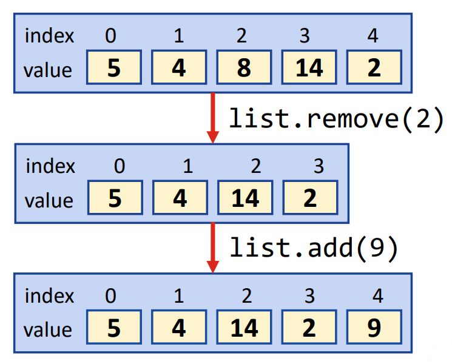

## Session 4: The basics of collections 集合基础  

### 集合  
- 任何一组单独的物体，作为一个整体，被称为物体*集合（collection）*  
    - 例如，动物园可以定义为动物的集合  
- 在 Java 中，定义了一个单独的框架 *（collection framework 集合框架）* 来处理集合的数据结构  
    - 集合的主要类和接口包含在 java.util.Collection 和 java.util.Map 包中  

### 集合的接口  
  
- `Collection<E>`：列表、队列和集合等集合的根接口  
    - `Set<E>`：不能包含重复元素的集合  
    - `List<E>`：可包含重复元素的有序集合  
    - `Queue<E>`：先入先出的集合模式*等待队伍*  
- `Map<K, V>`：将键与值关联的集合，不能包含重复的键，不是从集合派生而来  

### 集合 vs. 数组  
- 与数组不同，集合：  
    - 可以存储同质和异质数据类型  
    - 规模可以不断扩大  
    - 运行速度比数组慢  
    - 不能存储原始类型（int、char 等）  
- 集合定义了许多支持方法，在内存空间使用方面是更好的选择  

### List 列表  
- 有两种类型的列表类：ArrayList 和 LinkedList  
- 对 List 进行迭代时，会保留元素的顺序  
-   
#### ArrayList 数组列表  
- 通常是列表实现的最佳选择  
- 通过调用 `list.get(index)` 访问元素  
- 通过调用 `list.remove(index)` 删除元素  
- 通过调用 `list.add(data)` 添加元素  
-   
#### ArrayList 例  
```java
import java.util.*;

public class ArrayListExample {
    public static void main(String[] args) {
        // 我们通过 List 接口来引用 ArrayList，这样就有了更大的灵活性：如果我们后来发现 LinkedList 更合适，也很容易更改
        ArrayList<String> nameList = new ArrayList<String>();

        System.out.println("initial size: " + nameList.size());

        nameList.add("Bob");
        nameList.add("Cecilia");
        nameList.add("Alice");
        nameList.add("Daniel");
        System.out.println("new size: " + nameList.size());

        nameList.add("Edward");
        System.out.println("Final name list:");
        for (int i = 0l i < nameList.size(); i++) {
            System.out.print(nameList.get(i) + " ");
        }
        System.out.println("");
    }
}
```
输出：  
```shell
$ java ArrayListExample
initial size: 0
new size: 4
new size: 3
Final name list:
Bob Alice Daniel Edward
$ 
```
#### Iterators 迭代器  
- Iterator 类对象可用于循环浏览集合  
    - “迭代”（Iterating）是循环的专业术语  
    - 方法 `iterator()` 可用来获取任何集合的迭代器对象  
    - 迭代器的 `hasNext()` 和 `next()` 方法可用于循环浏览集合  
- 注意，<u>如果使用集合的某个方法修改了集合，迭代器会立即失效</u>  
    - 然后，使用迭代器抛出 ConcurrentModificationException  
    - 有助于避免两个线程同时修改集合  
#### 迭代器例  
```java
import java.util.*;
public class IteratorExample {
    public static void main(String[] args) {
        ArrayList<String> nameList = new ArrayList<String>();

        nameList.add("Bob");
        nameList.add("Cecilia");
        nameList.add("Alice");
        nameList.add("Deniel");

        Iterator<String> iterator = namelist.iterator();
        while (iterator.hasNext()) {
            System.out.println(iterator.next());
            // nameList.remove(0); // 这个操作**不会**生效
            // iterator.remove(0); // 这个操作会生效
        }
        System.out.println("Size: " + nameList.size());
    }
}
```
输出：  
- 当 `nameList.remove(0);` 和 `iterator.remove(0);` 未加入代码时  
  ```shell
  $ java IteratorExample
  Bob
  Cecilia
  Alice
  Daniel
  Size: 4
  $
  ```
- 当仅 `iterator.remove(0);` 加入代码时  
  ```shell
  $ java IteratorExample
  Bob
  Cecilia
  Alice
  Daniel
  Size: 0
  $
  ```
#### LinkedList 链表  
- 始于*头（head）*，终于*尾（tail）*  
- 元素与下一个元素相连  
- 高效插入和删除，但不利于内存  
- 通过调用 `list.get(index)` 访问元素  
- 通过调用 `list.add(data)` 或 `list.push(data)` 添加元素  
-   
#### LinkedList 例  
```java
import java.util.*;

public class LinkedListExample {
    public static void main(String[] args) {
        LinkedList<String> nameList = new LinkedList<String>();

        nameList.push("Bob");           // 在数组头插入
        nameList.add("Daniel");         // 在数组尾插入
        nameList.addFirst("Alice");     // 在数组头插入
        nameList.add(2, "Cecilia");

        System.out.println("Name list:");
        for (int i = 0; i < nameList.size(); i+=) {
            System.out.print(nameList.get(i) + " ");
        }
        System.out.println("");
    }
}
```
输出：  
```shell
$ java LinkedListExample
Name list:
Alice Bob Cecilia Daniel
$
```
#### ArrayList vs. LinkedList
- 基本上，这两种列表都能做同样的事情：它们的主要区别在于数据的内部表示法  
    - 在 ArrayList 中，查找某个索引处的元素更快，因为元素是按固定顺序排列在内存中的  
    - 在 LinkedList 中，添加和删除元素的速度更快，因为无需在内存中移动大块数据  
- 选择取决于应用  
    - 如果经常需要添加和删除元素，则 LinkedList 更好  
    - 如果只需要修改元素而不需要添加或删除元素，那么 ArrayList 更好  

### 集合中的几个重要方法  
| 方法 | 描述 |
| --- | --- |
| `sort()` | 对列表元素排序 |
| `binarySearch()` | 使用高效的二分搜索算法（binary search algorithm）定位列表中的元素 |
| `reverse()` | 反转列表元素 |
| `shuffle()` | 随机调整列表元素的顺序 |
| `fill()` | 设置列表中的每个元素，使其指向特定对象 |
| `copy()` | 将引用（references）从一个列表复制到另一个列表 |
#### 扑克牌例  
```java
import java.util.*;

class Card {
    public enum Face {Ace, Two, Three, Four, Five, Six, Seven,
                      Eight, Nine, Ten, Jack, Queen, King}
    public enum Suit {Clubs, Diamonds, Spades, Hearts}

    private final Face face;
    private final Suit suit;

    public Card(Face face, Suit suit) {
        this.face = face;
        this.suit = suit;
    }

    public Face getFace() { return face; }
    public Suit getSuit() { return suit; }
    public String toString() {
        return String.format("%s of %s", face, suit);
    }
}

public class DeckOfCards {
    private List<Card> cards;

    public DeckOfCards() {
        Card deck[] = new Card[52];
        int count = 0;
        for (Card.Suit suit: Card.Suit.values()) {
            for (Card.Face face: Card.Face.values()) {
                deck[count++] = new Card(face, suit);
            }
        }
        cards = Arrays.asList(deck);    // 将数组转换为列表
        Collections.shuffle(cards);
    }

    public void printCards() {
        for (int i = 0; i < 52; i++) {
            System.out.printf("%-19s%s", cards.get(i), ((i+1) % 4 == 0) ? "\n" : "");
        }
    }

    public static void main(String[] args) {
        DeckOfCards deck = new DeckOfCards();
        deck.printCards();
    }
}
```
输出：  
```shell
Jack of Spades     Three of Spades    Ace of Spades      Five of Clubs      
Ten of Spades      Seven of Hearts    Six of Clubs       Six of Spades      
Queen of Clubs     Five of Spades     Queen of Diamonds  King of Spades     
Ten of Hearts      Jack of Hearts     Five of Hearts     Five of Diamonds   
Six of Diamonds    Ten of Clubs       Ace of Diamonds    Nine of Clubs      
Three of Diamonds  Seven of Diamonds  Four of Hearts     Two of Diamonds    
Two of Spades      Two of Hearts      Nine of Spades     Seven of Clubs     
Eight of Spades    King of Diamonds   Eight of Clubs     Queen of Spades    
Three of Clubs     Three of Hearts    Seven of Spades    Nine of Hearts     
King of Clubs      Jack of Diamonds   Ace of Clubs       Ten of Diamonds
Four of Diamonds   Four of Spades     Jack of Clubs      Ace of Hearts
Two of Clubs       Nine of Diamonds   King of Hearts     Eight of Hearts
Six of Hearts      Eight of Diamonds  Queen of Hearts    Four of Clubs
```
#### `sort()` 和 `binarySearch()` 例  
```java
import java.util.*;

public class BinarySearchExample {
    public static void main(String[] args) {
        String[] names = {"Bob", "Alice", "Edward", "Cecilia", "David", "Frank"};
        List<String> list = new ArrayList<>(Arrays.asList(names));

        Collections.sort(list);
        for (String name: list) {
            System.out.println(name);
        }

        int index = Collections.bindaySearch(list, "Edward");
        System.out.printf("Index of Edwars is %d\n", index);
    }
}
```
输出：  
```shell
$ java BinarySearchExample
Alice
Bob
Cecilia
David
Edward
Frank
Index of David is 3
$
```