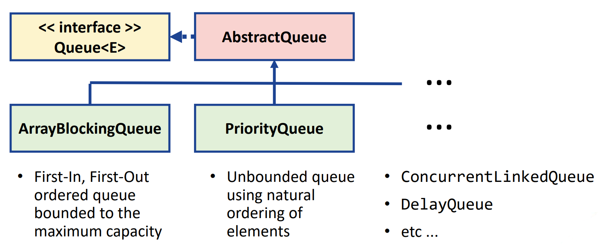

# Day 12: Advanced collections 高级集合  
- 目标  
    - 能使用 Java 集合框架中定义的队列、集合和映射，在 Java 应用程序中实施基本数据结构和算法  
    - 使用 Java 集合框架为搜索和排序算法实施自定义比较器  

## Session 1: Queues and sets 队列和集合  

### Queues 队列  
- 通常，队列中的元素以 FIFO（先进先出）方式排序  
- 调用 `queue.offer(data)` 插入元素  
- 调用 `queue.peek()` 访问顶层元素  
- 调用 `queue.poll()` 移除顶层元素  
-   

### 不同的队列  
-   
- ArrayBlockingQueue：以最大容量为界的先进先出队列  
  ```java
  import java.util.concurrent.*;
  import java.util.*;

  public class ArrayBlockingQueueExample {
      public static void main(String args[]) {
          Random random = new Random();
          ArrayBlockingQueue<Double> queue = new ArrayBlockingQueue<>(5); // 最大容量为 5
          while (queue.offer(random.nextDouble())) {}
          while (queue.size() > 0) {
              System.out.printf("%.2f\n", queue.peek());
              queue.poll();
          }
      }
  }
  ```
  输出：  
  ```shell
  $ java ArrayBlockingQueueExample
  0.94
  0.98
  0.54
  0.52
  0.62
  $
  ```
- PriorityQueue：使用元素自然排序的无界队列  
  ```java
  import java.util.*;

  public class PriorityQueueExample {
      public static void main(String[] args) {
          PriorityQueue<Double> queue = new PriorityQueue<>();
          queue.offer(9.2);
          queue.offer(5.1);
          queue.offer(12.7);
          queue.offer(0.8);

          while (queue.size() > 0) {
              System.out.printf("%.1f\n", queue.peek());
              queue.poll();
          }
      }
  }
  ```
  输出（留意元素的顺序）：  
  ```shell
  $ java PriorityQueueExample
  0.8
  5.1
  9.2
  12.7
  $
  ```
- ConcurrentLinkedQueue  
- DelayQueue  
- ...  

### Sets 集合  
- **集合**是不包含重复元素的集合（collections）  
- 对集合进行遍历时，除非是排序集合，否则无法保证元素的顺序  
-   

### HashSet 哈希集合  
- HashSet（哈希集合）中的索引是通过哈希函数计算的  
- 访问元素的方法是遍历集合  
- 调用 `set.contains()` 检查集合是否包含元素  
- 调用 `set.add(data)` 添加元素  
-   
#### HashSet 例  
```java
import java.util.*;

public class HashSetExample {
    public static void main(String[] args) {
        String[] names = {"Bob", "Alice", "Bob", "Cecilia", "David", "Frank"}; // 存在两个 Bob
        List<String> list = Arrays.asList(names);
        Set<String> set = new HashSet<>(list);
        System.out.println("The neme list without duplicates:");

        for (String name: set) {
            System.out.println(name);
        }
    }
}
```
输出：  
```shell
$ java HashSetExample
The name list without duplicates:
Cecilia
Bob
Alice
David
Frank
$
```
#### LinkedHashSet 例  
LinkedHashSet 与 HashSet 类似，只是保留了元素的顺序  
```java
import java.util.*;

public class LinkedHashSetExample {
    public static void main(String[] args) {
        String[] names = {"Bob", "Alice", "Bob", "Cecilia", "David", "Frank"}; // 存在两个 Bob
        List<String> list = Arrays.asList(names);
        Set<String> set = new LinkedHashSet<>(list);
        System.out.println("The neme list without duplicates:");

        for (String name: set) {
            System.out.println(name);
        }
    }
}
```
输出：  
```shell
$ java LinkedHashSetExample
The name list without duplicates:
Bob
Alice
Cecilia
David
Frank
$
```

### TreeSet 数集  
- 处理大量分类数据的理想选择  
- 用*红黑色自平衡二叉树（red-black self-balancing binary tree）* 存储数据  
- 调用 `set.contains()` 检查集合是否包含元素  
- 通过调用 `tree.first()`、`tree.last()` 或遍历集合来访问元素  
- 调用 `tree.add(data)` 添加元素  
-   
#### TreeSet 例  
```java
import java.util.*;

public class TreeSetExample {
    public static void main(String[] args) {
        String[] names = {"Bob", "Alice", "Cecilia", "David", "Eric", "Frank"};
        List<String> list = Arrays.asList(names);
        SortedSet<String> set = new TreeSet<String>(list);

        System.out.println("Names before Cecilia");
        for (String name: set.headSet("Cecilia")) {
            System.out.println(name);
        }

        System.out.println("Names from Cecilia");
        for (String name: set.tailSet("Cecilia")) {
            System.out.println(name);
        }

        System.out.println("First name: " + set.first());
        System.out.println("Last name: " + set.last());
    }
}
```
输出：  
```shell
$ java TreeSetExample
Names before Cecilia:
Alice
Bob
Names from Cecilia:
Cecilia
David
Eric
Frank
First name: Alice
Last name: Frank
$
```
#### 示例的内部表示法  
  

### 集合小结  
- 通常，可以使用不同类型的集合来完成相同的任务  
- 然而，不同的集合有不同的优点和缺点  
    - 搜索、添加和删除元素的复杂性  
    - 提供不同的排序、“洗牌”和反转等方法  
- 集合为许多任务提供了高效的内置数据结构和算法：无需重新造轮子！  