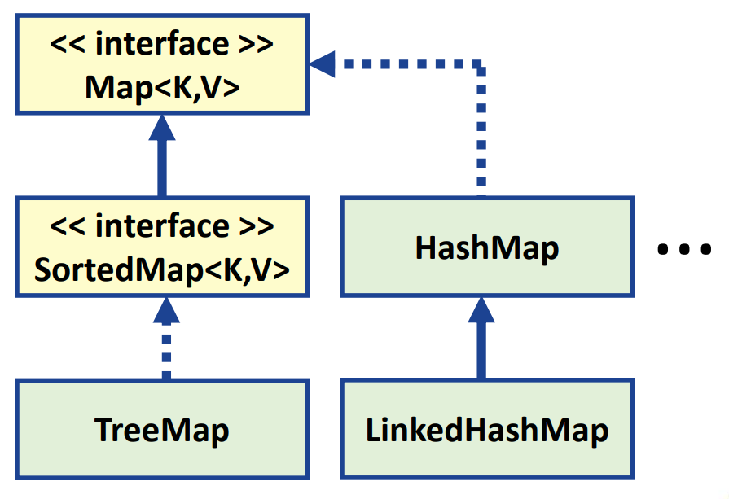
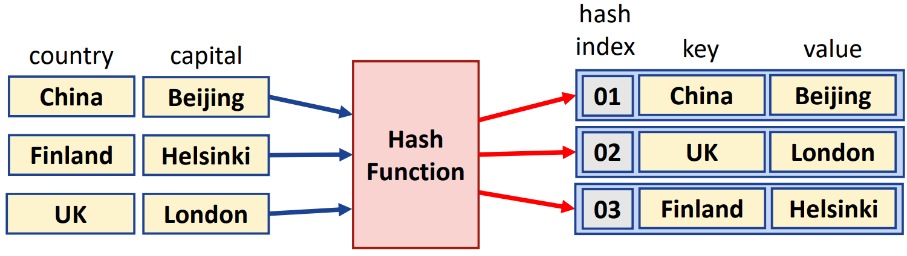
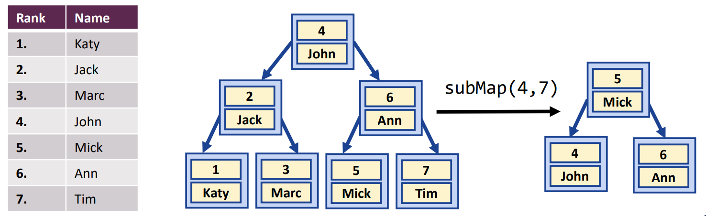

## Session 2: Maps and comparators  

### Maps  
-  
- Map 元素由*键（keys，K）* 和*值（values，V）* 组成  
- 遍历 HashMap 时，不保证元素的顺序  
- LinkedHashMap 则会保留输入的顺序  

### HashMap  
- 不能包含重复的键（但允许有重复的值）  
- 使用方法 `map.get(key)` 访问元素，使用 `map.put(key,value)` 添加元素，使用 `containsKey()` 测试 key 是否存在  
-   
#### HashMap 例  
```java
import java.util.*;

public class HashMapExample {
    public static void main(String[] args) {
        HashMap<String, String> capitalMap = new HashMap<>();
        Scanner input = new Scanner(System.in);

        capitalMap.put("China", "Beijing");
        capitalMap.put("UK", "London");
        capitalMap.put("Finland", "Helsinki");
        capitalMap.put("USA", "Washington DC");
        capitalMap.put("India", "New Delhi");
        capitalMap.put("Germany", "Berlin");

        System.out.print("Give a name of a country: ");
        String country = input.nextLine();
        String capital = capitalMap.get(country);

        if (capital != null) {
            System.out.printf("Capital of %s is %s!\n", country, capital);
        } else {
            System.out.printf("Sorry, I don't know the capital of %s.\n", country);
        }
    }
}
```
输出：  
```shell
$ java HashMapExample
Give name of a country: China
Capital of China is Beijing!
$
```
#### LinkedHashMap 例  
注意 HashMap 和 LinkedHashMap 对象的顺序不同！  
```java
import java.util.*;

public class LinkedHashMapExample {
    public static void main(String[] args) {
        HashMap<Integer, String> olympics = new HashMap<>();
        olympics.put(2008, "Beijing");
        olympics.put(2012, "London");
        olympics.put(2016, "Rio de Janeiro");
        olympics.put(2020, "Tokyo");

        System.out.println("Recent summer Olympics (HashMap):");
        System.out.println(olympics);

        olympics = new LinkedHashMap<>();
        olympics.put(2008, "Beijing");
        olympics.put(2012, "London");
        olympics.put(2016, "Rio de Janeiro");
        olympics.put(2020, "Tokyo");

        System.out.println("Recent summer Olympics (LinkedHashMap):");
        System.out.println(olympics);
    }
}
```
输出：  
```shell
$ java LinkedHashMapExample
Recent summer olympics (HashMap): 
{2016=Rio de Janeiro, 2020=Tokyo, 2008=Beijing, 2012=London}
Recent summer olympics (LinkedHashMap): 
{2008=Beijing, 2012=London, 2016=Rio de Janeiro, 2020=Tokyo}
$
```
#### 单词计数器例  
```java
import java.util.*;

public class WordCountExample {
    public static void main(String[] args) {
        Map<String, Integer> map = new HashMap<>();
        Scanner input = new Scanner(System.in);

        String text = input.nextLine();
        String words[] = text.split(" ");
        for (String token : words) {
            String word = token.toLowerCase();
            if (map.containsKey(word)) {
                map.put(word, map.get(word) + 1);
            } else {
                map.put(word, 1);
            }
        }

        Set<String> keys = map.keySet();
        TreeSet<String> sortedKeys = new TreeSet<>(keys);   // 用于按字母顺序排列单词
        for (String key: sortedKeys) {
            System.out.printf("%-10s%-10d%n", key, map.get(key));
        }
    }
}
```
输出：  
```shell
$ java WordCountExample
some words are more common than some other words
are 1 
common 1 
more 1 
other 1 
some 2 
than 1 
words 2 
$
```

### TreeMap  
- TreeMap 具有与 TreeSet 类似的内部结构，可以快速操作 `containsKey()`、`get()`、`put()` 和 `remove()`  
    - 可轻松划分为具有特定键范围的子 Map  
-   
#### TreeMap 例  
```java
import java.util.*;

public class TreeMapExample {
    public static void main(String[] args) {
        String[] teams = {"Celtic", "Rangers", "Aberdeen", "Livingstone", "Hearts", "St. Johnstone", "St. Mirren", "Hibernian", "Motherwell", "Ross County", "Kilmarnock", "Dundee Utd"};
        TreeMap<Integer, String> leagueTable = new TreeMap<>();

        for (int i = 0; i < teams.length; i++) {
            leagueTable.put(i + 1, teams[i]);
        }

        System.out.print("The first team: ");
        System.out.println(leagueTable.firstEntry().getValue());
        System.out.println("The top-3 teams:");
        System.out.println(leagueTable.headMap(4));
        System.out.println("The teams in positions 6-8:");
        System.out.println(leagueTable.subMap(6, 9));
    }
}
```
输出：  
```shell
$ java TreeMapExample
The first team: Celtic
The top-3 teams: 
{1=Celtic, 2=Rangers, 3=Aberdeen}
The teams in positions 6-8: 
{6=St. Johnstone, 7=St. Mirren, 8=Hibernian}
$
```

### Custom comparators  
- 对于排序来说，重要的是各元素的值可以相互比较  
    - 对于 String 字符串和 Integer 整数对象来说，这是小事一桩，但对于用户定义的类呢？  
- 通过实现 `Comparator<E>` 接口，可为任意元素 E 使用自定义的 `compare(e1,e2)` 方法  
    - 如果 e1 大于 e2，则返回值大于 0；如果 e2 大于 e1，则返回值小于 0；如果 e1 和 e2 相等，则返回值为 0  
    - `Comparator<E>` 的实现可以作为参数传递给可排序集合或映射的构造函数  
#### Custom comparator 例  
```java
import java.util.*;

// 与 11-4 中的扑克牌例类似
class Card {
    ...
}

class CardComparator implements Comparator<Card> {
    @Override
    public int compare(Card c1, Card c2) {
        // 牌序主要取决于牌面，其次取决于花色
        if (c1.getFace() == c2.getFace()) {
            return c1.getSuit().ordinal() - c2.getSuit().ordinal();
        } else {
            return c1.getFace().ordinal() - c2.getFace().ordinal();
        }
    }
}

public class CustomComparatorExample {
    public static void main(String[] args) {
        CardComparator comparator = new CardComparator();

        // 用于分类扑克牌的 TreeSet
        SortedSet<Card> cards = new TreeSet<>(comparator);
        for (Card.Suit suit: Card.Suit.values()) {
            for (Card.Face face: Card.Face.values()) {
                cards.add(new Card(face, suit));
            }
        } 

        // 单张牌的比较
        System.out.println("The first card: " + cards.first());
        System.out.println("The last card: " + cards.last());
        Card c1 = new Card(Card.Face.Three, Card.Suit.Clubs);
        Card c2 = new Card(Card.Face.Three, Card.Suit.Hearts);
        System.out.printf((comparator.compare(c1, c2) > 0 ? "%s > %s\n" : "%s < %s\n"), c1.toString(), c2.toString());
    }
}
```
输出：  
```shell
$ java CustomCompratorExample
The first card: Two of Clubs
The last card: Ace of Hearts
Three of Clubs < Three of Hearts
$
```