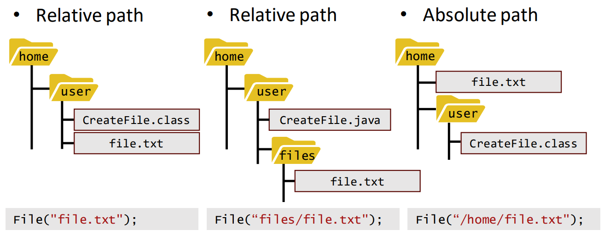

# Day 13: Using files in Java 在 Java 中使用文件  
- 目标  
    - 能创建空文件、向文本和二进制文件写入数据并从其中读取数据  
    - 能在文件中写入和读取格式化数据（如 CSV 格式）  
    - 能为在不同的应用程序中使用文件选择适当的方法  

## Session 1: Reading and writing to text files 读取/写入文本文件  

### 文件  
- 变量和数组中存储的数据是*临时性的*：当局部变量超出范围或程序终止时，计算机内存中的数据就会丢失  
- 为了长期保存数据，即使在创建数据的程序终止后，计算机使用*文件（files）*  
    - 计算机将文件存储在*二级存储设备（secondary storage devices）* 或*大容量存储设备（mass storage devices）* 上，包括硬盘、闪存盘、DVD 等；大容量存储设备中的文件通常以*目录（dictionaries）* 形式组织，形成树状结构  
    - 文件也经常通过互联网传输，与他人共享  

### Streams 流  
- Java 将每个文件视为连续的*字节流（Stream of bytes）*  
- 处理字节流的 Java 程序在到达*字节流终点（end of the stream）* 时会收到操作系统的指示  
    - 程序无需知道底层平台如何表示文件或数据流  
    - 在某些情况下，文件结束指示会作为异常出现  
    - 在其他情况下，指示是在流处理对象上调用方法的返回值  

### Byte-based and character-based streams 字节流和字符流  
- 文件流可用来处理字节或字符数据  
    - *Byte-based streams 字节流*：以二进制格式输出和输入数据：char 为 2 个字节，int 为 4 个字节，double 为 8 个字节，等等  
    - *Character-based streams 字符流*：输出和输入数据均为字符序列，其中每个字符为两个字节（即 char）  
- 使用字节流创建的文件是*二进制文件（binary files）*，而使用字符流创建的文件是*文本文件（text files）*  
    - 文本文件可由文本编辑器读取，而二进制文件则由能理解文件特定内容和格式的程序读取  

### 创建和使用文件  
- Java 程序通过创建对象并关联字节流或字符流来打开文件  
    - 对象的构造函数与操作系统交互，打开文件  
- 要处理文件，我们可以使用 `java.io` 软件包中的 File 类  
    - 要使用文件，请创建 File 类对象，并指定文件名或目录名作为构造函数的参数：  
      ```java
      File myFile = new File("Filename.txt");
      ```

### Java 文件目录  
- 如果文件构造函数中没有定义路径名，则假定文件位于程序运行的工作目录中  
- 可以使用相对（抽象）路径或绝对路径来定义文件在目录结构中的位置  
    - 请注意，绝对路径名与系统有关：Windows 和 Linux（Unix）中的路径定义不同  
    - File 的方法 `getAbsolutePath()` 可用来获取包含 File 对象绝对路径的字符串对象  
#### Java 文件目录例  
- *相对路径 | 相对路径 | 绝对路径*  
    

### File 类的方法  
- File 类最有用的方法包括：  
    - `createNewFile()`：创建一个新的空文件  
    - `delete()`：删除文件  
    - `exists()`：测试文件是否存在  
    - `getName()`：返回包含文件名的字符串对象  
    - `getAbsolutePath()`：返回包含绝对路径的字符串  
    - `length()`：返回文件长度  
    - `list()`：返回一个字符串数组，其中包含文件对象路径名表示的目录中的文件和目录名称  
    - `mkdir()`：使用文件名创建一个新的空目录  
#### 创建文件例  
```java
import java.io.*;
public class CreateFile {
    public static void main(String[] args) {
        try {
            File myFile = new File("myfilename.txt");
            // 如果文件创建成功，方法 createNewFile() 返回 true
            if (myFile.createNewFile()) {
                System.out.println("File created: " + myFile.getName());
                    // 方法 getName() 返回文件对象的名称
            } else {
                System.out.println("File already exists.");
            }
        } catch (IOException e) {
            // 必须捕获 IOException 以避免文件出错（如磁盘已满）
            System.out.println("An error occurred.");
            e.printStackTrace();
        }
    }
}
```
输出：  
```shell
$ java CreateFile
File created: myfilename.txt
$ java CreateFile
File already exists.
$
```

### 使用 FileWriter 类写入文件  
- 将数据写入文本文件的方法有很多：使用 FileWriter 类是最直接的方法之一  
    - FileWriter 的构造函数以文件对象或包含文件名的字符串对象作为输入参数  
    - 附加的布尔参数可用于允许附加到现有文件的末尾，而不是重写到开头  
- 方法 `write()` 可用于写入  
    - 将字符串对象或 char\[\] 数组作为输入参数  
    - 注意，在使用 `close()` 方法关闭文件或使用 `flush()` 方法刷新文件之前，数据不会实际写入文件中  
#### 写入文件例  
```java
import java.io.*;

public class WriteFile {
    public static void main(String[] args) {
        String fileName = "myfile.txt";
        FileWriter writer = null;

        try {
            // 创建一个新文件用于写入，如果文件已经存在，则打开现有文件用于添加
            writer = new FileWriter(fileName, true);
            // 写入或追加数据
            writer.write("Data written in the file!\n");
            // 将数据写入物理文件并关闭文件
            writer.close();
        } catch (IOException e) {
            System.out.println("An error occurred.");
            e.printStackTrace();
        }
    }
}
```
输出：
- ```shell
  $ javac WriteFile.java
  $ 
  ```
    - 目录：/home/user
        - 文件：myfile.txt
          ```
          Data written in the file!
          ```
- ```shell
  $ java WriteFile
  $ java WriteFile
  $ 
  ```
    - 目录：/home/user
        - 文件：myfile.txt
          ```
          Data written in the file!
          Data written in the file!
          ```

### 使用 FileReader 类读取文件  
- 在 Java 中读取文件有几种不同的方法；使用 FileReader 类与使用 FileWriter 写入文件是对称的  
    - FileReader 提供了 `read()` 方法，可用于从文件中读取字符  
- 由于 FileReader 功能有限，因此更推荐使用 BufferedReader 类逐行读取文本文件  
    - BufferedReader 对象是通过将 FileReader 对象作为构造函数的输入参数来创建的  
    - 然后可以使用方法 `readLine()` 逐行读取文本文件  
#### 逐行读取文件例  
```java
import java.io.*;
public class ReadFile {
    public static void main(String[] args) {
        try {
            // 创建 FileReader 和 BufferedReader 对象
            FileReader reader = new FileReader("myfile.txt");
            BufferedReader bufReader = new BufferedReader(reader);

            String line;

            // 方法 readLine() 读取下一行，如果文件中已无其他行，则返回 null
            while ((line = bufReader.readLine()) != null) {
                System.out.println(line);
            }
            
            reader.close();
        } catch (IOException e) {
            System.out.println("An error occurred.");
            e.printStackTrace();
        }
    }
}
```
文件 myfile.txt：  
```
Data written in the file!
Data written in the file!
```
输出：  
```shell
$ javac ReadFile.java
$ java ReadFile
Data written in the file!
Data written in the file!
$
```

### Files、Path 和 Paths 类  
- java.io 包中的传统 File 类有几个弱点  
    - 错误处理不当、元数据支持不佳、扩展问题……  
- Java 的 java.nio 包提供了用于改进文件和目录管理的 Files、Path 和 Paths 类  
    - 对于基本的文件创建、写入和读取操作，仍然可以使用 File、FileWriter、Scanner 等  
    - 如果要对文件和目录进行更高级或更大规模的处理（如重命名或移动文件），建议使用 java.nio 软件包  
    - 由于时间限制，本课程不涉及 java.nio  