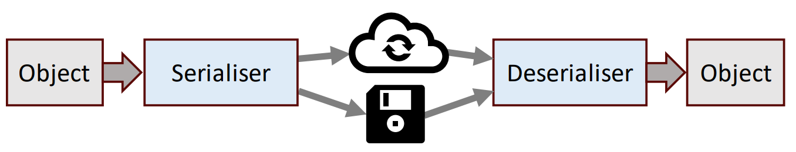

# Day 14: Serialisation, databases, and streams 序列化、数据库和数据流  
- 目标  
    - 序列化（marshal）和反序列化（unmarshal）Java 对象  
    - 解释函数式编程和流的基本概念  
    - 在 Java 应用程序中使用数据库  

## Session 1: Serialisation and deserialisation 序列化和反序列化  

### 序列化和反序列化  
- 数据*序列化（serialisation）* 是将数据结构或对象转换成字节流的过程，以便更方便地保存或传输数据  
- 反向过程，即*反序列化（deserialisation）*，是指从字节流中构建数据结构或对象的过程
-   

### Java 原生序列化  
- Java 支持实现 Serializable 接口的对象的原生（native）序列化  
    - 原生序列化的主要优势在于它是 Java 内置的，不需要任何外部库  
    - 原生序列化的主要缺点是它是 Java 特有的：默认情况下，序列化对象不能直接在其他平台上使用  
- 序列化的类需要实现一个不带参数的构造函数，以及序列化实例变量标准格式的 getter 和 setter 方法  
#### Java 原生序列化例  
```java
import java.io.*;

// 要序列化的类的定义
class User implements Serializable {
    private static final long serialVersionUID = 1L; // 用于确保序列化器和反序列化器之间的兼容性
    private int id;
    private String name;
    
    User() { this.id = 0; this.name = ""; }
    public void setId(int id) { this.id = id; }
    public int getId() { return id; }
    public void setName(String name) { this.name = name; }
    public String getName() { return name; }
}

public class SerializationExample {
    public static void main(String[] args) {
        User user = new User();
        user.setId(1);
        user.setName("James");

        // 将对象 user 序列化到文件 user.bin 中
        try {
            ObjectOutputStream out = new ObjectOutputStream(new FileOutputStream("user.bin"));
            out.writeObject(user);
        } catch (IOException e) {
            e.printStackTrace();
        }
    }
}
```
#### Java 原生反序列化例  
```java
import java.io.*;

class User implements Serializable {
    ... // 与序列化例相同
}

public class DeserializationExample {
    public static void main(String[] args) {
        User user = null;

        // 从文件 user.bin 对对象 user 执行反序列化操作
        try {
            ObjectInputStream in = new ObjectInputStream(new FileInputStream("user.bin"));
            user = (User) in.readObject();
        } catch (IOException e) {
            e.printStackTrace();
        }

        // 打印 user 对象中的数据
        System.out.printf("User id: %d, name: %s%n", user.getId(), user.getName());
    }
}
```
输出：  
```shell
$ java DeserializationExample
User id: 1, name: James
$
```

### Cross-platform and language serialisation 跨平台和跨语言序列化  
- 原生序列化不适合跨平台操作  
    - 数据格式和方法是 Java 特有的  
- *JavaScript 对象符号（JavaScript Object Notation，JSON）* 和*可扩展标记语言（Extensible Markup Language，XML）* 等数据格式通常用作独立于平台的序列化数据格式  
    - 不仅用于序列化对象，还用于表示任何数据结构  
    - 通常用于互联网应用，从服务器传输数据  
- Java 本身不再支持 JSON 或 XML 序列化：JSON 和 XML 序列化需要外部库  

### 可扩展标记语言（XML）  
- XML 具有基于文本的格式，适合表示对象和其他类型的数据结构  
    - XML 不限于任何特定的编程语言或数据类型  
- XML 文档分为*标记（markup）* 和*内容（content）*  
    - 标记结构（markup constructs，标签）定义内容类型  
    - 内容一般位于*开始标记（start-tag）* 和*结束标记（end-tag）* 之间：
      ```xml
      <name>John Smith</name>
      ```
    - 开始标记、内容和结束标记构成一个元素；元素也可以作为子元素嵌套在元素内部  

### 编组和取消编组 XML  
- 在 Java 中，Java Architecture for XML Binding (JAXB) 用于将 Java 对象转换为 XML 代码，或将 XML 代码转换为 Java 对象  
    - 将 Java 对象转换为 XML 格式的过程称为*编组（marshalling）*，而将 XML 格式的数据转换回 Java 对象的过程称为*取消编组/反编组（unmarshalling）*  
    - JAXB 适用于 plain old Java objects (POJO)：XML 序列化不需要特殊的超类或接口（如 serializable）  
    - JAXB 的 API 包含在旧版本的 Java 中，但在 Java 版本 11 中被移除——需要安装外部 JAXB 库才能使用 JAXB  

### 使用 JAXB 编组  
- 需要将 JAXB 库作为依赖项安装到 Maven 项目中  
    - Jakarta XML 绑定框架（binding framework）：https://eclipse-ee4j.github.io/jaxb-ri/  
- JAXB 编组步骤  
    - 声明用于将数据存储为对象的类  
    - 注释要编组的类和实例变量（如果使用 setter 和 getter 方法，则会自动包含实例变量）  
    - 创建 JABX 上下文，作为 JAXB API 的入口点  
    - 使用 JAXB marshaller 将序列化对象写入 XML 文件  
#### 编组例  
```java
// Product.java

class Product {
    // 将实例变量名称、代码和价格定义为 XML 元素
    @XmlElement(name = "name")
    String name;
    @XmlElement(name = "code")
    int code;
    @XmlElement(name = "price")
    double price;

    public Product() { this("", 0, 0.0); }
    public Product(String name, int code, double price) {
        this.name = name;
        this.code = code;
        this.price = price;
    }

    public void printProductInfo() {
        System.out.printf("%-15s%-10d%-10.2f%n", name, code, price);
    }
}
```
```java
// Store.java

import java.util.*;
import javax.xml.bind.annotation.*;

// 将 Store 类定义为 XML 根元素，名称为 store
@XmlRootElement(name = "store")
public class Store {
    // 通常围绕集合使用的包装 XML 元素
    @XmlElementWrapper(name = "products")
    // 为列表中的项目定义 XML 元素
    @XmlElement(name = "product")
    private List<Product> products = new ArrayList<>();

    public List<Product> getProducts() {
        return products;
    }
}
```
```java
// MarshallingExample.java

import java.io.*;
import javax.xml.bind.*;

public class MarshallingExample {
    public static void main(String[] args) {
        Store store = new Store();

        try {
            store.getProducts().add(new Product("Hammer", 15002, 15
            30));
            store.getProducts().add(new Product("Saw", 16807, 22.95));
            store.getProducts().add(new Product("Pliers", 23381, 10.25));

            // 将 Store 对象及其 Product 对象列表添加到 XML 文件 store.xml 中
            JAXBContext context = JAXBContext.newInstance(Store.class);
            Marshaller mar = context.createMarshaller();
            mar.setProperty(Marshaller.JAXB_FORMATTED_OUTPUT, Boolean.TRUE);
            mar.marshal(store, new File("./store.xml"))
        } catch (Exception e) {
            e.printStackTrace();
        }
    }
}
```
编组数据后输出的 XML 文件 store.xml：  
```xml
<?xml version="1.0" encoding="utf-8" standalone="yes"?>
<store>
    <products>
        <product>
            <name>Hammer</name>
            <code>15002</code>
            <price>15.3</price>
        </product>
        <product>
            <name>Saw</name>
            <code>16807</code>
            <price>22.95</price>
        </product>
        <product>
            <name>Pliers</name>
            <code>23381</code>
            <price>10.25</price>
        </product>
    </products>
</store>
```

### 使用 JABX 取消编组  
- 取消编组类似将编组反过来操作  
    - 声明并注释用于将数据存储为对象的类；可以重复使用 marshalling 中的类定义  
    - 创建 JABX 上下文，作为 JAXB API 的入口点  
    - 使用 JABX unmarshaller 将数据从 XML 文件读取为对象  
- 甚至可以将用不同编程语言（如 JavaScript）编写的对象取消编组  
#### 反编组例  
```java
// UnmarshallingExample.java

import java.io.*;
import java.xml.bind.*;

public class UnmarshallingExample {
    public static void main(String[] args) {
        try {
            // 从 XML 文件中取消编组 Store 对象及其 Product 对象列表
            JAXBContext context = JAXBContext.newInstance(Store.class);
            Unmarshaller umar = context.createUnmarshaller();
            Store store = ((Store) umar.unmarshal(new FileReader("./store.xml")));

            // 打印内容，确保数据正确恢复
            for (Product product: store.getProducts()) {
                product.getProductInfo();
            }
        } catch (Excepiton e) {
            e.printStackTrace();
        }
    }
}
```
输出：  
```shell
$ java UnmarshallingExample
Hammer 15002 15.30 
Saw 16807 22.95 
Pliers 23381 10.25 
$
```

### XML 和 JSON 对比  
- JSON 是另一种常用的对象表示格式  
    - 最初是为 JavaScript 开发的，但也可用于 Java 或其他语言  
    - JSON 更紧凑，生成和解析速度更快  
    - JSON 格式更易于人类读写  
    - 另一方面，JSON 的可扩展性和灵活性不如 XML  
- JSON 更适用于简单数据和 Web 应用程序  
- XML 更适合大型复杂数据，以及需要频繁转换和验证的应用程序  
#### XML 例  
```xml
<?xml version="1.0" encoding="UTF-8" standalone="yes"?>
<store>
    <product>
        <name>Hammer</name>
        <code>15002</code>
        <price>15.3</price>
    </product>
</store>
```
#### JSON 例  
```json
{
    "store": {
        "product": {
            "name": "Hammer",
            "code": 15002,
            "price": 15.3
        }
    }
}
```