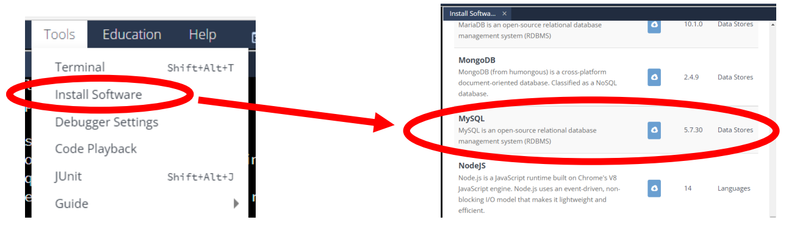

## Session 2: Basics of database programming 数据库编程基础  

### 数据库基础  
- 如果应用程序需要处理大量有组织的数据，如表格（tables）或模式（schemas），直接使用文件会很不方便  
    - 应用程序必须为每种不同的数据结构定义文件格式  
    - 应用程序必须在文件中添加和删除数据  
- *数据库（database）* 是由*数据库管理系统（database management system，DBMS）* 管理的有组织数据和信息的集合  
    - DBMS 为应用程序提供了创建数据库、保存不同类型数据、更新和删除数据等的界面  
    - DBMS 可在多个用户使用相同数据的情况下确保数据的一致性和安全性  

### 数据库的典型用例  
- 在典型的应用场景中，应用程序实现了用于查看和编辑数据的用户界面，并与 DBMS 服务器进行通信，以访问和修改数据库中的数据  
    - 在远程服务器上，多个用户可以使用同一个数据库  
        

### Relational databases 关系数据库  
- *关系数据库*是最流行的数据库类型  
    - 逻辑数据结构和物理文件存储结构是分开的  
    - 逻辑数据以*表格（tables）* 为结构，其中每一列都是一个属性，每一行都是一条*记录（record）*，具有系统分配的唯一 ID  
    - 一个数据库可以包含多个表，用于存储不同类型的数据，一个表中的数据可以引用另一个表中的数据  
    -   

### SQL 数据库  
- *结构化查询语言（Structured Query Language，SQL）* 通常用于管理关系数据库（即 SQL 数据库）中的数据  
- SQL DBMS 在数据库和表格中组织数据  
-   

### 基本 SQL 命令  
| Syntax | Description |
| --- | --- |
| `CREATE DATABASE [IS NOT EXISTS] dbname` | 创建数据库“dbname”。如果使用 IF NOT EXISTS，则仅在数据库不存在时创建数据库 |
| `CREATE TABLE [IF NOT EXISTS] tblname (col1 col1type, col2 col2type, ...)` | 在活动数据库中创建表 "tblname"。如果使用 IF NOT EXISTS，则仅在表不存在时创建该表 |
| `DROP TABLE [IF EXISTS] tblname` | 删除表“tblname” |
| `INSERT INTO tblname VALUES (val1, val2)` | 用给定的值在表“tblname”中插入新行 |
| `SELECT col1, col2, ... FROM tblname [WHERE col1 = val1];` | 返回表格“tblname”中选定列的值。列列表的通配符 \* 选择所有列 |
| `DELETE FROM tblname WHERE col1 = val1;` | 删除列 col1 值为 val1 所在的行 |
- SQL 实现之间存在一些差异  
- 本课程不涉及 SQL 命令和语法细节  

### 在 Codio 中使用 MySQL  
- 使用数据库时，需要连接到 DBMS 服务器（如 MySQL、SQLite 等）  
    - 服务器可在本地（localhost）或互联网上运行  
    - 在 Codio 中，以安装 MySQL 为例：  
        

### MySQL 控制台界面  
- 安装后，可通过控制台界面在 Codio 中使用 MySQL  
    - 以 root 身份登录 MySQL（默认没有密码）  
      ```
      mysql -u root
      ```
    - 登录后，MySQL 提示符 `mysql>` 显示，你可以输入 MySQL 命令  
      ```
      mysql>
      ```
    - 要设置密码，使用  
      ```sql
      SET PASSWORD = 'password';
      ```
    - 使用 `EXIT` 命令注销（MySQL 命令不区分大小写，因此 `exit` 也会生效）  
    - 若设置了密码，下次登录时需要加上 `-p` 参数来输入密码：`mysql -u root -p`
#### MySQL 基本控制台示例  
- 入门示例
  ```
  $ mysql –u root
  Welcome to the MySQL monitor. 
  ...
  mysql> SET PASSWORD = 'jari';
  Query OK, 0 rows affected (0.02 sec)
  mysql> QUIT
  Bye
  $ mysql –u root
  ERROR 1045 (28000): Access denied for user 'root'@'localhost' (using password: YES)
  $ mysql –u root –p
  Enter password:
  Welcome to the MySQL monitor.
  ...
  mysql>
  ```
- 创建数据库 store，在该数据库中创建表 products  
  ```sql
  CREATE DATABASE store;
  USE store;
  CREATE TABLE products ( id INT AUTO_INCREMENT PRIMARY KEY,
                          name VARCHAR(255),
                          price DECIMAL(5, 2));
  INSERT INTO products (name, price) values ('Hammer', 1.205);
  INSERT INTO products (name, price) values ('Saw', 20.91);
  ```
  ```
  mysql> CREATE DATABASE store;
  Query OK, 1 row affected (0.00 sec)

  Mysql> USE store;
  Database changed
  Mysql> CREATE TABLE products ( id INT AUTO_INCREMENT PRIMARY KEY,
      -> name VARCHAR(255),
      -> price DECIMAL(5, 2));
  Query OK, 0 rows affected (0.47 sec)

  mysql> INSERT INTO products (name, price) values ('Hammer', 15.20);
  Query OK, 1 row affected (0.08 sec)

  mysql> INSERT INTO products (name, price) values ('Saw', 20.91);
  Query OK, 1 row affected (0.08 sec)

  mysql> 
  ```
- 展示 products 表中的内容  
  ```sql
  SELECT * FROM products;
  ```
  ```
  mysql> SELECT * FROM products;
  +----+--------+-------+
  | id | name   | price |
  +----+--------+-------+
  |  1 | Hammer | 15.20 |
  |  2 | Saw    | 20.95 |
  +----+--------+-------+
  2 rows in set (0.00 sec)

  mysql>
  ```
    - SQL 还可以进行更复杂的查询：例如，可以要求 SQL 查找价格最低的产品等  
- 可使用关键字 `FOREIGN KEY REFERENCES` 创建表之间的引用，以定义引用另一个表的数据类型  
  ```sql
  CREATE TABLE customers ( id INT AUTO_INCREMENT PRIMARY KEY, name VARCHAR(255),
                prod_id INT, FOREIGN KEY (prod_id) REFERENCES products(id), quantity INT);
  -- 注意，表产品中的 id 可以直接添加，也可以通过产品名称进行搜索
  INSERT INTO customers (name, prod_id, quantity) VALUES ('James Smith', 1, 2);
  INSERT INTO customers (name, prod_id, quantity) VALUES ('Jane Brown',
                (SELECT id FROM products WHERE name='Saw'), 5);
  ```
  ```
  mysql> create table customers ( id INT AUTO_INCREMENT PRIMARY KEY, name VARCHAR(255),
      -> prod_id INT, FOREIGN KEY (prod_id) REFERENCES products(id), quantity INT);
  Query OK, 0 rows affected (0.15 sec)

  mysql> INSERT INTO customers (name,prod_id,quantity) VALUES ('James Smith', 1, 2);
  Query OK, 1 rows affected (0.17 sec)

  mysql> INSERT INTO customers (name,prod_id,quantity) VALUES ('Jane Brown', 
      -> (SELECT id FROM products WHERE name='Saw'), 5);
  Query OK, 1 rows affected (0.18 sec)

  mysql>
  ```
- 展示 customers 表中的内容  
  ```sql
  SELECT * FROM customers;
  ```
  ```
  mysql> SELECT * FROM customers;
  +----+-------------+---------+----------+
  | id | name        | prod_id | quantity |
  +----+-------------+---------+----------+
  |  1 | James Smith |       1 |        2 |
  |  2 | Jane Brown  |       2 |        5 |
  +----+-------------+---------+----------+
  4 rows in set (0.00 sec)

  mysql> EXIT
  Bye
  $
  ```

### SQL 进阶使用  
- SQL 是一种功能强大的语言，用于管理数据和对有组织的数据进行各种查询  
    - 基本 SQL 语法很简单，但掌握高级 SQL 可能具有挑战性（不在本课程范围内）  
    -   