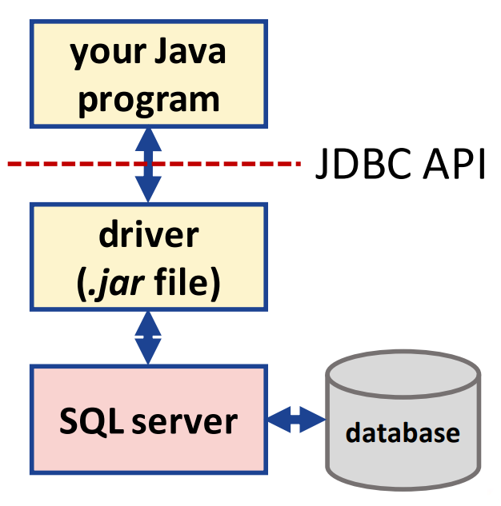

## Session 3: Database programming in Java | Java 中的数据库编程  

### Java 中的数据库编程  
- *Java 数据库连接（Java Database Connectivity，JDBC）* 的 API 提供对几乎任何数据源的通用数据访问  
    -   
    - 关系数据库、电子表格（spreadsheets），甚至平面文件（flat files）  
    - 构建工具（building tools）和替代界面（alternative interfaces）的共同基础  
- 包括两个软件包：java.sql 和 javax.sql  
- 存在不同的 DBMS 服务器，本课程的示例适用于 MySQL  

### 为 Java 安装数据库驱动程序  
- 适当的驱动程序安装程序取决于平台和使用的 SQL 服务器  
- 假设使用的是 Codio（运行 Ubuntu）和 MySQL 服务器，你可以执行：  
  ```
  sudo apt-get install libmysql-java
  ```
- 驱动程序 mysql.jar 将位于 /usr/share/java/ 文件夹中  
- 现在，你可以编译和运行数据库 Java 应用程序：  
  ```
  javac DatabaseExample.java
  java -classpath ".:/usr/share/java/mysql.jar" DatabaseExample
  ```

### 流行的 JDBC 数据库 URL 格式  
| JDBC | URL 格式 |
| --- | --- |
| Oracle | `jdbc:oracle:thin:[<user>/<password>]@<host>[:<port>]:<SID>` |
| MySQL | `jdbc:mysql://[hosts][/database][?properties]` |
| Microsoft | `jdbc:sqlserver://[serverName[\instanceName][:portNumber]][;property=value[;property=value]]` |
| PostgreSQL | `jdbc:postgresql://host:port/database?properties` |
- MySQL 的端口号是可选的（假设使用默认端口）  
- 请注意，要使 URL 在 Codio 的默认设置下工作，我们需要使用附加属性 `useSSL=false`  

### 数据库例  
```java
import java.sql.*;

public class DatabaseExample {
    String urlPrefix = "jdbc:mysql://localhost/"; // 数据库服务器的 URL：取决于位置和使用的 DBMS
    String urlPostfix = "?autoReconnect=true&useSSL=false";

    // 连接 SQL
    private Connection connect(String dbName) {
        Connection conn = null;
        String url = urlPrefix + dbName + urlPostfix;
        String username = "root";
        String password = "codio"; // Codio 中 MySQL 的默认密码

        try {
            conn = DriverManager.getConnection(url, username, password);
        } catch (SQLException e) { // 尝试连接 DBMS 服务器时需要 SQLException 异常处理程序
            System.out.println(e.getMessage());
        }

        return conn;
    }

    // 创建数据库
    public void createDatabase() {
        try (Connection conn = connect("")) { // 数据库（可能）尚不存在…
            if (conn != null) {
                DatabaseMetaData meta = conn.getMetaData();
                System.out.println("Product name" + meta.getDatabaseProductName());
                Statement stmt = conn.createStatement();
                stmt.execute("CREATE DATABASE IF NOT EXISTS organization");
                    // 创建新数据库 organization 的 SQL 语句
                System.out.println("Database created");
                conn.close();
            }
        } catch (SQLException e) {
            System.out.println(e.getMessage());
        }
    }

    // 创建表
    public void createTable() {
        // 创建 SQL 语句
        StringBuilder sqlStatement = new StringBuilder();
        sqlStatement.append("CREATE TABLE IF NOT EXISTS members (");
        sqlStatement.append(" id INTEGER,");
        sqlStatement.append(" first_name VARCHAR(20),");
        sqlStatement.append(" last_name VARCHAR(20),");
        sqlStatement.append(" age INTEGER,");
        sqlStatement.append(" town VARCHAR(20))");
        String sql = sqlStatement.toString();

        try (Connection conn = connect("organization");
             Statement stmt = conn.createStatement()) {
            // 如果 members 表已经存在，则删除该表
            stmt.execute("DROP TABLE IF EXISTS members");
            // 执行 SQL 语句
            stmt.execute(sql);
            conn.close();
        } catch (SQLException e) {
            System.out.println(e.getMessage());
        }
    }

    // 向表添加数据
    public void addMember(String id, String firstName, String lastName,
                          String age, String town) {
        StringBuilder sqlStatement = new StringBuilder();
        sqlStatement.append("INSERT INTO members VALUES(?, ?, ?, ?, ?)");
            // 问号是实际值的占位符
        String sql = sqlStatement.toString();

        try (Connection conn = connect("organization");
             PreparedStatement pstmt = conn.prepareStatement(sql)) {
            // PreparedStatement 可用于在语句中设置值；尽可能使用它，因为它会检查数据类型
            pstmt.setString(1, id);
            pstmt.setString(2, firstName);
            pstmt.setString(3, lastName);
            pstmt.setString(4, age);
            pstmt.setString(5, town);
            pstmt.executeUpdate();

            System.out.println("Member added");
            conn.close();
        } catch (SQLException e) {
            System.out.println(e.getMessage());
        }
    }

    // 更新数据
    public void updateMember(String id, String firstName, String lastName,
                             String age, String town) {
        // 与插入数据类似，但 id 用于选择要更新的记录
        StringBuilder sqlStatement = new StringBuilder();
        sqlStatement.append("UPDATE members SET");
        sqlStatement.append(" first_name = ?, last_name = ?, age = ?,");
        sqlStatement.append(" town = ? WHERE id = ?");
        String sql = sqlStatement.toString();

        try (Connection conn = connect("organization");
             PreparedStatement pstmt = conn.prepareStatement(sql)) {
            pstmt.setString(1, firstName);
            pstmt.setString(2, lastName);
            pstmt.setString(3, age);
            pstmt.setString(4, town);
            pstmt.setString(5, id);
            pstmt.executeUpdate();

            System.out.println("Member updated");
            conn.close();
        } catch (SQLException e) {
            System.out.println(e.getMessage());
        }
    }

    // 获取表指定行
    public void getMember(String id) {
        String sql = "SELECT * FROM members WHERE id = ?";
            // 查找具有给定 id 的行

        try (Connection conn = connect("organization");
             PreparedStatement pstmt = conn.prepareStatement(sql)) {
            pstmt.setString(1, id);
            ResultSet rs = pstmt.executeQuery();

            System.out.println("Finding member with ID " + id);
            while (rs.next()) {
                System.out.println(rs.getString("id") + "\t" +
                                   rs.getString("first_name") + "\t" +
                                   rs.getString("last_name") + "\t" +
                                   rs.getString("age") + "\t" +
                                   rs.getString("town"));
            }

            conn.close();
        } catch (SQLException e) {
            System.out.println(e.getMessage());
        }
    }

    // 获取表所有行
    public void getMembers() {
        String sql = "SELECT * FROM members";

        try (Connection conn = connect("organization");
             Statement stmt = conn.createStatement();
             ResultSet rs = stmt.executeQuery(sql)) {
            System.out.println("Finding all members");

            while (rs.next()) {
                System.out.println(rs.getString("id") + "\t" +
                                   rs.getString("first_name") + "\t" +
                                   rs.getString("last_name") + "\t" +
                                   rs.getString("age") + "\t" +
                                   rs.getString("town"));
            }

            conn.close();
        } catch (SQLException e) {
            System.out.println(e.getMessage());
        }
    }

    // 删除某一行
    public void deleteMember(String id) {
        String sql = "DELETE FROM members WHERE id = ?";

        try (Connection conn = connect("organization");
             PreparedStatement pstmt = conn.prepareStatement(sql)) {
            pstmt.setString(1, id);
            pstmt.executeUpdate();

            System.out.println("Member ID: " + id + " deleted");
            conn.close();
        } catch (SQLException e) {
            System.out.println(e.getMessage());
        }
    }

    // 主函数
    public static void main(String[] args) {
        DatabaseExample dbDemo = new DatabaseExample();

        dbDemo.createDatabase();
        dbDemo.createTable();

        dbDemo.addMember("101", "John", "Smith", "35", "Glasgow");
        dbDemo.addMember("007", "James", "Bond", "70", "London");
        dbDemo.addMember("201", "Markus", "Mulker", "40", "Berlin");

        dbDemo.getMember("007");

        dbDemo.updateMember("101", "John", "Smith", "36", "Aberdeen");

        dbDemo.deleteMember("007");

        dbDemo.getMembers();
    }
}
```
输出：  
```
$ java -classpath ".:/usr/share/java/mysql.jar" 
DatabaseExample
Product name: MySQL
Database created
Member added
Member added
Member added
Finding member with ID 007
7       James   Bond    70      London
Member updated
Member ID: 007 deleted
Finding all members
101     John    Smith   36      Aberdeen
201     Markus  Muller  40      Berlin
```

### 使用 MySQL 控制台例  
- 也可以使用 MySQL 命令行界面来检查在 Java 中创建的数据库内容…  
    - ```sql
      USE organization;
      SHOW TABLES;
      SELECT * FROM members;
      ```
    - ```
      $ mysql -u root -p
      Enter password: 
      Welcome to the MySQL monitor. ...

      mysql> USE organization
      ...
      Database changed

      mysql> SHOW TABLES;
      +------------------------+
      | Tables_in_organization |
      +------------------------+
      | members                |
      +------------------------+
      1 row in set (0.00 sec)

      mysql> SELECT * FROM members;
      +------+------------+-----------+------+----------+
      | id   | first_name | last_name | age  | town     |
      +------+------------+-----------+------+----------+
      | 101  | John       | Smith     | 36   | Aberdeen |
      | 201  | Markus     | Muller    | 40   | Berlin   |
      +------+------------+-----------+------+----------+
      2 rows in set (0.00 sec)

      mysql> quit
      Bye
      $
      ```