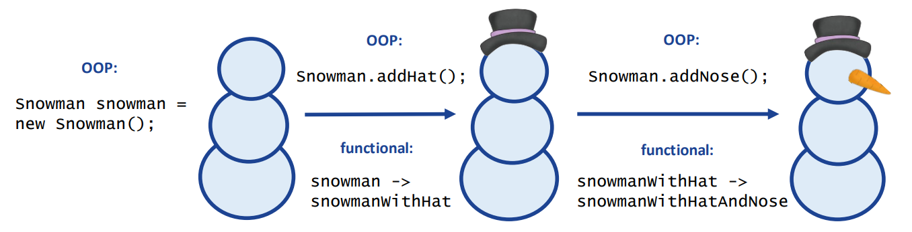
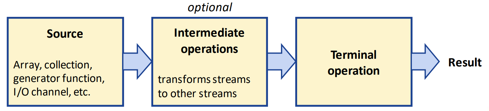
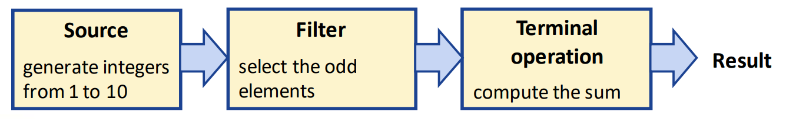

## Session 4: Functional programming and streamsing and streams 函数式编程和流  

### 函数式编程的动机（motivation）  
- 在函数式编程（functional programming）中，函数转换输入，使得  
    - 数据和逻辑保持分离：实体（如对象）的内部状态不会改变  
    - 非常适合并行代码  
    - 更容易替换单个代码块  
- 有些人认为这是一种“更安全”的编程风格，更容易调试，代码也更简洁  
- 在 Haskell、Scala 等许多语言中都很流行  
- 然而 Java 并*非*真正的函数式编程语言  

### 面向对象编程 vs. 函数式编程  
- 在面向对象编程（object oriented programming，OOP）中，方法可以影响其范围之外的程序其他部分  
    - 在复杂程序中，这些副作用可能会造成问题  
- 纯函数是*无状态（stateless）* 的，只是将输入转化为输出  
-   

### 功能接口（函数式接口）和 Lambda 表达式
- 正如 [Day 4 Session 2 - 功能接口](04-2-Interfaces.md#功能接口) 所介绍的，任何只包含一个抽象方法的接口都被称为功能接口  
- Lambda 表达式允许以简洁的形式表示功能接口的单个方法  
- Lambda 的格式：  
  ```java
  (argument list) -> (body)
  ```
    - argument list（参数列表）可以为空 `()` 或包含一个或多个参数  
    - body（主体）包含方法的实现（基本上是一个没有名称的函数）  
#### 使用 Formatter 编写的例子  
```java
import java.util.*;

// 有一个抽象方法 run() 的功能接口
interface StringFunction {
    String run(String str);
}

public class SnowmanExample {
    public static void main(String[] args) {
        String snowman = "snowman";
        System.out.println(snowman);

        StringFunction addHat = (s) -> s + " and hat"; // run() 方法的实现
        String snowmanWithHat = addHat.run(snowman);
        System.out.println(snowmanWithHat)

        StringFunction addNose = (S) -> s + " and nose"; // run() 方法的实现
        String snowmanWithHatAndNose = addNose.run(snowmanWithHat);
        System.out.println(snowmanWithHatAndNose);
    }
}
```
输出：  
```
$ java SnowmanExample
snowman
snowman and hat
snowman and hat and nose
$
```

### 使用双冒号（colon，`::`）的引用方法  
- 可使代码更易读  
- 类引用在 `::` 的左边，方法引用在 `::` 的右边  
- 该方法适用于相应的函数参数  

| 名称 | Method reference 方法引用 | 等效 Lambda |
| --- | --- | --- |
| Unbound 无界 | `Trade::getPrice` | `trade -> trade.getPrice()` |
| Bound 有界 | `System.out::println` | `s -> System.out.println(s)` |
| Static 静态 | `System::getProperty` | `key -> System.getProperty(key)` |
| Constructor 构造函数 | `Trade::new` | `price -> new Trade(price)` |
#### 双冒号例  
```java
import java.util.*;

interface StringFunction {
    int run(String str);
}

public class DoubleColonExample {
    public static void main(String[] args) {
        Scanner input = new Scanner(System.in);
        System.out.print("Give number: ");
        String text = input.nextLine();

        StringFunction toInt = Integer::parseInt; // 等效于 (s) -> Integer.parseInt(s);
        System.out.printf("The number is %d\n", toInt.run(text));
    }
}
```
输出：  
```
$ java DoubleColonExample
Give number: 567
The number is 567 
$
```

### Java API 中的功能接口  
java.util.function 包定义了多个功能接口  
| 接口 | 定义 |
| --- | --- |
| Predicate      | `public interface Predicate<T>      { Boolean test(T t); }` |
| Function       | `public interface Function<T,R>     { R apply(T t); }` |
| BiFunction     | `public interface BiFunction<T,U,R> { R apply(T t, U u); }` |
| Consumer       | `public interface Consumer<T>       { void accept(T t); }` |
| Supplier       | `public interface Supplier<T>       { T get(); }` |
| UnaryOperator  | `public interface UnaryOperator<T> extends Function<T,T> {}` |
| BinaryOperator | `public interface BinaryOperator<T> extends BiFunction<T,T,T> {}` |

### Chaining functions 连锁函数  
- 如果函数接口包含默认方法 andThen()，则可以用它来连锁函数  
    - 例：$y=f_2(f_1(x))$  
      ```java
      import java.util.function.*;

      public class ChainingFunctionExample {
          public static void main(String[] args) {
              Function<String, Integer> f1 = x -> x.length();
              Function<Integer, Integer> f2 = x -> x * 2;
              Integer y = f1.andThen(f2).apply("University of Aberdeen");
              System.out.println("result: " + y);
          }
      }
      ```
      输出：
      ```
      $ java ChainingFunctionExample
      result: 44
      $
      ```

### Streams 流  
- 在函数式编程中，流（stream，不要与 I/O stream \[I/O 流\]混淆！）在引用类型对象（reference type objects）上执行一项任务或一连串任务，这些任务组成一个*流水线（stream pipeline）*  
- java.util.stream 包支持流操作  
-   

  *源 | 中间操作（可选） | 终端操作 | 结果*
#### 常用中间流（intermediate stream）操作  
| 操作 | 描述 |
| --- | --- |
| `filter` | 只返回满足给定条件（predicate）的元素流 |
| `distinct` | 返回删除了重复内容的数据流 |
| `limit` | 从原始数据流的起点返回一个具有指定元素个数的数据流 |
| `map` | 返回将原始元素映射为新值（可能是不同类型）的数据流 |
| `sorted` | 返回元素按排序顺序排列的数据流 |
#### 常用终端流（terminal stream）操作  
| 操作 | 描述 |
| --- | --- |
| `forEach` | 处理数据流中的每个元素（例如，显示每个元素） |
| `average` | 返回各元素的平均值 |
| `count` | 返回数据流中的元素总数 |
| `max` | 返回数据流中的最大值 |
| `min` | 返回数据流中的最小值 |
| `reduce` | 使用特定函数（例如将两个元素相加并返回总和的 lambda）将集合中的元素还原为单一值 |
#### 数据流的例子  
```java
import java.util.IntStream;

public class StreamExample {
    public static void main(String[] args) {
        System.out.printf(
            "Sum of the odd integers between 1 and 10: %d%n",
            IntStream.rangeClosed(1, 10)
                     .filter(x -> x % 2 == 1)
                     .sum()
        );
    }
}
```
输出：  
```
$ java StreamExample
Sum of the odd integers between 1 and 10: 25
$
```
  