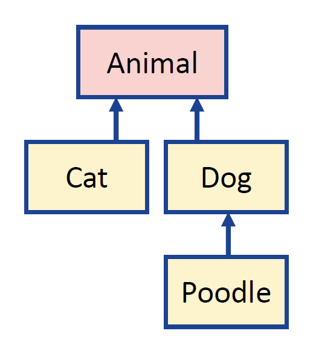
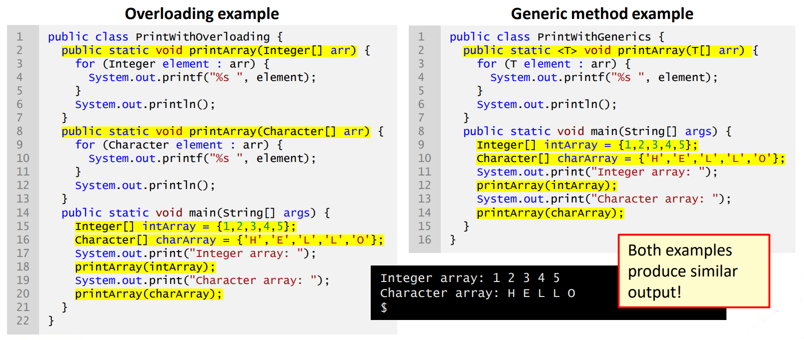

# Day 15: Generics, garbage collection, agile methods 泛型、垃圾回收、敏捷方法  
- 目标  
    - 能在你的 Java 应用程序中有效使用泛型  
    - 能描述垃圾回收的基本概念、优点和缺点 
    - 能解释软件开发生命周期的基本原理  
    - 能描述敏捷软件开发方法并将其用于你的软件项目中  
    - 能查找更多信息和资源以扩展 Java 知识，包括本课程未涉及的方面

## Session 1: Generics in Java | Java 中的泛型  

### Java 中的泛型  
- 泛型在 Java 5 中引入：通过允许对类型进行抽象，泛型提供了为类和方法创建类型安全通用模型（type-safe general models）的方法  
    - *泛型类和接口（generic types and interfaces）* 使你能够指定相关类型的集合  
    - 通过*泛型方法（generic methods）*，你可以用一个方法声明来指定一组相关的方法  

### 集合中的原始和具体类型  
- 角括号 `<>` 中声明的*具体类型（concrete types）* 是指有效载荷类型（payload types）或*类型参数（type arguments）*  
- 使用参数类型实现集合  
- 原始集合类型（raw collection types，未声明具体类型）将元素存储为对象，需要将其转换为实际类型  
    - 应**避免**在代码中使用原始集合类型：它们会在编译时发出警告信息  
#### 原始和具体类型例  
```java
import java.util.*;

public class CollectionTypeExample {
    public static void main(String[] args) {
        List names = new ArrayList();           // 原始类型
        List<Integer> ages = new ArrayList<>(); // 具体类型

        names.add("Alice");
        names.add("Bob");
        ages.add(25);
        ages.add(30);

        String name1 = (String)names.get(0);    // 正常运行
        String name2 = names.get(1);            // 会引发报错
        Integer age1 = ages.get(0);             // 正常运行
        Integer age2 = ages.get(1);             // 正常运行
        
        System.out.println("Person 1: %s, %d%n", name1, age1);
        System.out.println("Person 2: %s, %d%n", name2, age2);
    }
}
```

### 泛型类和接口  
- 泛型类和接口（generic classes and interfaces）提供了以*类型无关（type-independent）* 的方式描述类或接口的方法  
- 泛型类或接口声明的外观与非泛型声明相似，只是在类/接口名称后面有一个类型参数部分  
    - 泛型类/接口的类型参数部分可以有一个或多个*类型参数（type parameter）*，用逗号分隔  
    - 类型参数只能代表引用类型（reference types，即不能代表 primitive types 原始类型）

### 声明泛型类和接口  
- 字母 **T** 代表“类型”（type）、**E** 代表“元素”（element）、**K** 代表“键”（key）、**V** 代表“值”（value），这些字母通常用作类型参数（type parameters，但 Java 语法并不强制要求）  
- Type parameters 是占位符，将由 type argument 替换  
- 声明泛型接口  
  ```java
  interface Bendable<T> {
      void bend(T t);
      T unbend();
  }
  ```
- 声明泛型类  
  ```java
  public class MyClass<T> {
      private T t;
      public void setValue(T t) { this.t = t; }
      public T getValue()       { return t;   }
  }
  ```

### Bounded type parameters 有界类型参数  
- 在某些情况下，你可能希望限制可用作类型参数的类型  
    - `<T extends Superclass>` 定义了 T 的上限，即 T 只接受超类及其子类的实例  
    - 在这种情况下，超类也可以是接口  
    - 也可以定义多个边界：`<T extends B1, B2, ...>`，其中 B1 可以是一个类，其他边界是接口  
- 对于使用仅为实现特定接口或继承特定超类的类定义的操作的通用方法来说，有界类型参数是必不可少的  
#### 泛型方法例  
```java
import java.util.*;

public class GenericMethodExample {
    public static <T extends Comparable<T>> // 如果类实现了 Comparable，则定义方法 compareTo()
                  int compareTwoFirst(List<T> list) {
        return list.get(0).compareTo(list.get(1));
    }

    public static void main(String[] args) {
        List<String> names = new ArrayList<>();
        names.add("Alice");
        names.add("Bob");
        System.out.println("Comparison of names: " + compareTwoFirst(names));

        List<Integer> ages = new LinkedList<>();
        ages.add(35);
        ages.add(35);
        System.out.println("Comparison of ages: " + compareTwoFirst(ages));
    }
}
```
输出：
```
$ java GenericMethodExample
Comparison of names: -1
Comparison of ages: 0
$
```

### 编译和初始化泛型类  
- 编译器会对类/接口的类型参数（type parameters）进行*擦除（erasure）*，并用其上界代替  
- 编译器使用 type arguments 来替换 type parameters，以便执行类型检查，并在必要时插入转置操作  
- 进行类型擦除是为了确保向后兼容原始类型  
#### 擦除实践  
- 如果没有定义上限，类 Object 代表最高级别的超类  
- 代码：  
  ```java
  public class Stack<E> {
      private E[] content;
      public Stack(int capacity) {
          this.content = (E[]) new Object[capacity];
      }

      public void push(E data) {
          ...
      }

      public E pop() {
          ...
      }
  }
  ```
- 编译器会转换为：  
  ```java
  public class Stack {
      private Object[] content;

      public Stack(int capacity) {
          this.content = (Object[]) new Object[capacity];
      }

      public void push(Object data) {
          ...
      }

      public Object pop() {
          ...
      }
  }
  ```

### 使用泛型的通配符  
- 无法使用 type parameter 创建实例，但必须提供一个 type parameter（如 `ArrayList<String>`）  
- 如果在编译时不知道对象的类型，可以用通配符 `<?>`  
    - 通配符可以是上界 `<? extends B>` 或下界 `<? super B>`，即只允许使用 B 及其超类  
    - 通配符不能在所有情况下使用，例如，当一个方法需要多个相同类型的参数时  
    - 建议在允许的情况下使用通配符而不是通用 type parameter  
#### 通配符例  
即使去掉通配符，这个示例也能编译，但通配符使代码更加清晰，因为它能清楚地显示未知的数据类型  
```java
import java.util.*;

public class WildcardExample {
    static ArrayList<?> makeArray(String type) {
        if (type.equals("integer")) {
            ArrayList<Integer> list = new ArrayList<>();
            list.add(1);
            list.add(2);
            return list;
        } else if (type.equals("string")) {
            ArrayList<String> list = new ArrayList<>();
            list.add("Alice");
            list.add("Bob");
            return list;
        }
        return null;
    }

    public static void main(String[] args) {
        // System.out.println 可以打印整数和字符串列表
        List<?> list = makeArray("string");
        System.out.println(list);

        list = makeArray("integer");
        System.out.println(list);
    }
}
```
输出：  
```
$ java WildcardExample
[Alice, Bob]
[1, 2]
$
```
#### 有界通配符例  
  

```java
import java.util.*;

abstract class Animal {
    public String whatAmI() { return "I am an animal"; }
}

class Cat extends Animal {
    public String whatAmI() { return "I am a cat"; }
}

class Dog extends Animal {
    public String whatAmI() { return "I am a dog"; }
}

class Poodle extends Dog {
    public String whatAmI() { return "I am a poodle"; }
}

public class BoundedWildcardExample {
    public static void addDog(Dog dog, List<? super Dog> list) {
                                    // 确保列表不要求特定类型的狗
        list.add(dog);
        System.out.println("Added someone saying: " + dog.whatAmI());
    }

    public static Dog getDog(List<? extends Dog> list) {
                                // 确保列表中有狗或狗的亚类
        return list.get(0);
    }

    public static void main(String[] args) {
        List<Dog> list = new ArrayList<Dog>();
        Dog dog = new Poodle();
        addDog(dog, list);

        dog = getDog(list);
        System.out.println("Found someone saying: " + dog.whatAmI());
    }
}
```
输出：  
```
$ java BoundedWildcardExample
Added someone saying: I am a poodle
Found someone saying: I am a poodle
$
```

### 为什么使用泛型？  
- 我们也可以使用*重载*（*overload*，例如，不同类型使用相同名称的方法）来代替泛型方法  
- 如果重载的方法执行相同的操作，则泛型方法更紧凑、更方便  
- 一个泛型方法声明可以用不同数据类型的参数调用  
    - 根据传给泛型方法的参数类型，编译器会适当处理每个方法调用  
- 与原始类型相比，泛型提供了更好的类型安全性  
#### 重载 vs. 泛型方法  
两种方法产生相似输出！  
  

### 泛型小结  
- 在 Java 中，可以使用泛型引用类型参数（types parameters）来代替特定引用类型参数  
    - 通常用于指定集合的有效载荷  
    - 使用泛型有助于确保类型安全  
- 通用类型会被编译器替换为对象或上界类（如果已定义）  
- 编译时未知的数据类型可以用通配符 `?`  
- 重载可以代替泛型方法，但使用泛型方法往往更清晰、更简洁  