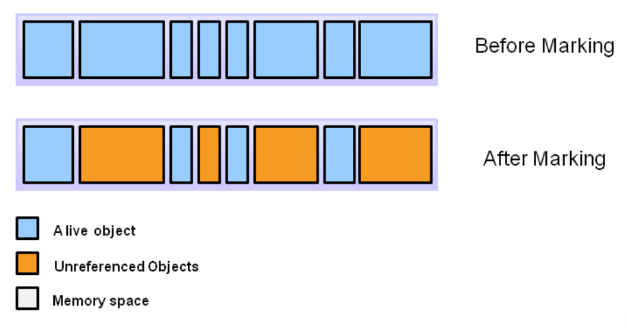
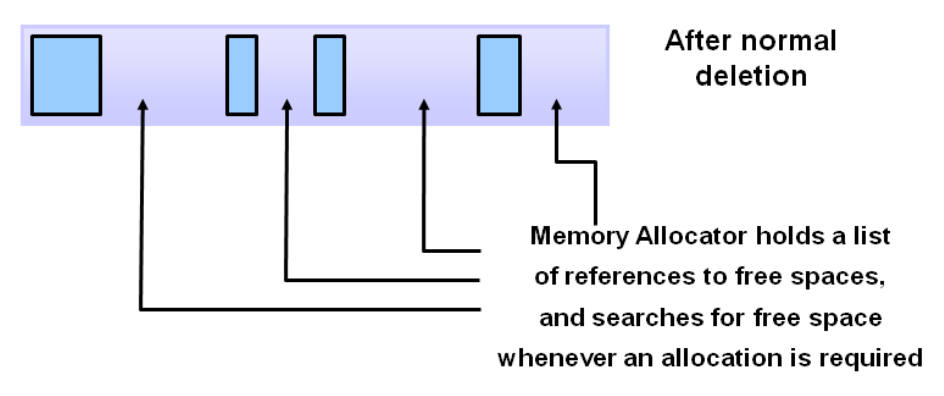
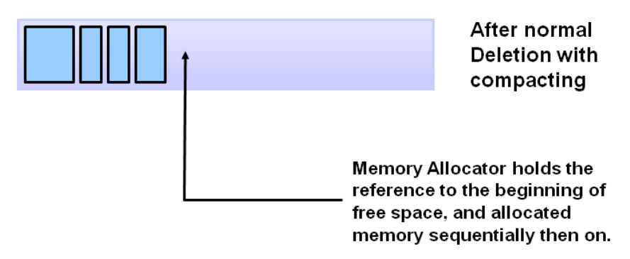
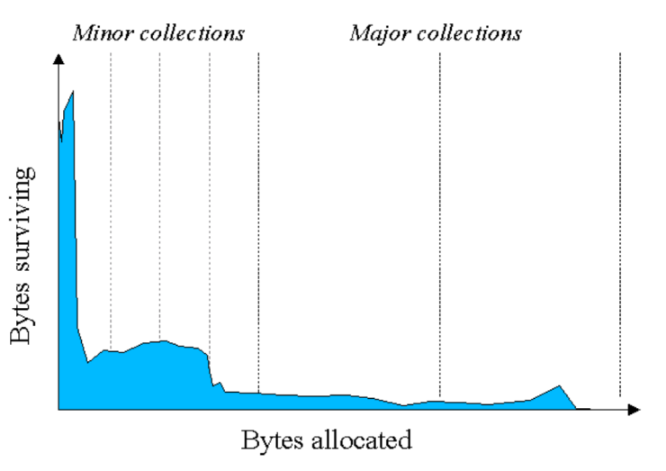
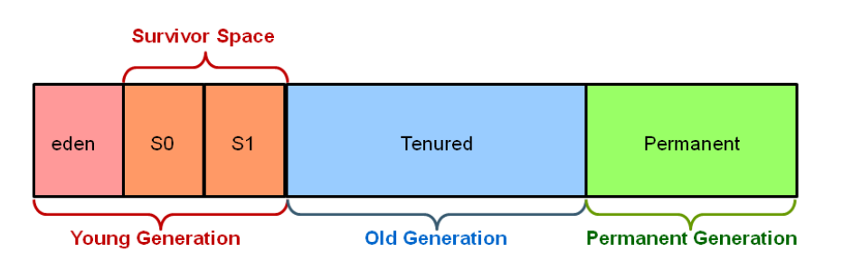

## Session 2: Garbage collection 垃圾回收  

### 对象销毁  
- 对象被创建、使用并（最终）销毁  
    - 销毁（destruction）是语言具体的（language specific）  
    - 大多数面向对象的语言都有一个*析构函数（destructor）* 的概念：当对象被销毁时，析构函数会运行  
- 对象销毁后，我们可以释放为对象专门创建的任何资源（例如打开的文件）或内存  

### Java 中的对象销毁  
- 事实上，我们（人类）并不擅长记录需要删除的内容  
    - 我们要么忘记删除（可能导致*内存泄漏 memory leak*），要么多次删除（可能导致*崩溃 crash*）  
- 我们可以让系统自行决定何时删除。这就是 Java 方法  
    - **优点**：系统会识别何时删除，并为我们执行删除操作  
    - **缺点**：我们无法准确预测何时删除某些内容  

### 垃圾回收器 Garbage collector（GC）  
- *垃圾（garbage）* 是对象曾经使用过的内存，但程序永远不会再读取或写入这些内存  
- *垃圾回收器（Garbage collector，GC）* 是一个后台进程，通过负责程序计算机内存资源的重新分配，为 Java 环境提供自动内存管理功能  
- Java 会自*动执行垃圾回收*，帮助将不再使用的对象占用的内存归还给系统  

### 自动垃圾回收  
- 自动垃圾回收（automatic garbage collection）就是查看堆内存，识别哪些对象在使用，哪些不在使用，并删除未使用对象的过程  
    - *使用中对象（in-use object）* 或*引用对象（referenced object）*，是指程序的某些部分仍通过指针与之链接的对象  
    - *未使用对象（unused object）* 或*未引用对象（unreferenced object）* 是指程序的任何部分都不再引用的对象  
- 未引用对象使用的内存可被回收  
    - 在 C 语言等编程语言中，分配和取消分配内存是一个手动过程，而在 Java 中，取消分配内存的过程是由垃圾回收器自动处理的  

### Java 的垃圾回收器如何工作？  
- JVM 通常在一个单独的进程中运行垃圾收集器，垃圾收集的三个步骤都在该进程中执行：  
    1. Marking 标记  
        - 该过程的第一步称为标记：垃圾回收器会在此过程中识别出哪些内存正在使用，哪些没有使用  
        - 在标记阶段要对所有物体进行扫描，以做出这一判断，这可能是一个非常耗时的过程  
        -   
    2. Deletion 删除  
        - 正常删除会删除未引用的对象，将引用对象和指针留在空闲空间中  
        - 内存分配器持有可分配新对象的空闲空间块的引用  
        - 正常删除后，内存分配器持有空闲空间引用列表，并在需要分配时搜索空闲空间  
            
    3. Compaction 压缩  
        - 为了进一步提高性能，除了删除未引用的对象外，我们还可以压缩剩余的引用对象  
        - 通过将引用对象移动到一起，新的内存分配可以变得更容易、更快  
        - 正常删除并压缩后，内存分配器持有对空闲空间起始位置的引用，然后按顺序分配内存  
            

### 风险：低效率  
- 随着分配的对象越来越多，对象列表也越来越大，导致垃圾回收时间越来越长  
    - 在 JVM 中标记和压缩所有对象的效率很低  
- *代垃圾收集（generational garbage collection）* 是提高效率的一种解决方案  

### 代垃圾收集  
- 对应用的经验分析表明，大多数对象的寿命都很短  
- Y 轴显示分配的字节数，X 轴显示随着时间推移分配的字节数  
    
- 随着时间的推移，分配到的物体越来越少；事实上，大多数物体的寿命都很短，如图表左侧较高的数值所示  

### JVM 世代（generations）  
- 从对象分配行为中获取的信息可用于提高 JVM 的性能  
- 按照这种方法，堆被分成更小的部分或世代：*年轻一代（young generation）*、*老一代（old generation）* 和*永久一代（permanent generation）*  
-   

### 垃圾收集器（GC）实现的替代方案  
JVM 提供了四种可供选择的 GC 实现：  
- **Serial GC | 串行 GC**  
    - 串行 GC 是在单线程上运行的最简单的 GC 实现  
    - 串行 GC 运行时会冻结所有应用程序线程  
        - 因此，在多线程应用程序（如服务器环境）中使用它不是一个好主意  
        - 串行 GC 是在客户机（client-style machine）上运行的大多数对暂停时间要求不高的应用程序的首选垃圾回收器  
    - 使用以下参数启用串行 GC：
        ```
        java -XX:+UseSerialGC Application
        ```
- **Parallel GC | 并行 GC**  
    - 从 Java 5 到 Java 8，并行 GC 一直是 JVM 的默认 GC，有时也称为*吞吐量收集器（Throughput Collector）*  
    - 与串行 GC 不同，并行 GC 使用多个线程管理堆空间，但它也会在执行 GC 时冻结其他应用程序线程  
    - 如果使用并行 GC，我们可以指定最大垃圾回收线程数和暂停时间  
    - 使用以下参数启用并行 GC：  
      ```
      java -XX:_UseParallelGC Application
      ```
- **G1 GC（garbage first垃圾优先）**  
    - G1 是为在多处理器机器上运行的应用程序设计的，具有较大的内存空间，可从 JDK 7 Update 4 开始使用  
        - G1 将堆划分为一组大小相等的堆区，每个堆区都是虚拟内存的连续范围  
        - 在执行垃圾回收时，G1 会同时执行全局标记阶段，以确定整个堆中对象的有效性  
        - 标记完成后，G1 知道哪些区域大部分是空的，就会先收集这些区域的空间，这通常会产生大量的空闲空间  
    - 使用以下参数启用 G1 GC：  
      ```
      java -XX:+UseG1GC Application
      ```
- **ZGC（Z garbage collector）**  
    - ZGC 在 Java 11 中首次亮相，是 Linux 的一个实验性选项  
        - JDK 14 在 Windows 和 macOS 操作系统下引入了 ZGC  
        - ZGC 可同时执行所有耗资巨大的工作，而不会停止执行应用程序进程超过 10 毫秒  
        - 与 G1 类似，ZGC 也对堆进行了分区，但堆区的大小可以不同  
    - 使用以下参数启用 ZGC：  
      ```
      java -XX:+UseZGC Application
      ```

### Java 中 GC 的优势  
- GC 将程序员从在程序代码中手动执行内存分配和取消分配中解脱出来，从而消除或大大减少了某些类型的错误：  
    - *Dangling pointer bugs 悬空指针错误*：释放了一段内存，但对象仍有引用——程序中使用了其中一个引用  
    - *Double free bugs 双重释放错误*：程序试图释放一段已被释放的内存  
    - *Memory leaks 内存泄漏*：如果程序不释放不再被任何对象引用的内存，时间一长就会导致内存耗尽  

### GC 的劣势  
- 运行垃圾收集器显然不是无偿的：如果你的程序创建了大量对象，你很快就会发现收集器正在运行  
    - 这会使程序出现明显的停顿！  
- 程序员无法控制专门用于释放不再需要的对象的 CPU 时间调度  
- 自动内存管理的效率比不上适当的手动内存分配（allocation）/去分配（deallocation）  
- 尽管 Java 实现包含垃圾回收器，可自动处理内存管理，但仍有可能在应用程序中引入内存泄漏  

### Overhead 开销  
- 垃圾收集器会带来一些程序员无法控制的运行时开销  
    - 这可能会导致涉及大量线程或处理器的大型应用程序或占用大量内存的套接字出现性能问题  
- 你可以使用 System.gc() 方法要求 JVM 在你的代码中运行 GC：  
  ```java
  class HelloWorld {
      public static void main(String[] args) {
          HelloWorld h1 = new HelloWorld();

          // 要求使用 Java 垃圾回收
          System.gc();
      }
  }
  ```

### 垃圾回收小结  
- Java 运行时环境 (JRE) 提供在编程语言级别实现的自动内存管理功能  
    - 程序员无需担心从内存中删除或释放对象的问题  
- 堆（heap）是存储对象的内存区域  
    - 堆实现在内存中重新定位对象，以重组内存并提高效率，同时不会中断引用  
- 垃圾收集器 (GC) 是一个后台进程，通过负责程序计算机内存资源的重新分配，为 Java 环境提供自动内存管理功能  