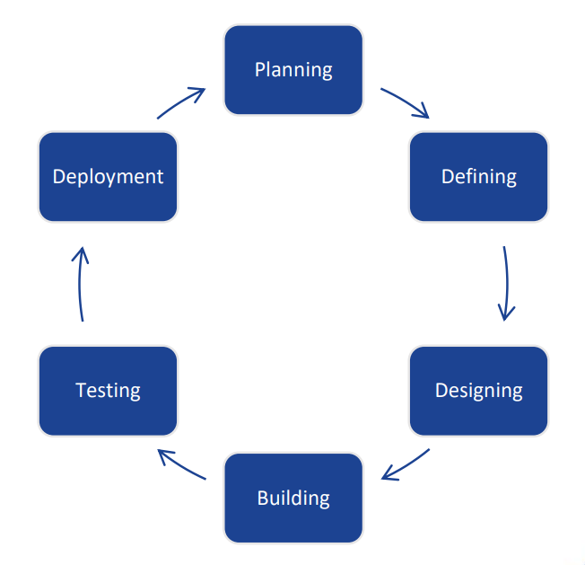
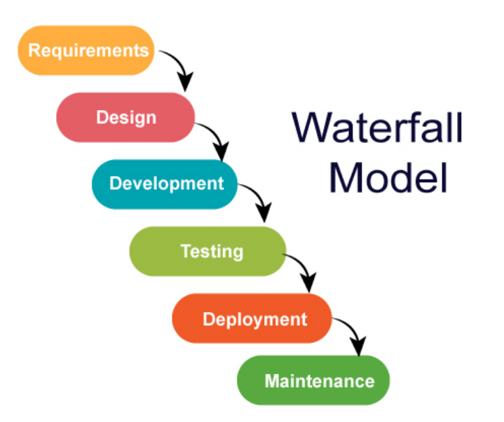
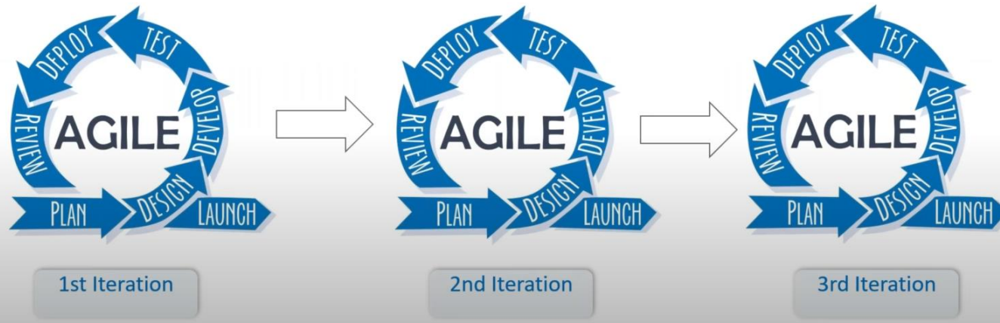

## Session 3: Agile methodologies 敏捷方法  

### SDLC 概述  
- *软件开发生命周期（Software Development Life Cycle，SDLC）* 是软件行业用于设计、开发和测试高质量软件的流程  
    - SDLC 的目标是生产出高质量的软件，满足或超越客户的期望，并在预期时间和成本估算内完成  
- [ISO/IEC/IEEE 12207](https://www.iso.org/standard/63712.html) 是 SDLC 流程的国际标准  
    - ISO/IEC/IEEE 12207 的目标是成为定义开发和维护软件所需的所有任务的标准  

### SDLC 流程  
-   
- 典型的软件开发生命周期包括以下几个阶段：  
    - 规划和需求分析  
    - 确定需求  
    - 设计产品结构  
    - 构建或开发产品  
    - 测试产品  
    - 投放市场和维护

### SDLC 模型  
- 在软件开发过程中可以遵循各种 SDLC 模型，称为*软件开发过程模型（Software Development Process Models）*  
    - 每种流程模型都遵循其类型所特有的一系列步骤，以确保在软件开发流程中取得成功  
- 最重要、最流行的 SDLC 模型有  
    - Waterfall model 瀑布模型  
    - Iterative model 迭代模型  
    - Spiral model 螺旋模型  
    - V-model | V 型模型  
    - Big Bang model 大爆炸模型  

### 开发模型：传统瀑布式开发 vs. 敏捷开发  
#### 瀑布模型  
-   
- 瀑布模型是最早用于软件开发的 SDLC 模型  
- 它也被称为*线性顺序生命周期模式（inear-sequential life cycle）*  
    - 每个阶段必须在下一阶段开始前完成，各阶段不得重叠  
#### 敏捷模型是什么？  
- 敏捷模式认为，每个项目的处理方式都不尽相同，因此需要对现有方法进行调整，以最大限度地满足项目要求  
- 这些任务被划分为*时间框*（*time boxes*，小的时间范围），以便为一个版本提供特定功能  
- 采用迭代方法，每次迭代后都会交付可运行的软件版本  
    - 每次构建的功能都是递增的；最终构建的功能包含客户要求的所有功能  

### 敏捷基础原则  
- 迭代工作（这是优先事项）  
- 产品的推出不在周期之内：在投入生产前进行审查  
-   

### 敏捷方法  
- 随着时间的推移，敏捷模型因其灵活性和适应性而变得流行起来  
- 最流行的敏捷方法包括  
    - Rational Unified Process（合理统一流程，1994）、Scrum（1995）、Crystal Clear（水晶方法）、Extreme Programming（极限编程，1996）、Adaptive Software Development（自适应软件开发）、Feature Driven Development（功能驱动型开发）和 Dynamic Systems Development Method（动态系统开发方法，DSDM，1995）  
    - 根据 2001 年发表的《敏捷宣言》（*Agile Manifesto*），所有这些方法现在统称为“敏捷方法”（Agile Methodologies）  

### 敏捷原则  
- **Working software 工作软件**：演示工作软件被认为是与客户沟通以了解其需求的最佳手段，而不是仅仅依赖于文档资料  
- **Customer collaboration 客户协作**：由于各种因素的影响，在项目开始时无法完全收集需求，因此持续的客户互动对于获得适当的产品需求非常重要  
- **Responding to change 应对变化**：敏捷开发注重快速应对变化和持续发展  

### 敏捷 vs. 传统 SDLC 模型  
- 传统的 SDLC 模型（如瀑布模型）则基于预测性方法（predictive approach）  
    - 预测团队通常会进行详细规划，并对未来几个月或产品生命周期内要交付的任务和功能进行全面预测  
    - 预测方法完全取决于在周期开始时进行的需求分析和规划。任何要纳入的变更都要经过严格的变更控制管理和优先级排序  
- 敏捷基于适应性软件开发方法（adaptive software development methods）
    - 采用一种*适应性（adaptive）* 方法，没有详细的规划，只在需要开发的功能方面明确未来的任务  
    - 采用*功能驱动开发（feature-driven development）*，团队动态适应不断变化的产品需求  
        - 通过迭代发布，对产品进行非常频繁的测试，最大限度地降低未来出现重大故障的风险  

### 敏捷各有利弊  
- 敏捷方法已被软件行业广泛接受  
    - 然而，敏捷不一定适合所有产品  
- 所有 SDLC 方法都有利弊  
#### 敏捷方法的优点  
- 促进团队合作和交叉培训  
- 快速开发功能，并进行演示  
- 所需资源最少  
- 适用于固定或不断变化的需求  
- 提供早期部分工作解决方案  
- 适用于不断变化的环境的良好模式  
- 规则最少  
- 文档易于管理  
- 可在整体规划的范围内同时进行开发和交付  
- 几乎不需要规划  
- 易于管理  
- 为开发人员提供灵活性  
#### 客户互动  
- 客户互动是敏捷方法的支柱  
- 开放式交流和最少的文档是敏捷开发环境的典型特征  
- 敏捷团队彼此密切合作，通常地位相同  
#### 敏捷方法的缺点  
- 必须要有整体规划、敏捷领导者和敏捷项目管理实践（没有这些，模式将无法运行）  
- 在很大程度上取决于客户互动  
    - 如果客户不确定，团队可能会被推向错误的方向  
- 对个人的依赖程度很高，因为所生成的文档最少  
    - 由于缺乏文档资料，向团队新成员转让技术可能具有相当大的挑战性  

### Recommendations 建议（XP vs. Scrum）  
| Aspects 方面 | Practices 实践 | XP | Scrum |
| --- | --- | --- | --- |
| Iteration length 迭代时长 | 是否允许修改需求 | 1-2 周 | 2-4 周 |
| Handle changes within an iteration 处理一次迭代中的需求变化 | 要求是否与优先权严格相符 | 当某项需求未得到满足时，可以用其他需求来替代，但实施时间是相同的 | Scrum 不允许这样做：一旦迭代完成，就不允许更改，Scrum 主管要严格检查 |
| Priority of features 功能优先级 | 要求是否与优先权严格相符 | 是 | 不需要 |
| Engineering practices 工程实践 | 是否采用严格的工程方法来确保进度或质量 | 非常严格 | 要求开发人员有意识地 |

### 敏捷方法小结  
- 敏捷方法是一种项目管理方法，它将项目分成若干阶段，并强调持续协作和改进  
    - 团队遵循规划、执行和评估的周期  
    - 敏捷方法重视适应性和灵活性  
    - 敏捷旨在更好地响应不断变化的业务需求，因此侧重于使团队以可行的增量交付成果  