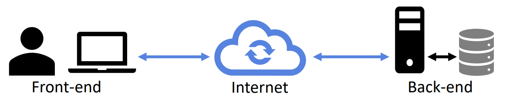

## Session 4: Topics not covered on the course 课程未涉及的主题  

### 关于 Java 还有很多……  
- 在本课程中，我们介绍了大部分 Java *基础知识*  
    - Java 的基本语法和编程结构  
    - 在 Java 中使用类、接口和对象  
    - 用于实现图形用户界面（Swing）、使用集合、文件、数据库等的常用库  
- 通过本课程的学习，你应该掌握用 Java 实现不同类型桌面应用程序的知识  
- 但是，本课程中还有更多关于 Java 的内容没有涉及到  
    - 使用集成开发环境（integrated development environment，IDE）、高级库（Java FX、多媒体等）、移动设备 Java 等...

### Integrated development environments 集成开发环境（IDEs）  
- 在本课程中，我们使用 Codio 作为开发环境  
    - 在 Codio 中进行 Java 开发与在任何控制台环境（如 Linux）中进行 Java 开发并无本质区别，后者使用文本编辑器编辑 Java 源文件  
- 然而，专业的 Java 开发通常使用集成开发环境（IDE）  
    - 集成开发环境集成了编辑（editing）、编译（compiling）、调试（debugging）和管理（managing）项目文件及依赖关系（dependencies）的工具  
    - 有几种 Java 集成开发环境，既有商用的，也有开源的  
#### 典型的 IDE 功能  
-   
- 大多数 IDE 的图形用户界面都有独立的项目文件区、编辑器区和控制台输出区  
    - 可使用文件视图添加和删除文件  
    - 可使用菜单栏编译项目  
    - 编辑器通常用不同颜色突出显示 Java 关键字和变量  
#### 使用 IDE 调试  
- 在本课程中，我们讨论了使用 JUnit 进行测试  
    - 然而，除测试外，调试也是软件开发的重要组成部分  
- IDE 通常具有内置调试器，可用于跟踪错误  
    - 允许创建断点并逐步运行程序  
    - 允许在运行时监控变量值和内存使用情况  
    - 允许在运行时暂停和恢复线程  
#### Java 开发常用的 IDE  
- 流行的 Java IDE（适用于 Linux、Mac 和 Windows）包括：
    - **IntelliJ IDEA**：最流行的 Java IDE，提供免费的社区版本和付费版本  
    - **Eclipse IDE**：另一个成熟流行的 Java IDE，开源，有多个插件可用于定制  
    - **Apache NetBeans**：第三个成熟的开放源码 Java IDE，提供快速创建应用程序的向导  
- 流行的集成开发环境不仅限于 Java，还支持其他语言（如 C++、Python、JavaScript……）  

### 用于图形编程的 JavaFX  
- JavaFX 是一个平台和一系列 Java 库，用于在 Java 程序中创建图形用户界面和图形  
    - JavaFX 预计将逐步取代 Swing，但在可预见的未来，Swing 和 JavaFX 可能仍将并存  
        - JavaFX 已从 JDK 第 11 版中删除，现在作为一个单独的项目进行开发  
    - JavaFX 为开发人员提供了更好的动画和特效支持；因此，JavaFX 是在 Java 中进行更高级图形编程的首选  
        - Swing 的许多知识也可用于 JavaFX  
#### Swing vs. JavaFX  
- **Swing**  
    - 用于构建基本图形用户界面的古老而完善的程序库  
        - 标准 Java SDK 的一部分  
    - 为传统桌面和跨平台应用程序提供良好的向后兼容性  
    - 对多媒体的支持有限  
    - 从长远来看，可能会被 JavaFX 取代  
- **JavaFX**  
    - 仍在积极开发中的更先进的新图形平台  
        - 不属于标准 Java SDK 的一部分（自版本 11 起）  
    - 针对轻型和移动系统进行了充分优化  
    - 出色的内置音频、视频和高级图形功能  
#### JavaFX 媒体  
- 通过 javafx.scene.media 包，可从本地或互联网（流媒体）创建媒体播放  
    - 支持多种视频和音频编解码器和格式  
    - 支持图形叠加和变换  
-   

    - *图片来自 https://docs.oracle.com/javafx/2/media/overview.htm*

### 用于网络开发的 Java  
- 在本课程中，我们介绍了通过 Java 程序（本地或互联网）使用数据库的方法；然而，网络编程远不止这些！  
- Java 可用于前端（用户应用）和后端（服务器）应用程序开发  
    - Java 因其可移植性而成为网络开发的热门选择  
    -   
- 有多个软件包可用于支持 Java 网络开发  
    - 原生 java.net 软件包支持基本的套接字编程  
        - 实现简单的客户端—服务器交互  
    - Spring 框架（https://spring.io）是一个流行的开源框架，用于用 Java 构建网络应用程序  
        - Spring 是一个大型框架，但也是模块化的：开发人员可以只使用特定应用程序所需的包和类  
    - Google Web Toolkit（GWT）允许编写 Java 代码并将其编译为可在网络浏览器中运行的 JavaScript 代码  

### 用于移动开发的 Java  
- Java 是 Android 系统开发的默认语言  
    - Android Studio 是开发 Android 应用程序的官方 IDE  
        - https://developer.android.com/studio  
    - 提供适用于不同安卓设备的模拟器，可在台式电脑上开发和测试应用程序，而无需使用真正的安卓设备  
        -   

### 成功的 Java 应用程序  
- Java 已被成功用于实施多个应用程序（或其中的一部分），如：  
    - Hadoop  
    - Matlab（部分）  
    - Minecraft  
    - Wikipedia 的搜索  
    - 大量 Android 应用程序  
    - 大量企业应用程序（尤其是在金融行业）  
- 如果你有一个软件创意，用 Java 实现它是一个好主意！  