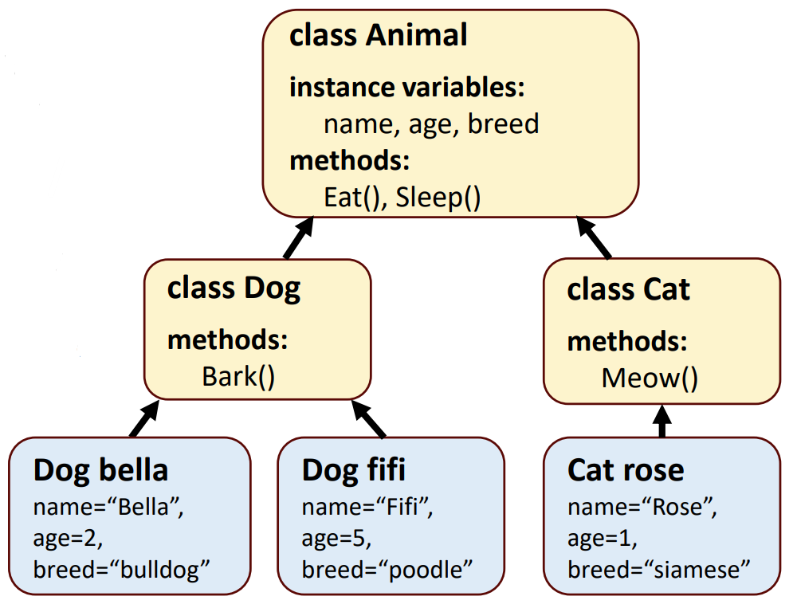

# 复习笔记  

### Day 1: 简介  
- Java 是一种古老的语言，在跨平台、网络和移动开发方面尤为成功  
    - Java 的主要优点是*可移植性*：Java 虚拟机（JVM）可以在任何平台上运行相同的 Java 字节码  

### Day 1-2：Java 基础  
- 介绍使用 Git 进行版本控制  
- 介绍基础 Java 语法和结构  
    - 基本 Java 程序结构：至少一个类，静态方法 `main()` 是程序执行的入口点  
    - 使用原始类型变量（primitive type variables）和基本内置方法  
    - 条件结构：`if...else`、`switch...case`  
    - 循环：`while`、`do...while`、`for`  
    - 数组和 ArrayList 类  

### Day 3：类和对象  
- 类、对象、方法和实例变量（instance variables）的概念  
- 静态方法和变量  
    - 静态类一般指包含静态成员的类  
    - 静态方法和变量属于类，而不是根据创建的实例，可以直接通过类名调用（如 `Math.random()`、`Math.PI`）  
    - 静态变量由该类所有实例共享  
      ```java
      public class Employee {
          public static int count = 0;
          // 计数器变量 count 是 Employee 类所有实例共享的静态变量
        ...
      ```
      例如，创建 Employee 的实例 e1、e2 后，无论是通过 `e1.count`、`e2.count` 还是 `Employee.count` 访问，返回的都是相同值  
- 静态导入  
    - 语法：
      ```java
      import static packageName.ClassName.staticMemberName;
      ```
    - 使用通配符 `*` 导入一个类中的所有静态成员  
    - 允许在代码中直接引入类的静态成员，而不需要使用类名来限定，使代码更简洁  
        - 例如，通过 `import static java.lang.Math.*;` 语句，可以直接使用 `sqrt()` 或 `pow()` 等，而不需要 `Math.sqrt()` 或 `Math.pow()`  
- 使用 `final` 将变量声明为不可修改（即常量），任何修改的尝试都会报错  
- 访问修饰符（Access modifiers）：default、private、protected、public  
  | Assess to 访问 | default 默认 | private 私有 | protected 受保护 | public 公共 |
  | --- | :---: | :---: | :---: | :---: |
  | Same class 相同类 | ✔️ | ✔️ | ✔️ | ✔️ |
  | Same package subclass 相同包的子类 | ✔️ | ❌ | ✔️ | ✔️ |
  | Same package non-subclass 相同包的非子类 | ✔️ | ❌ | ✔️ | ✔️ |
  | Different package subclass 不同包的子类 | ❌ | ❌ | ✔️ | ✔️ |
  | Different package non-subclass 不同包的非子类 | ❌ | ❌ | ❌ | ✔️ |
    - 访问修饰符允许封装（encapsulation，从其他类中隐藏数据），这是 OOP 的基本概念之一 
- 继承、组成和多态  
    - 继承
        - 从更高级的类继承共同结构的类  
          
        - 减少重复，简化代码维护，提高可重用性  
        - 被继承的类是超类（superclass/parent），继承自另一个类的类是子类（subclass/child）  
        - 使用 `extends` 从一个类继承  
          ```java
          class Dog extends Animal {...}
          ```
        - 在子类的方法前使用 `@override` 关键字来向编译器表明这个方法在覆写超类的方法  
            - 否则，编译器不会检验是否覆写了超类的方法（如语法错误导致方法名不同）  
        - 使用 `super()` 调用超类的构造函数，使用 `super.methodName()` 调用超类中的方法  
    - 组成（has-a）  
        - 创建依赖更少的对象，来降低复杂性  
        - 例：Car *has an* engine  
        - 组成 vs 继承  
          | Composition 组成 | Inheritance 继承 |
          | --- | --- |
          | 组合和聚合形成“has-a”关系，总和大于部分 | 当信息授权在层级内自由进行时的继承 |
          | 对象是独立的，因此开发成本较高：可重复使用的内置依赖性较少 | 更易于开发，但依赖性更强：改变超类中的某些内容，很容易就会影响到所有子类，从而造成破坏 |
    - 多态 Polynomial  
        - 定义一个接口并由多个实现  
        - 分为编译时多态性和运行时多态性

### Day 5: 测试和依赖管理  
- 测试和依赖性管理是软件开发的重要组成部分  
    - 测试可确保程序完成其应该完成的工作  
    - 持续测试有助于避免日后进行成本更高的调试  
    - 依赖关系管理对于避免项目与其使用的第三方库之间的依赖关系中断至关重要  
- 可使用 Maven 和 JUnit 等工具自动进行测试和依赖性管理  
    - Maven 的功能  
        - Builds 构建  
        - Documentation 文档  
        - Reporting 报告  
        - Dependencies 依赖关系  
        - Source code management 源代码管理 (SCM)  
        - Releases 发布  
        - Distribution 分发  

### Day 5-6: 内存的概念、异常  
- 原始类型变量包含变量的值，而引用类型变量包含对计算机内存中其他地方的实际数据的引用  
- 在调用方法时，方法的本地数据以先进先出的方式存储在调用堆栈中  
    - 递归是一种编程技术，在这种技术中，方法调用自身  
- 在出现错误或其他意外情况时会抛出异常：可使用 try...catch 结构处理异常  
  ```java
  try {
      // 执行语句，可能会抛出异常
  }
  catch (Exception e) {
      // 只有出现异常时才会执行这里的语句
  }
  // 无论是否有异常，程序都会继续执行之后的语句
  ```

### Day 7: 图形用户界面 GUI  
- Java Swing 库允许使用标准组件（如按钮、标签、菜单项、文本字段等）实现图形用户界面  
    - 容器是包含其他组件的组件  
    - 可以使用不同的布局来安排组件之间的相互关系  

### Day 7-8: 事件驱动编程  
- Swing 图形用户界面通过使用事件监听器来添加功能  
    - 事件由 Swing 组件触发，作为对用户操作的响应，如点击按钮  
    - 通过实施适当的事件监听器接口并将其分配给图形用户界面组件，可使用自定义事件监听器 x  
- 常用的事件监听器接口包括 ActionListener（可点击组件，如按钮）和 EventListener（可选择组件，如菜单项）  
    - 可为每个组件分配多个事件监听器  

### Day 9: 高级 Swing  
- 在 Swing 中，模型可以将图形用户界面组件和与组件相关的数据分离开来  
- 复杂的 Swing 组件（如 JList 和 JTable）有多种预定义模型，使其更易于自定义  
    - 通过模型，可以为组件分配不同的功能（在表格或列表中删除或添加项目等）  

### Day 9-10: 并发  
- 在并发编程中，多个代码块同时（或看似同时）执行  
    - 在 Java（以及许多其他编程语言）中，并发性是通过多线程来实现的  
    -   
- 并发是一个复杂的话题，可能有几个注意事项  
    - 线程干扰（多个线程同时访问相同数据）会导致内存不一致  
- 线程同步可用于“锁定”一个线程，使其他线程必须等待该线程结束  
    - 嵌套锁可能导致死锁  
    - 并行编程需要精心设计！  

### Day 11：字符串和集合  
- 在许多实用程序中，对字符串的操作是必不可少的  
    - Java 提供的类具有将字符串拆分成子串、串联字符串、使用正则表达式搜索等方法  
- 为处理同类对象组，Java 提供了集合框架  
    - 用于不同类型集合的类  
    - 主要的集合类型有列表、队列、集合和映射，还有几种不同的子类型  

### Day 12: 高级集合  
- 队列是元素通常以先入先出方式排列的集合  
- 集合是不包含重复元素的集合  
- 地图是元素以键和值对的形式组织起来的集合  
- 比较器对自定义类对象的排序至关重要  

### Day 13: 使用文件  
- 文件用于共享数据和长期保存数据  
    - Java 为使用文件和目录提供了多个类和方法，包括创建、读取和写入  
    - 文件通常作为 I/O 流按顺序读写  
    - 文本文件和二进制文件都可在 Java 中使用  

### Day 13-14: 序列化和数据库  
- 序列化（或 marshalling）是指将对象转换为适合存储或传输的格式的过程  
- Java 数据库连接 (JDBC) API 提供对数据库和其他数据源的访问权限  
    - 可直接在 Java 中生成 SQL 语句  
- 尽管 Java 本质上是 OOP 语言，但在 Java 中也可以进行函数式编程  

### Day 15: 杂项  
- Java 泛型是重载的类型安全替代方案，可提高代码的清晰度  
- 垃圾回收是 JVM 自动运行的过程，用于释放未使用的内存分配  
- 现代软件开发普遍采用敏捷方法  
- 简要回顾本课程未涉及的一些相关主题  