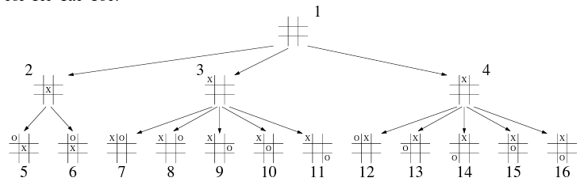
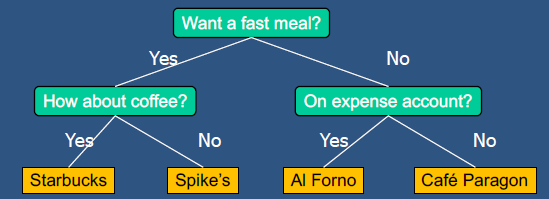

# Lecture 8.1: Trees 树  

## 有时数据不是连续的  
这些数据可能以其他的模式或关系组织。  

## Tree 树  
  
- 计算机科学中，树(Tree)是层次结构的抽象模型  
- 树由具有父子关系的节点组成  
- 应用:  
    - Organization charts 组织图  
    - File Systems 文件系统  
    - Programming environments 编程环境  

## Tree Terminology 相关术语
  
- 根节点(Root)：没有父节点(A)  
- 内部节点(Internal node): 至少有一个子节点  
- 兄弟节点(siblings):深度相同的子节点(B、C、D)。  
- 外节点(External node，又称叶节点 leaf):没有子节点的节点(E, I, J, K, G, H, D)  
- 节点的祖先(Ancestor):parent、grandparent、grand-grandparent等  
- 节点深度(Depth):祖先节点的数量  
- 树的高度(Height):任意节点的最大深度(3)  
- 节点的后代(Descendant):child、grandchild、grand-grandchild等  
- 子树(Subtree):由节点及其子结点组成的树  
- 边(Edge)：其中一个节点是另一个节点的父节点  
- 路径(Path)：节点序列，例如 A/B/F/J、cs252/projects/demos/market 等  

## 树 ADT  
我们用位置来抽象节点  
- 通用的方法：  
    - 整数 `len ()`  
    - 布尔值 `is_empty()`  
    - 迭代器 `positions()`  
    - 迭代器 `iter ()`  
- 访问方法：  
    - 位置 `root()`  
    - 位置 `parent(p)`  
    - 迭代器 `children(p)`  
    - 整数 `num_children (p)`  
- 查询方法：  
    - 布尔值 `is_leaf(p)`  
    - 布尔值 `is_root(p)`  
- 更新方法:  
    - 元素 `replace(p, o)`  
- 类的数据结构可以定义其他更新树 ADT 的方法  

## 遍历方法  
### Preorder Traversal 先序遍历  
- 遍历以系统的方式访问树的节点  
- 在预序遍历中，一个节点在其子节点之前被访问  
- 应用:打印结构化文档  
```
**Algorithm** preorder(T, p):
    perform the "visit" action for position p
    **for** each child c in T.children(d) **do**
        preorder(T, c)      {recursively traverse the subtree rooted at c}
```
  
### Postorder Traversal 后序遍历  
- 一个节点在它的子节点之后被访问  
- 应用:计算目录及其子目录中文件所使用的计算空间  
```
**Algorithm** postorder(T, p):
    **for** each child c in T.children(p) **do**
        postorder(T, c)         {recursively traverse the subtree rooted at c}
    perform the "visit" action for position p
```
  
## Breadth-First Traversal 广度优先遍历  
- 在广度优先遍历中，每一层的所有节点都在其子节点之前被访问  
- 应用:计算游戏中可能走法的游戏树，以根为初始配置  
```
**Algorithm** breadthfirst(T):
    Initialize queue Q to contain T.root()
    **while** Q not empty **do**
        p = Q.dequeue()     {p is the oldest entry in the queue}
        perform the "visit" action for position p
        **for** each child c in T.children(p) **do**
            Q.enqueue(c)    {add p's children to the end of the queue for later visits}
```
  

## Binary Tree 二叉树  
  
- 二叉树是一种具有以下属性的树:  
    - 每个内部节点最多有两个子节点(对于正确的二叉树，正好是两个)  
    - 一个节点的子结点是一个有序的对  
- 我们称内部节点的子节点为左子节点(left child)和右子节点(right child)  
- 另一种递归定义:  
    - 二叉树要么是由单个节点组成的树  
    - 要么是根有一对有序子结点的树，每个子结点都是二叉树  
- 应用：  
    - 算术表达式  
    - 决策过程  
    - 搜索  

## 二叉树实例
### Arithmetic Expression Tree 算术表达式树  
- 与算术表达式关联的二叉树  
    - 内部节点：操作符(operators)  
    - 外部节点：操作数(operands)  
- 例：表达式 (2 × (a - 1) + (3 × b)) 的算术表达式树  
      
### Decision Tree 决策树  
- 与决策过程相关的二叉树  
    - 内部节点：回答是或否的问题  
    - 外部节点：决策  
- 例：晚餐决策  
      

## Properties of Proper Binary Trees 二叉树的性质  
- Notation 符号  
    - n - 节点数  
    - e - 外部节点数  
    - i - 内部节点数  
    - h - 高度(Height)  
- 性质  
    - e = i + 1  
    - n = 2e - 1  
    - h ≤ i  
    - h ≤ (n - 1) / 2  
    - e ≤ 2^h  
    - h ≥ log2(e)  
    - h ≥ log2(n + 1) - 1  

## 二叉树 ADT
- 二叉树 ADT 扩展了树 ADT ，即继承了树 ADT 的所有方法  
- 额外的方法  
    - 位置 left(p)  
    - 位置 right(p)  
    - 位置 sibling(p)  
- 更新方法可以由实现二叉树 ADT 的数据结构定义  
- 实现
    ```Python
    class BinaryTree(Tree):
        """Abstract base class representing a binary tree structure."""

        # ---------- additional abstract methods ----------
        def left(self, p):
            """Return a Position representing p's left child.
            
            Return None if p does not have a left child.
            """
            raise NotImplementedError("must be implemented by subclass")

        def right(self, p):
            """Return a Position representing p's right child.
            
            Return None if p does not have a right child.
            """
            raise NotImplementedError("must be implemented by subclass")
        
        # ---------- concrete methods implemented in this class ----------
        def sibling(self, p):
            """Return a Position representing p's sibling (or None if no sibling)."""
            parent = self.parent(p)
            if parent is None:                  # p must be the root
                return None                     # root has no sibling
            else:
                if p == self.left(parent):
                    return self.right(parent)   # possibly None
                else:
                    return self.left(parent)    # possibly None
            
            def children(self, p):
                """Generate an iteration of Positions representing p's children."""
                if self.left(p) is not None:
                    yield self.left(p)
                if self.right(p) is not None:
                    yield self.right(p)
    ```
### Inorder Treversal 中序遍历  
- 在中序遍历中，节点会被访问到左子树之后，右子树之前  
- 应用：绘制二叉树  
    - x(v) - v 的有序秩(inorder rank)  
    - y(v) - v 的深度(depth)  
```
**Algorithm** inorder(p):
    **if** p has a left child lc **then**
        inorder(lc)         {recursively traverse the left subtree of p}
    **if** p has a right child rc **then**
        inorder(rc)         {recursively traverse the right subtree of p}
```
  
我们从左到右遍历二叉树  
### Print Arithmetic Expressions  
- 顺序遍历的专门化  
    - 访问节点时，输出操作数和操作符  
    - 遍历左子树前输出“(”  
    - 遍历右子树后输出“)”  
```
**Algorithm** printExpression(v)
    **if** v has a left child
        print("(")
        inOrder (left(v))
    print(v.element ())
    **if** v has a right child
        inOrder (right(v))
    print (")")
```
### Evaluate Arithmetic Expressions 计算算术表达式  
- 后序遍历的专门化  
    - 递归方法，返回子树的值  
    - 当访问一个内部节点时，合并所有子树的值  
```
**Algorithm** evalExpr(v)
    **if** is_leaf (v)
        return v.element ()
    **else**
        x ← evalExpr(left (v))
        y ← evalExpr(right (v))
        ◇ ← operator stored at v
        return x ◇ y
```
### Euler Tour Traversal 欧拉环遍历  
- 二叉树的泛型遍历  
- 包括特殊情况的前序、后序和中序遍历  
- 绕着树进行遍历，每个节点访问三次  
    - 在左侧（前序）  
    - 从底部（中序）  
    - 在右侧（后序）  
- 当我们访问每个节点时，我们可以进行前后工作，并从一层返回信息到下一层  
```
**Algorithm** eulertour(T, p):
    perform the "pre visit" action for position p
    **for** each child c in T.children(p) **do**
        eulertour(T, c)
    perform the "post visit" action for position p
```
  

## Linked Structure for Trees 树的连接结构  
- 节点由存储元素、父节点和子节点序列的对象表示  
- 节点对象实现位置 ADT  
  
  

## Linked Structure for Binary Trees 二叉树的连接结构  
- 节点由存储元素、父节点、左子节点和右子节点的对象表示  
- 节点对象实现位置 ADT  
  
  

## Array-Based Representation of Binary Trees 基于数组表示的二叉树  
  
- 节点存储在数组 A 中  
  
- 节点 v 存储在 A\[rank(v)\] 中  
    - rank(root) = 0  
    - 如果节点是 parent(node) 的左子节点，那么 rank(node) = 2 * rank(parent(node)) + 1  
    - 如果节点是 parent(node) 的右子节点，那么 rank(node) = 2 * rank(parent(node)) + 2  