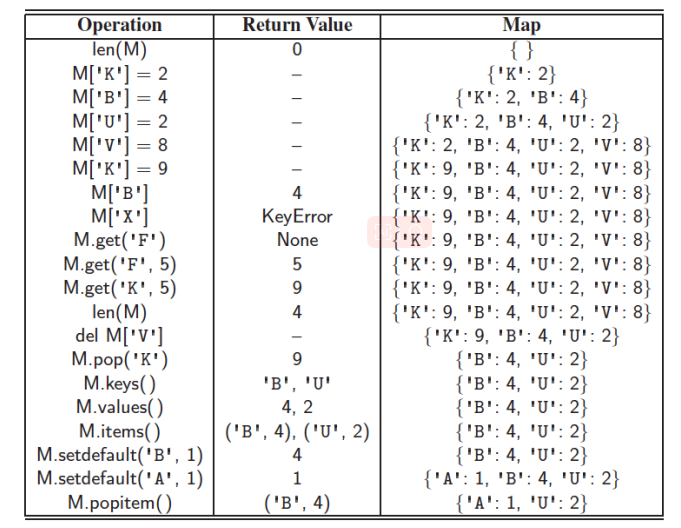

# Lecture 9.1: Maps and Dictionaries 映射和字典  

## Maps 映射  
- 映射是键值对的项的可搜索集合  
- 映射的主要操作是搜索、插入和删除元素  
- 不允许有多个物品使用相同的键  
- 应用:  
    - 通讯录  
    - 学生记录数据库  
### 映射为相同的值提供多个键  
_to_their_units_of_currency_(the_values).png)  
映射文本中的词频是另一个常见的应用。  
### Dictionaries 字典  
Python 的 `dict` 类可以说是该语言中最重要的数据结构。  
它表示一种被称为字典的抽象，其中唯一键映射到相关值。  
这里，我们在具体讨论 Python 的 `dict` 类时使用术语 `dictionary` ，在讨论抽象数据类型的更一般概念时使用术语 `map`。  
### 映射 ADT （使用 `dict` 语法）  
  
### 更多映射操作  
  
  
### 操作示例  
  

