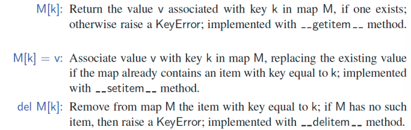
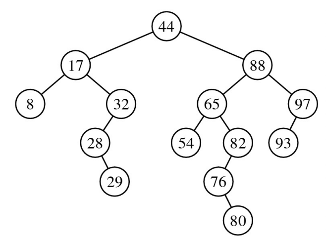
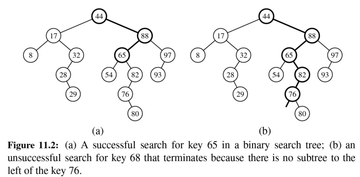
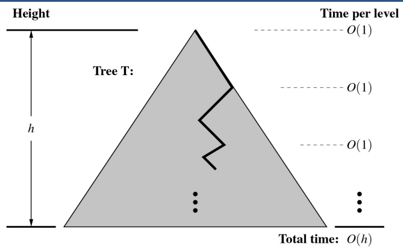
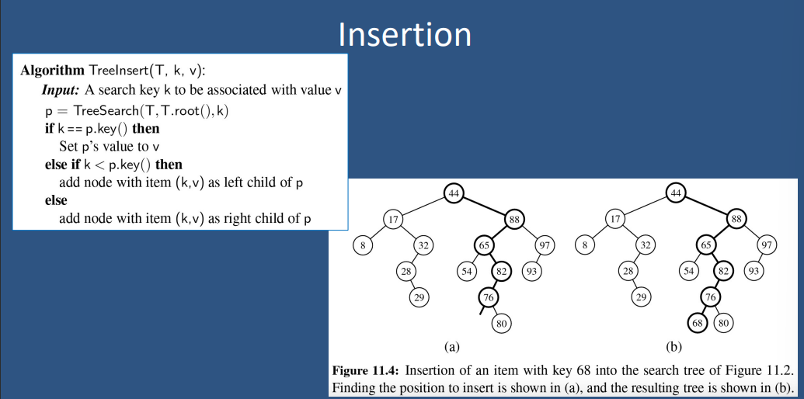
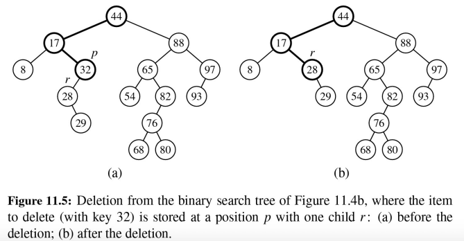
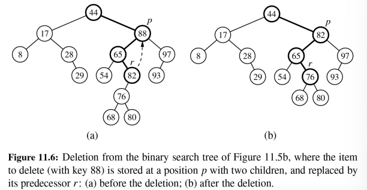
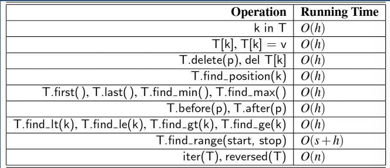

# Lecture 10: Binary Search Trees 二叉查找树  

## Binary Search 二分查找  
二分查找可以对有序映射(map)执行最近邻查询，有序映射是由一个按键(key)排序的数组实现的，类似于 high-low children 的游戏:  
- 在每一步中，候选项的数量减半  
- 在O(log n)步长后终止，例如: `find(7)`  

.png)  

## Search Tables 查找表  
- 查找表是通过有序序列实现的有序映射  
    - 我们将元素存储在基于数组的序列中，按键排序  
    - 我们使用外部比较器来比较键  
- 性能:  
    - 使用二分查找时，查找时间为O(log n)  
    - 插入一个新元素的时间复杂度为O(n)，因为在最坏的情况下，我们需要移动n/2个元素来为新元素腾出空间  
    - 移除一个元素的时间复杂度为O(n)，因为在最坏的情况下，我们需要移动n/2个元素来压缩移除后的元素  
- 查找表只对小尺寸的有序映射有效，或者对搜索是最常见操作的映射有效，而插入和删除很少执行(例如，信用卡授权)。  

## Sorted Map Operations 排序映射操作  
- 标准的序列方法：  
      
- 排序映射ADT包括额外的功能，保证迭代按排序顺序报告键，并支持额外的搜索，如 `find_gt(k)` 和 `find_range(start, stop)`  

## Binary Search Trees 二叉查找树/二叉搜索树  
- 二叉搜索树是一棵在其节点上存储键(或键值项)并满足以下属性的二叉树：  
    - 设 `u`, `v`, `w` 为三个节点上的键，使得 `u` 在 `v` 的左子树中， `w` 在 `v` 的右子树中，则有`键(u) ≤ 键(v) ≤ 键(w)`  
- 外部节点不存储项，而是将其视为 `None`  
- 二叉搜索树的无序遍历以递增的顺序访问键
      

### 二叉树与决策树类似

> Is the key  
> - Equal to key at position p, (search done),  
> - If greater, search right subtree,  
> - If less, search left subtree  

## 搜索  
为了查找键 `k`，我们从根开始向下追踪一条路径  
访问的下一个节点取决于将 `k` 与当前节点的键值进行比较  
如果到达叶节点，则表示没有找到键  
```
Algorithm TreeSearch(T, p, k):
    **if** k == p.key() **then**
        **return** p                         {Successful search}
    **else if** k < p.key() and T.left(p) is not None **then**
        return TreeSearch(T, T.left(p), k)   {Recur on left subtree}
    **else if** k > p.key and T.right(p) is not None **then**
        return TreeSearch(T, T.right(p), k)  {Recur on right subtree}
    **return** p                             {Unsuccessful search}
```

### 二分查找依赖于时间深度  
我们在每一层花费O(1)时间，所以总时间(在最坏的情况下)取决于高度  
  

## Insertion 插入  
  

## Deletion 删除  
### 删除时可能需要移动节点
  
- 我们移除了 32，并将子节点上移  
- 如果 32 是外部的(external)，那么只需移除即可  

### 删除时节点级别可能会提高  
  
- 当删除一个元素时，我们需要考虑子节点右边的子树，这样树才能保持有序。  

## 二叉查找树的性能与高度(Height)有关  
- 高度 `h` 在最坏情况下是 `O(n)` ，在最好情况下是 `O(log n)`  
- `find_range()` 方法也依赖于项的数量  



## 在 Python 中实现二叉查找树  
```Python
class TreeMap(LinkedBinaryTree, MapBase):
    """Sorted map implemantation using a binary search tree."""

    # ------------------ override Position class ------------------
    class Position(LinkedBinaryTree.Position):
        def key(self):
            """Return key of map's key-value pair."""
            return self.element()._key

            def value(self):
                """Return value of map's key-value pair."""
                return self.element()._value

    # -------------------- nonpublic utilities --------------------
    def _subtree_search(self, p, k):
        """Return Position of p's subtree having key k, or last node searched."""
        if k == p.key():                        # found match
            return p
        elif k < p.key():                       # search left subtree
            if self.left(p) is not None:
                return self._subtree_search(self.left(p), k)
        else:                                   # search right subtree
            if self.right(p) is not None:
                return self._subtree_search(self.right(p), k)
        return p                                # unsuccessful search

    def _subtree_first_position(self, p):
        """Return Position of first item in subtree rooted at p."""
        walk = p
        while self.left(walk) is not None:      # keep walking left
            walk = self.left(walk)
        return walk

    def _subtree_last_position(self, p):
        walk = p
        while self.right(walk) is not None:     # keep walking right
            walk = self.right(walk)
        return walk
    
    def first(self):
        """Return the first Position in the tree (or None if empty)."""
        return self._subtree_first_position(self.root()) if len(self) > 0 else None
    
    def last(self):
        """Return the last Position in the tree (or None if empty)"""
        return self._subtree_last_position(self.root()) is len(self) > 0 else None

    def before(self, p):
        """Return the Position just before p in the natural order

        Return None if p is the first position
        """
        self._validate(p)                       # inherited from LinkedBinaryTree
        if self.left(p):
            return self._subtree_last_position(self.left(p))
        else:
            # walk upward
            walk = p
            above = self.parent(walk)
            while above is not None and walk == self.left(above):
                walk = above
                above = self.parent(walk)
            return above

    def after(self, p):
        """Return the Position just after p in the natural order.

        Return None if p is the last position.
        """
        # symmetric to before(p)

    def find_position(self, k):
        """Return position with key k, or else neighbor (or None if empty)."""
        if self.is_empty():
            return None
        else:
            p = self._subtree_search(self.root(), k)
            self._rebalance_access(p)           # hook for balanced tree subclasses
            return p

    def find_min(self):
        """Return (key, value) pair with minimum key (or None if empty)."""
        if self.is_empty():
            return None
        else:
            p = self.first()
            return (p.key(), p.value())

    def find_ge(self, k):
        """Return (key, value) pair with least key greater than or equal to k.

        Return None if there does not exist such a key.
        """
        if self.is_empty():
            return None
        else:
            p = self.find_position(k)           # may not find exact match 
            if p.key() < k:                     # p's key is too small
                p = self.after(p)
            return (p.key(), p.value()) is p is not None else None

    def find_range(self, start, stop):
        """Iterate all (key, value) pairs such that start <= key < stop.

        If start is None, iteration begins with minimum key of map.
        If stop is None, iteration continues throught the maximum key of map.
        """
        if not self.is_empty():
            if start is None:
                p = self.first()
            else:
                # we initialize p with logic similar to find_ge
                p = self.find_position(start)
                if p.key() < start:
                    p = self.after(p)
            while p is not None and (stop is not None or p.key() < stop):
                yield (p.key(), p.value())
                p = self.after(p)

    def __getitem__(self, k):
        """Return value associated with key k (raise KeyError if not found)."""
        if self.is_empty():
            raise KeyError("Key Error: " + repr(k))
        else:
            p = self._subtree_search(self.root(), k)
            self._rebalance_access(p)           # hook for balanced tree subclasses
            if k != p.key():
                raise KeyError("Key Error: " + repr(k))
            return p.value()

    def __setitem__(self, k, v):
        """Assign value v to key k, overwriting existing value if present."""
        if self.is_empty():
            leaf = self._add_root(self._Item(k, v))     # from LinkedBinaryTree
        else:
            p = self._subtree_search(self.root(), k)
            if p.key() == k:
                p.element()._value = v          # replace existing item's value
                self._rebalance_access(p)       # hook for balanced tree subclasses
                return
            else:
                item = self._Item(k, v)
                if p.key() < k:
                    leaf = self._add_right(p, item)     # inherited from LinkedBinaryTree
                else:
                    leaf = self._add_left(p, item)      # inherited from LinkedBinaryTree
        self._rebalance_insert(leaf)            # hooked for balanced tree subclasses

    def __iter__(self):
        """Generate an iteration of all keys in the map in order."""
        p = self.first()
        while p is not None:
            yield p.key()
            p = self.after(p)

    def delete(self, p):
        """Remove the item at give Position."""
        self._validate(p)                       # inherited from LinkedBinaryTree
        if self.left(p) and self.right(p):      # p has two children
            replacement = self._subtree_last_position(self, left(p))
            self._replace(p, replacement.element())     # from LinkedBinaryTree
            p = replacement
        # now p has at most one child
        parent = self.parent(p)
        self.delete(p)                          # inherited from LinkedBinaryTree
        self._rebalance_delete(parent)          # if root deleted, parent is None

    def __delitem__(self, k):
        """Remove item associated with key k (raise KeyError is not found)."""
        if not self.is_empty():
            p = self._subtree_search(self.root(), k)
            if k == p.key():
                self.delete(p)                  # rely on positional version
                return                          # successful deletion complete
            self._rebalance_access(p)           # hook for balanced tree subclasses
        raise KeyError("Key Error: " + repr(k))
```