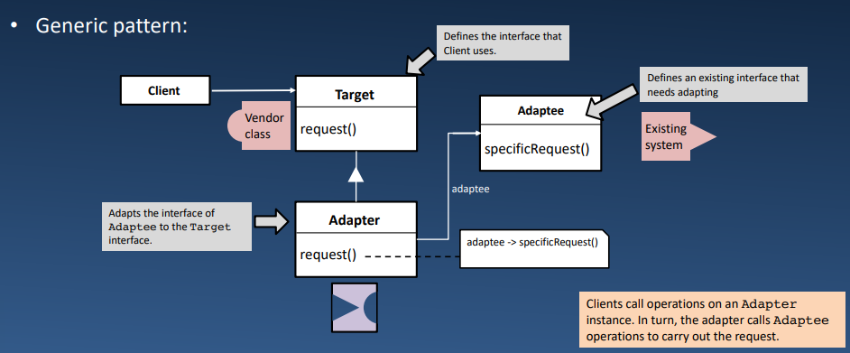

# Lecture 11.5: *Adapter* Pattern 适配器模式  

| 模式 | Adapter 适配器（也称 Wrapper） |
| --- | --- |
| 递归（Recurring）问题 | 如何在两个不兼容的接口之间创建桥梁？ |
| 解决方案 | 实现一个包装器类（适配器），将来自它的请求转换为另一个类（Adaptee） |
| 结果 | 单个适配器可以与多个适配器（Adaptee 及其子类）一起工作 |

## GoF 中的适配器  
  

## 适配器模式 & Python  
考虑这个例子：  
- 客户端希望发送一个 `sound()` 请求给 `bird` 对象，并输出它们发出的声音…  
    ```Python
    class Turkey:
        def fly_to(self):
            print("I believe I can fly...")

        def gobble(self, n):
            print("gobble " * n)
    ```
- Turkey 并没有实现 `sound()` ——而是实现了 `gobble(n)` 方法  
- 因此我们需要适配器！  
    ```Python
    class TurkeyAdapter:
        def __init__(self, turkey):
            self.turkey = turkey
            # delegate to native Turkey method
            self.fly_to = turkey.fly_to
            self.gobble_count = 3

        # adapt gobble to quack
        def sound(self):
            self.turkey.gobble(self.gobble_count)
    ```
    ```
    >>> turkey = Turkey()
    >>> turkeybird = TurkeyAdapter(turkey)
    >>> turkeybird.fly_to()
    I believe I can fly...
    >>> turkeybird.sound()
    gobble gobble gobble
    ```