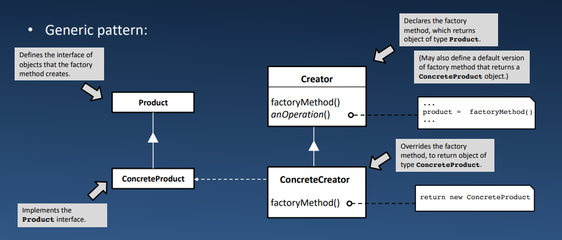
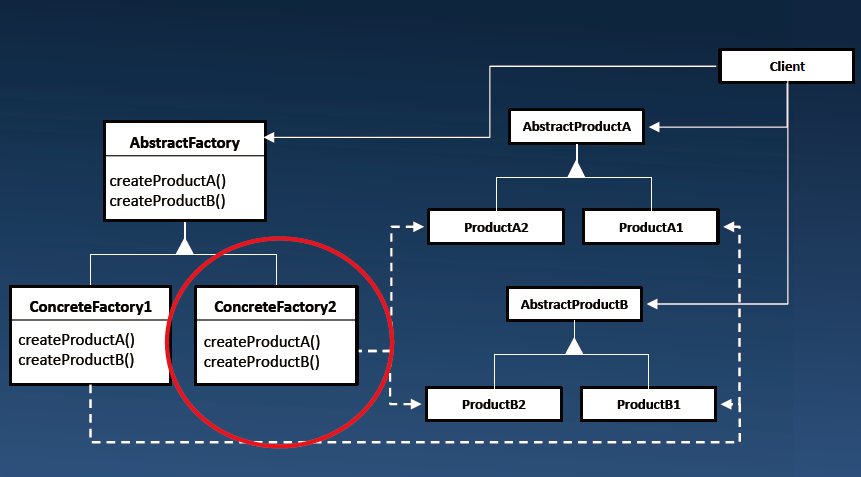

# Lecture 12.2: *Factory* Pattern 工厂模式  

| 模式 | Factory Method 工厂方法/工厂模式（也称 virtual constructor） |
| --- | --- |
| 递归（Recurring）问题 | 我们可能并不总是事先知道我们想要创造什么样的对象;有些对象只能在执行时创建（例如，在用户请求之后） |
| 解决方案 | 1. 定义一个带有创建对象的操作(工厂方法)的类<br>2. 让子类决定实例化哪个特定的类 |
| 结果 | 接口与实现分离，提供实现灵活性<br>免除客户端直接创建对象的责任 |

## GoF 版本的工厂方法  
  

## 工厂方法 & Python  
考虑这个（非常简单的）例子：  
```Python
from abc import ABC

class Vehicle(ABC):
    def drive(self):
        pass

class SportsCar(Vehicle):
    def drive(self):
        print('Sports car driving.')

class ElectricCar(Vehicle):
    def drive(self):
        print('Electric car driving.')

class CarCreator:
    @staticmethod
    def factory_method(product_type):
        if product_type == ‘sports':
            return SportsCar()
        elif product_type == ‘electric':
            return ElectricCar()
        else:
            raise ValueError('Cannot make: {}'.format(product_type))
```
`factory_method()` 接受一个参数，该参数允许它确定要创建什么类型的 Vehicle ;在这种情况下，它恰好是一个字符串，但它可以是任何数据集  
本例中：  
```
CarCreator -> Creatorz
SportsCar, ElectricCar -> ConcreteProduct
```
```
>>> v1 = CarCreator.factory_method('sports’)
>>> v1.drive()
Sports car driving.

>>> v2 = CarCreator.factory_method('electric’)
>>> v2.drive()
Electric car driving.
```

## *AbstractFactory* Pattern 抽象工厂模式  
`FactoryMethod` 通常用作较大的 `AbstractFactory` 的一部分。  
- 提供创建相关或依赖对象族的接口  
- 将客户端与类的实现细节隔离开来  
- 它使交换类族(实现)更容易  
    - 修改 `ConcreteFactory`  
  