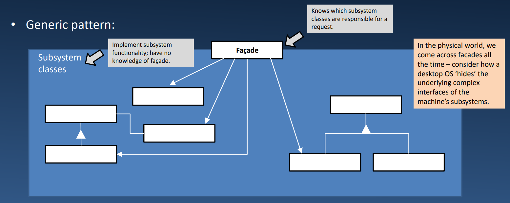

# Lecture 12.3: *Façade & Singleton* Patterns 外观模式和单例模式  

## *Façade* Pattern 外观模式  
| 模式 | Façade 外观 |
| --- | --- |
| 递归（Recurring）问题 | 类的集合(子系统)变得如此复杂，以至于客户端很难使用；许多不同的接口 |
| 解决方案 | 1. 实现一个为子系统创建单个入口点的类<br>2. 将客户端请求委托给适当的子系统对象 |
| 结果 | 从子系统组件中保护客户；使子系统更容易使用<br>不阻止客户端直接使用子系统对象 |

### GoF 版本的外观模式  
  

### 外观模式 & Python  
考虑以下例子：
```Python
# 复杂的子系统元素
class CPU:
    def freeze(self): pass
    def jump(self, position): pass
    def execute(self): pass

class Memory:
    def load(self, position, data): pass

class HardDrive:
    def read(self, lba, size): pass
```
```Python
# Façade
class Computer:
    def __init__(self):
        self.cpu = CPU()
        self.memory = Memory()
        self.hard_drive = HardDrive()

    def start_computer(self):
        self.cpu.freeze()
        self.memory.load(0, self.hard_drive.read(0, 1024))
        self.cpu.jump(10)
        self.cpu.execute()
```
```
>>> facade = Computer()
>>> facade.start_computer()
```

## Singleton 单例模式  
| 模式 | Singleton 单例 |
| --- | --- |
| 递归（Recurring）问题 | 只需要一个类的实例，客户端可以从一个已知的接入点访问它 |
| 解决方案 | 1. 实现一个创建单个普通实例的类<br>2. 将创建单个实例的操作隐藏在类(或类似)操作后面 |
| 结果 | 对实例的受控访问<br>避免使用全局变量 |

### GoF 版本的单例模式  
  

### 单例模式 & Python  
考虑以下例子：  
在Python的经典单例中，我们检查一个实例是否已经创建。如果创建了，则返回它；否则，我们创建一个新实例，将其赋值给一个类属性，然后返回它  
```Python
class Singleton: 
    def __new__(cls): 
        if not hasattr(cls, ‘instance’): 
            cls.instance = super().__new__(cls) 
        return cls.instance
```
```
>>> singleton = Singleton()
>>> another_singleton = Singleton()
>>> print(singleton is another_singleton)
True

>>> singleton.only_one_var = "There can be only one...”
>>> print(another_singleton.only_one_var)
There can be only one...
```
我们的单例定义强制所有实例共享相同的标识  
谁在乎身份(identity)——我们在乎的是状态（和行为）！  
**我们需要一个 Borg！**

## *Borg* Singleton | Brog 单例  
- Brog 也称为单态(monostate)  
- 在 Brog 模式中，所有的实例都是不同的，但它们共享相同的状态：  

```Python
class Borg:
    __shared_state = {} 
    def __init__(self): 
        self.__dict__ = self.__shared_state

    # and whatever else you want in your
    # class -- that's all!
```
```
>>> locutus = Borg()
>>> seven_of_9 = Borg()
>>> print(locutus is seven_of_9)
False

>>> locutus.onlyOne = 'Resistance is futile!'
>>> print(seven_of_9.onlyOne)
Resistance is futile!
```
- `__dict__`
    - 每个Python对象都有一个由 `__dict__` 表示的属性
    - 这是一个包含为对象定义的所有属性的字典