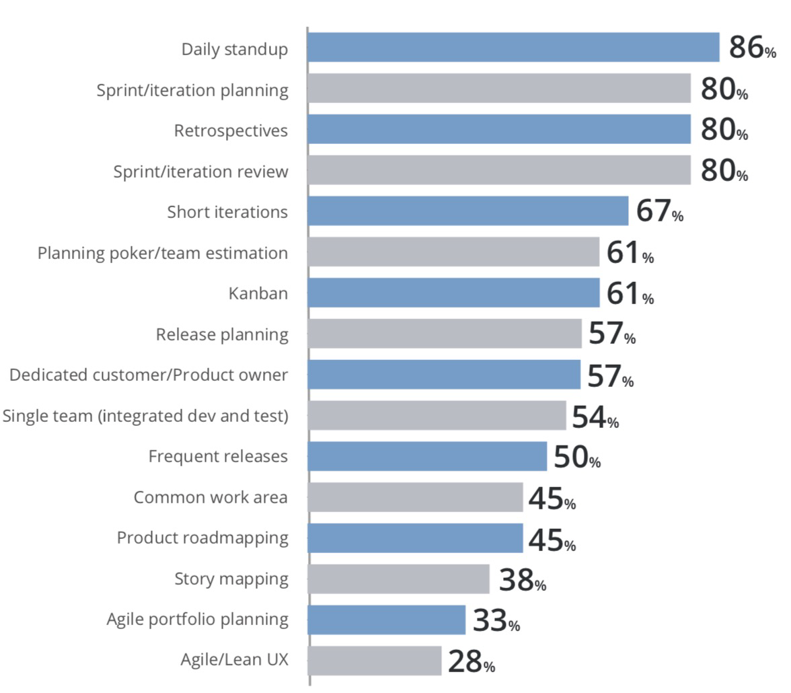

# Lecture 15.2: Agile Development and Course Wrap Up 敏捷开发和课程总结  

## 使用敏捷开发流程  
> “**Working software** over comprehensive documentation”  
> **可工作的软件**胜过全面的文档  

> “**Deliver working software frequently**, from a couple of weeks to a couple of months, with a preference to the shorter timescale.”  
> **频繁地交付可工作的软件**，交付周期可以是几周，也可以是几个月，交付周期越短越好。  

> https://agilemanifesto.org/  
> https://agilemanifesto.org/principles.html  
> http://www.extremeprogramming.org/  
> http://www.scrumguides.org/scrum-guide.html  

### Agile 是一个方向  
  
  

## 敏捷软件开发价值  
- **Individuals and Interactions** over processes and tools  
    **个人和交互**高于过程和工具  
- **Working Software** over comprehensive documentation  
    **可工作的软件**胜过全面的文档  
- **Customer Collaboration** over contract negotiation  
    **客户协作**高于合同谈判  
- **Responding to Change** over following a plan  
    **响应变化**而不是遵循计划  

## XP 和 Scrum 方法可以很好地协同工作  
- **XP** = extreme programming 极限编程 - 开发实践的集合  
    http://www.extremeprogramming.org/  
- **Scrum** = 在开发中遵循的过程（不仅仅是软件）  
    https://www.scrum.org/resources/scrum-guide  

## 我们（总是？）处于不确定的空间  
_in_unsure_spaces.png)  
- 未知的空间是等待发现的机会  
- 当某些事情不清楚时，就会有风险，我们会通过发现和测试假设来减轻风险  
- 如果没有风险，那又何苦呢？  

## 用户故事指导开发  
> As a \<type\> I want to \<task\> so that I can \<business value\>.  

故事应该是垂直的、可测试的、有用户价值的。它应该导致可见的变化、跨越多个架构层。  

## 敏捷开发关注于小批量交付的工作软件  
  

## 垂直切片提供更好的开发  
  
每小时提交多次，越小越好  

## 遵循计划或流程  
计划倾向于使用“大预先设计”（big upfront design, BUD）  
  
迭代和增量开发使用一个过程来交付价值  

## 敏捷实践支持更快的反馈： testable/usable/lovable  
  

## Scrum 和 Scrum/XP 混合是很常见的  
所有方法共享的前 5 个实践  
  
  

## 测试是敏捷方法的关键部分  
  
  

## 你必须测试你的代码  
如果不测试代码，你就不会知道：  
1. 新功能是否会破坏原有功能  
2. 或具体哪部分被破坏了  

测试会告诉你这些  
如果你在开发时不抽出时间，那么你会在代码崩溃后抽出时间。你可以选择什么时候做测试  

## 敏捷方法提供了更好的反馈  
  

## 使用红色、绿色、重构来编写代码  
**Use red, green, refactor to code**  
> Make it green, then make it clean  

  

## 缩短反馈循环（feedback loop）可以降低成本  
- 越早发现问题，就意味着问题越早得到解决  
- 越早修好，成本越低  
- 越早修复意味着花在它们身上的时间越少  
- 更早的修复意味着更多的时间用于其他事情，例如部署应用程序和带来收入——你不必总是等待它“完成”才能开始使用它  

## 遵循 TDD 原则  
  

## 根据客户的业务需求进行测试  
- 只编写应用程序中需要的测试  
- 这包括由客户共同编写的验收测试——避免误解  
> 编写最低限度有用的代码，  
> 然后停止，  
> 转向下一个功能  

## 结对编程（pair programming）适合所有人  
- 有趣  
- 节省返工的成本  
- 有利于学习（Expert-Novice 学习）  
- 有利于在团队中分享知识  

---

## 课程总结
- 现在讨论我们学到了什么  
- 这门课最喜欢的部分是什么？  
- 你学到的最重要的东西是什么？  
- 有没有什么你不喜欢的东西？  

## 如何成为优秀的程序员/软件开发人员？  
### 如何成为软件开发人员？  
- 首先了解问题  
- 不要在意应该学习或使用哪种语言  
- 但要尽可能使用最先进的  
### 如何成为优秀的软件开发人员？  
- 编写好的测试  
- 从错误消息中学习（调试）  
- 不断学习新的术语/概念/想法  
- 保持敏捷  
### **最重要的：练习、练习、还是练习**  
### 如何成为优秀的程序员？  
成为专业的：十年（10000 小时）  
> Peter Norvig: Teach yourself programming in ten years  
> http://norvig.com/21-days.html  
#### 步骤  
1. 从简单的语言开始： Python  
2. 学习其他语言: Java/Scala/Scheme/C++  
3. 与其他程序员交谈和合作  
4. 通过小项目不断学习  
5. 发明自己的语言  
    - 或者，至少考虑一下  

## 结语  
到达这里并不容易  
你们都经历过密集的编程经验  
祝你未来的 CS 课程一切顺利(特别是算法问题解决课程)  