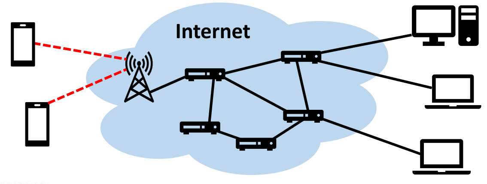
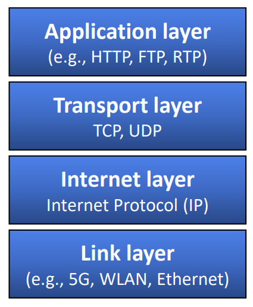
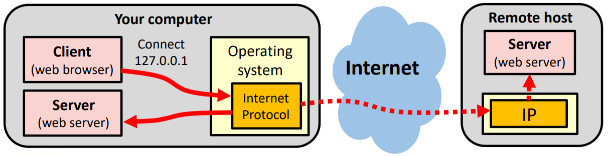
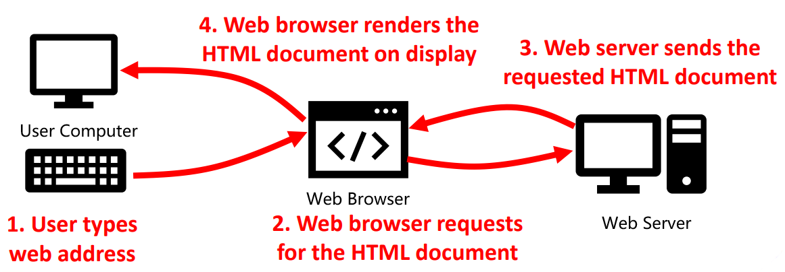
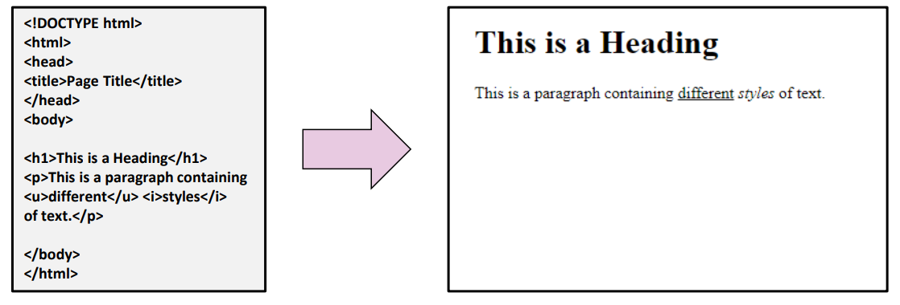

## Lecture 1.2 - 互联网介绍  

### 互联网如何工作？  
- 互联网是通过路由器网络连接的计算机（或本地网络）的全球网络  
-   

### 互联网协议套件（suite）  
- 互联网使用一套协议（protocol，即标准化的通信机制），以确保不同设备之间的连接性  
    -   
    - 互联网层和传输层通常在操作系统中实现，链路层在网络硬件中实现  
- 本课程中我们主要关注应用层  

### 应用层协议  
- 不用的应用使用不同的协议  
- HTTP 协议在本课程中非常重要，因为其用于在万维网（World Wide Web，WWW）中访问资源（如网页）  

| 协议名 | 协议名（中文） | 缩写 | 应用 |
| --- | --- | --- | --- |
| Hypertext Transfer Protocol | 超文本传输协议 | HTTP | 万维网 |
| File Transfer Protocol | 文件传输协议 | FTP | 文件传输 |
| Simple Mail Transport Protocol | 简单邮件传输协议 | SMTP | 电子邮件 |
| Real-Time Transport Protocol | 实时传输协议 | RTP | 流媒体 |

### 超文本传输协议（HTTP）  
- 用于 Web 客户端（浏览器）和服务器之间的通信  
- 要请求访问网页，浏览器发送 `GET <URL>` 消息  
    - 统一资源定位器（Uniform Resource Locator，URL）格式为：`service_type://hostname.domain:port/filepath/filename`  
    - 例如：https://cn.bing.com/search  
    - 如果缺少服务类型（service type）、主机名（host name）、端口（port）或文件名（file name），则使用默认值  
- 要向网络服务器发送数据，浏览器可以使用 HTTP 命令 `POST`  
- 还有其他（不那么重要的）几个 HTTP 命令  

### HTTP 响应状态码  
- 服务器发送的 HTTP 响应状态代码（HTTP response status code）表示特定 HTTP 请求是否成功  
- 最相关的状态代码示例  
    - **200 - OK** 标准响应，请求成功  
    - **403 - Forbidden** 用户无权访问资源  
    - **404 - Not Found** 未找到请求的资源（如网页）  
    - **500 - Internal Server Error** 通用服务器错误信息  
    - **503 - Service Unavailable** 服务器暂时瘫痪  
    - ……还有很多其他代码  

### HTTP 是无状态的（stateless）  
- HTTP 仅用于在客户端和服务器之间传输请求和响应：它不会记住以前的请求  
- 服务器不会自动知道你已登录：需要其他机制向服务器表明你的身份  
    - 客户端侧：Cookie 和 URL 参数  
    - 服务器侧：会话（Session）  

### 域名系统（Domain Name System，DNS）  
- 互联网路由器使用数字地址查找设备  
    - IP 地址（IPv4）由四组介于 0 - 255 之间的数字组成，如 `139.133.205.1`，而不是分级名称，如 `www.abdn.ac.uk`  
    - 设备可以使用 DNS 服务器（_“互联网电话本”_）将分层 DNS 地址转换为 IP 地址  
    - 操作系统（通常）会自动完成这一过程  

### 实用命令行工具  
- 要查找 IP 地址和诊断互联网连接，可以使用几种命令行工具  
- 以下示例适用于 Windows 和 Linux（Codio）  
  | 命令 | 示例 | 功能 |
  | --- | --- | --- |
  | `nslookup` | `nslookup abdn.ac.uk` | 通过 DNS 地址查找 IP 地址 |
  | `nslookup` | `nslookup 139.133.1.4` | 通过 IP 地址查找 DNS 地址 |
  | `ping` | `ping abdn.ac.uk` | 测试指定的主机是否正在响应 |
  | `netstat` | `netstat` | 检查活动连接 |
  | `traceroute`(Linux) `tracert`(Windows) | `traceroute www.bt.com` `tracert www.bt.com` | 追踪从电脑到远程主机的路径 |

### 本地运行服务器  
- 对于 Web 应用程序开发，可以在同一台设备上本地运行客户端和服务器  
    - DNS 名称 `localhost` 或 IP 地址 `127.0.0.1` 指向同一设备  
    - 甚至不一定需要一个正常的互联网连接！  
-   

### 超文本标记语言（Hypertext Markup Language，HTML）  
- WWW 中交换的文件通常用 HTML 编写，网络浏览器可以理解  
-   

#### HTML 文件  
- HTML 文件基本上只是一个文本文件，它定义了网站在网络浏览器中的样子  
-   

#### 查看 HTML 源代码  
- 浏览器通常会让你看到 HTML 源代码  
    - 例如，在 Chrom 中，右键并选择“查看网页源代码”  

#### HTML 简史  
- **1980-1989** - 蒂姆·伯纳斯-李（Tim Berners-Lee）提议为欧洲核子研究中心（CERN）的研究人员建立一个访问和共享科学文件的系统  
- **1990** - 首次规范 HTML、浏览器和服务器  
    - 以前也有标记语言，但 HTML 的革命性理念是加入 ***超链接（Hyperlink）***，让用户可以通过点击链接从一个文档移动到另一个文档  
- **1991** - 首次公开描述 HTML  
- **1993** - 互联网工程任务组（Internet Engineering Task Force，IETF）发布 HTML 建议草案  
- **1995** - HTML 2.0  
- **1997** - HTML 4  
- **2014** - HTML 5  

### 小结  
- 课程介绍  
- 互联网是由相互连接的计算机组成的全球网络  
    - 计算机通过发送请求和接收响应进行通信  
    - 万维网利用超文本文件共享信息，并允许在网页之间导航  
- 网页是静态的，而网络应用允许用户和网络服务器之间进行更复杂的交互  
    - 本课程从网页开始，直至网络应用程序