# Day 2: 超文本标记语言（HTML）  
### 概览  
- 关于 HTML  
- HTML 文件格式  
- 良好的标签和元素  
- 良好做法和验证  

## Lecture 2.1: HTML 基础和常用标签  
### 什么是 HTML？  
- HTML 是 ***超文本标记语言（HyperText Markup Language）***
    - ***不是***编程语言  
- **超文本**  
    - 可通过相互连接的链接（hyperlink 超链接）与其他文本（文件）相互参照的文本  
- **标记语言**  
    - 定义文本显示方式的标签集  
    - 区分文本内容和文本（及其他内容）的呈现/显示方式  

### 基本 HTML 文档结构  
- HTML 文档是一种文本文档，由文本内容和定义格式的标记组成  
    - 标签不区分大小写，例如 `<html>` 和 `<HTML>` 均可使用  
    - 为清晰起见，可以使用缩进，但不是强制性的  
#### 示例  
```html
<!DOCTYPE html>

<html lang="en">
    <head>
        <meta charset="utf8">
        <title>Basic structure</title>
    </head>

    <body>
        <h1>Baisc HTML</h1>
        <p>Some text in a paragraph.</p>
    </body>
</html>
```
- `DOCTYPE` - 所有页面均以 DOCTYPE 声明开始  
    - 并非真正的 HTML 标记，但可告知浏览器要显示的文档类型  
- `html` - 定义文档根目录  
    - 所有其他标记都应位于 HTML 开头标记 `<html>` 和结尾标记 `</html>` 之间  
    - 参数 `lang` 可用于定义文档的语言（`en` 表示英语）  
- `head` - 定义包含文件信息的部分  
    - 以 `<head>` 开头，`</head>` 结尾  
- `meta` -  用于描述网页“有关数据的数据”  
    - 在本例中，`charset` 是 `<meta>` 标签的一个属性，其值为 `utf8`，用于指定页面的字符编码  
    - 不应省略，以确保正确显示我们打算使用的字符和符号  
- `title` - 定义文档标题，应仅包含文本  
    - 标题将显示在浏览器工具栏、标签页或窗口中  
- `body` - 实际内容放在*正文（body）部分*  
    - 一个 HTML 文档中应只包含一个正文部分  
- 内容（content）  
    - HTML 标准定义了许多用于格式化内容的标签  
    - 本例中，`h1` 和 `p` 元素的内容在开头标记和结尾标记之间  
      ```
         ┌─────────── element ────────────┐
          <p>Some text in a paragraph.</p>
           ↑             ↑              ↑
      opening tag     content      closing tag
      ```
- 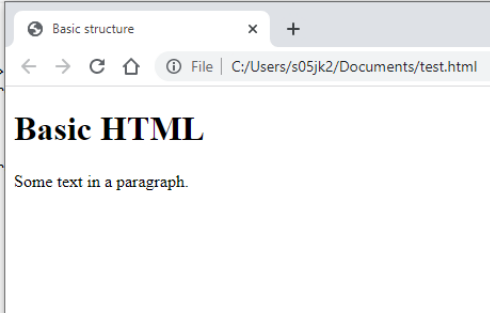  

### 常用标签  
#### 标题（header）  
- 标题标记 `<h1>`、…、`<h6>` 常用于章节和小节标题  
- ```html
  ...
  <body>
      <h1>Header level 1</h1>
      <h2>Header level 2</h2>
      <h3>Header level 3</h3>
      <h4>Header level 4</h4>
      <h5>Header level 5</h5>
      <h6>Header level 6</h6>
  </body>
  ...
  ```
- 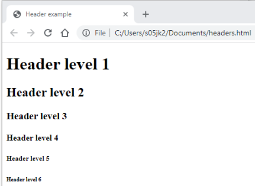  

#### 段落和换行符  
- 一个段落的内容应包含在 `<p>` 和 `</p>` 标记内  
- 换行符 `<br>` 可用于强制换行，即使是在段落内部  
- ```html
  ...
  <body>
      <p>This is the first paragraph of this HTML document. It contains quite a lot of text. You will see that it spreads to several lines.</p>

      <p>This is also a paragraph.<br>Unlike in the first paragraph, here we use line breaks. </p>
  </body>
  ...
  ```
- 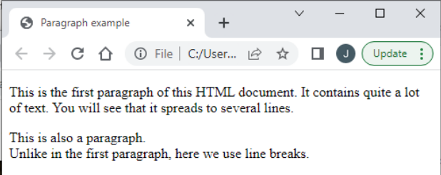  

#### 有序和无序列表  
- ```html
  ...
  <h2>Ordered List</h2>
  <ol>
      <li>First in list</li>
      <li>Second in list</li>
      <li>Third in list</li>
  </ol>

  <h2>Unordered List</h2>
  <ul>
      <li>First in list</li>
      <li>Second in list</li>
      <li>Third in list</li>
  </ul>
  ...
  ```
- 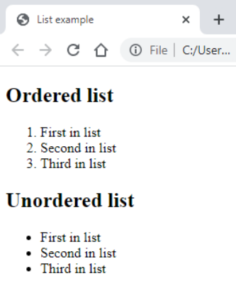

#### 描述列表  
- ```html
  ...
  <h2>Description List</h2>
  <dl>
      <dt>Coffee</dt>
          <dd>Dark hot drink</dd>
      <dt>Tea</dt>
          <dd>Transparent hot drink</dd>
      <dt>Orange juice</dt>
          <dd>Orange cold drink</dd>
  </dl>
  ...
  ```
- 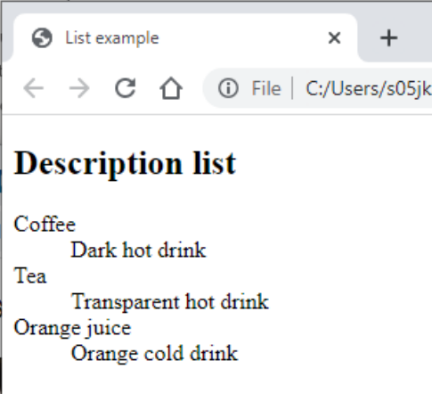  

#### 强调标记  
- 标签 `<em>` 和 `<strong>` 可用于强调文本  
- 注意，标记 `<i>` 和 `<b>` 通常用于斜体和粗体，但它们的实际格式可以重新定义！  
- ```html
  ...
  <body>
      <h2>Emphasis</h2>

      <em>I wish to emphasize this text.</em>
      <br>
      <strong>A strongly emphasized text.</strong>
  </body>
  ...
  ```
- 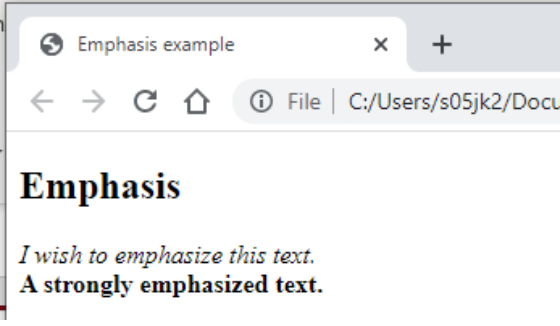  

#### 引用  
- ```html
  ...
  <body>
      <h2>Quotes</h2>
      Hamlet:<blockquote>"To be or not to be?"</blockquote>
  </body>
  ...
  ```
- 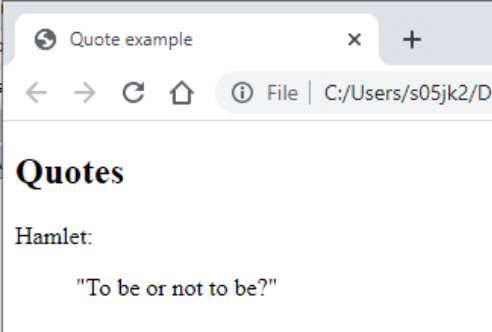  

#### 表格  
- 按行和列排列数据通常是呈现某类信息的最佳方式  
- 在 HTML 中，表格数据可以使用 `<table>` 元素进行格式化  
    - 表格行元素 `<tr>` 可嵌套在表格元素内  
    - 表格标题元素 `<th>` 和表格单元格元素 `<td>` 可嵌套在行元素内
- ```html
  ...
  <h2>Tables</h2>
  <table>
      <tr>
          <th>Name</th>
          <th>Year of Birth</th>
          <th>Hometown</th>
      </tr>
      <tr>
          <td>John Smith</td>
          <td>1967</td>
          <td>Aberdeen</td>
      </tr>
      <tr>
          <td>James Bond</td>
          <td>1953</td>
          <td>London</td>
      </tr>
  </table>
  ...
  ```
- 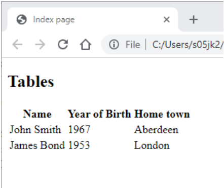  

#### 图像  
- 使用 `` 标签来显示图像  
- 使用 `src` 属性指定图像文件  
    - 图像并不一定需要在同一个服务器上——使用 URL 来从其他服务器获取图像是可行的  
- 可以使用 `alt` 属性来指定替代文字  
- ```html
  ...
  <body>
      <h2>Images</h2>

      Local image:<br>
      
      Image from the net:<br><br>
      
  </body>
  ...
  ```
- 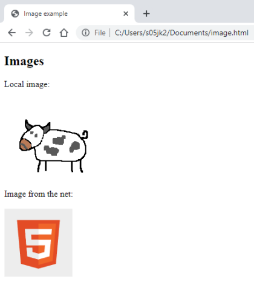  

#### 视频和音频  
- 可使用 `<video>` 元素嵌入视频，使用 `<audio>` 元素嵌入音频，使用 `<source>` 元素指定来源  
    - 包含多个属性可用于设置视频宽度和高度、控制等  
    - 如果不支持媒体，则显示标记之间的文本  
- ```html
  ...
  <video width="320" height="240" controls>
      <source src="myvideo.mp4" type="video/mp4">
      Video not supported on your device.
  </video>
  ...
  ```
  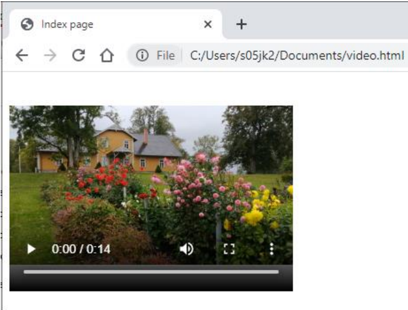  
- ```html
  ...
  <audio controls>
      <source src="music.mp3" type="audio/mpeg">
      Audio not supported on your device.
  </audio>
  ...
  ```
  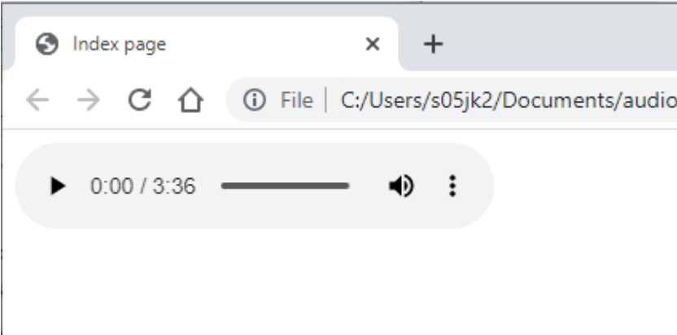  

#### 链接  
- 链接在 HTML 中非常重要  
- 链接使用锚（anchor） `<a>` 标记显示，目标地址用 `href` 属性指定  
    - 目标地址可以是本地网页或远程 URL  
    - `<a>` 和 `</a>` 之间的文本将被样式化，以显示链接  
    - 链接也可以是图片  
- ```html
  ...
  <body>
      <h2>Website example</h2>

      <a href="subpage1.html">Link to 1st subpage</a><br>
      <a href="subpage2.html">Link to 2nd subpage</a><br>
      Visit <a href="http://www.abdn.ac.uk">University of Aberdeen website</a>!

  </body>
  ...
  ```
- 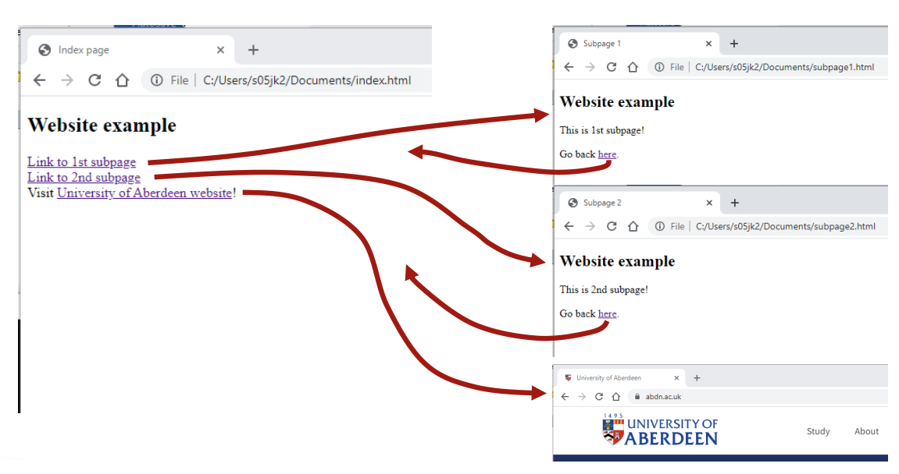  

#### HTML 注释  
- `<!--` 和 `-->` 之间的任何文本都将被视为注释，不会在浏览器中显示  
- 你可以使用注释来跟踪您的编码过程，或者给自己或其他正在处理代码的人写提醒事项  
- ```html
  ...
  <body>
      <h2>Comments</h2>

      This text is visible in the browser.
      <!-- This text is not visible in the browser. -->
      And here is some more text for the browser.
  </body>
  ...
  ```