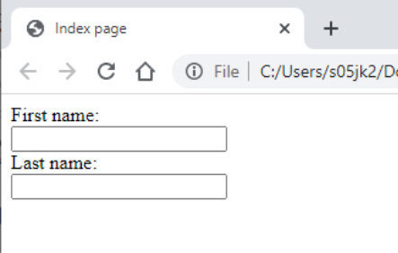
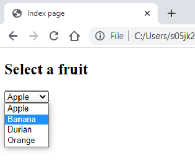
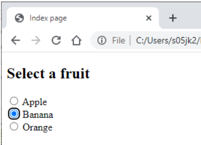
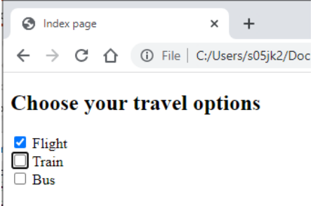
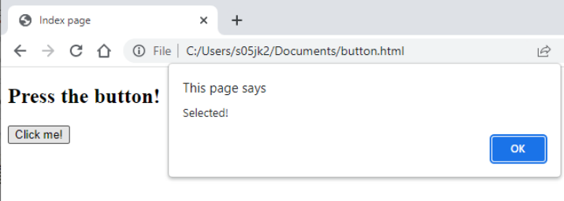
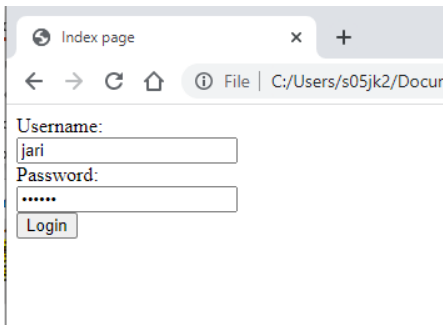
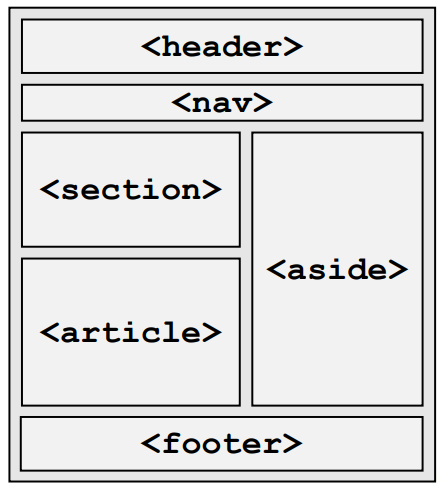

## Lecture 2.2: HTML 表单、语义元素、良好实践  
### HTML 表单  
- HTML 表单（form）为用户提供了与网站互动的途径  
    - 主要用于获取用户输入/数据  
- 获取的数据通常经过处理并存储在服务器数据中  
    - 我们需要使用 `action` 属性告诉服务器如何处理发送的数据  
- 一个表单可以包含多种不同的输入类型  
    - 我们可以使用属性来指定每种特定输入类型的类型（文本、复选框、按钮等）、ID 和名称  
- 可对表单元素进行标注，以提高可用性  

#### 表单元素  
- 表单区域由 `<form>` 元素声明  
    - 属性 `action` 指定服务器将如何处理用户输入的信息  
    - 属性 `method` 指定了提交表单时要使用的 HTTP 方法  
- `<input>` 元素  
    - `type` 属性指定输入的类型 - 本例中，`text` 表示单行文本  
    - `name` 属性将用作对该特定输入的引用  
- 使用 `<label>` 元素来标注输入类型  
    - 让我们的表单更有用……  
    - `for` 属性为要标注的特定输入类型提供引用 - 注意 `for` 引用的是 `id` 而不是 `name`  
- ```html
  ...
  <form action="processData.php" method="post">
      <label for="fName">First name:</label>
      <br>
      <input type="text" id="fName" name="fName">
      <br>
      <label for="lName">Last name:</label>
      <br>
      <input type="text" id="lName" name="lName">
  </form>
  ...
  ```
-   

### 输入类型
#### 下拉选择  
- 元素 `<select>` 可用来显示多个供用户选择的选项，支持许多属性  
    - `size` - 可见选项的数量  
    - `multiple` - 可选择的选项数量  
    - 等等  
- `<option>` 元素指定可选择的选项  
    - `value` 属性为每个选项赋值  
    - `selected` 属性指定默认选项  
    - 在开头和结尾标签之间写入每个选项的文本  
- ```html
  ...
  <form action="processData.php" method="post">
      <h2>Select a fruit</h2>
      <select id="fruits" name="fruits">
          <option value="Apple">Apple</option>
          <option value="Banana">Banana</option>
          <option value="Durian">Durian</option>
          <option value="Orange">Orange</option>
      </select>
  </form>
  ...
-   

#### 单选  
- `<radio>` 元素允许从多个选项选择一个  
    - `name` 属性为单个输入的选项分组  
    - `id` 属性标识每个选项  
- ```html
  ...
  <h2>Select a fruit</h2>

  <input type="radio" name="fruit" id="apple" value="Apple">
  <label for="apple">Apple</label><br>
  <input type="radio" name="fruit" id="banana" value="Banana">
  <label for="banana">Banana</label><br>
  <input type="radio" name="fruit" id="orange" value="Orange">
  <label for="orange">Orange</label><br>
  ...
  ```
-   

#### 复选框  
```html
...
<h2>Choose yor travel options</h2>

<input type="checkbox" name="flight" id="flight" value="flight">
<label for="flight">Flight</label><br>
<input type="checkbox" name="train" id="train" value="train">
<label for="train">Train</label><br>
<input type="checkbox" name="bus" id="bus" value="bus">
<label for="bus">Bus</label><br>
...
```
  

#### 按钮  
- 元素 `<button>` 可用作某些操作（如显示警报）的通用控件  
- ```html
  ...
  <h2>Press the button!<h2>

  <button type="button" onclick="alert('Selected!')">
  Click me!
  </button>
  ```
-   

#### 提交  
- `submit` 输入类型用于将表单内容发送给表单处理程序  
- 表单处理程序由表单的 `action` 属性指定  
- ```html
  ...
  <form action="processData.php" method="post">
      <label for ="username">Username:</label><br>
      <input type="text" id="username" name="username"><br>
      <label for ="username">Password:</label><br>
      <input type="password" id="pword" name="pword"><br>
      <input type="submit" value="Login">
  </form>
  ...
  ```
-   

#### 其他输入类型  
- 除了前面这些，还有多种输入类型可供选择  
    - 此外，还有多种属性可用于指定显示和表单值，例如尺寸、最小和最大值、必填、自动完成……  
- ```html
  <input type="color">
  <input type="date">
  <input type="datetime-local">
  <input type="email">
  <input type="file">
  <input type="hidden">
  <input type="image">
  <input type="month">
  <input type="number">
  <input type="range">
  <input type="reset">
  <input type="search">
  <input type="tel">
  <input type="time">
  <input type="url">
  <input type="week">
  ```

### 结构化 HTML 文档  
- 我们可以使用***语义元素（semantic elements）*** 来定义 HTML 文档的结构  
    - 描述意义（meaning），而非表现形式（presentation）  
    - 帮助浏览器了解页面元素的组织方式  
- 人和机器都可读的 HTML  
    - 有助于保持演示和内容的分离  
    - 无论是内容还是表现形式的改变，都会减少工作量  
-   

#### 语义元素  
- 文章元素 `<article>...</article>`  
    - 自包含的独立内容  
    - 可由其他网站或应用程序独立发布或重复使用  
    - 例如：论坛帖子、杂志文章、博客文章等  
    - 应包含标题  
- 段落元素 `<section>...</section>`
    - 页面上的通用文件或应用程序部分  
    - 页面上带有标题的专题内容分组  
    - 例如：章节、指南或教程的分步说明  
- 标题元素 `<header>...</header>`  
    - 代表一组介绍或导航辅助工具  
    - 通常包含章节标题 `<h1>` 至 `<h6>`，但也可用于目录、表单元素或徽标  
    - 必要时在页面的章节和文章区域使用  
- 导航元素 `<nav>...</nav>`  
    - 用于提供链接的区域  
    - 可包括链接列表、目录、下拉菜单等  
    - 通常用于链接块，如页面顶部或底部  
- 侧面内容元素 `<aside>...</aside>`  
    - 与主文档内容间接相关的内容  
    - 与主文档内容分离的内容  
    - 有时包含导航辅助工具、广告、侧边栏、引用等内容  
- 页脚元素 `<footer>...</footer>`  
    - 代表其最近祖先的页脚  
    - 特定部分、文章或页面其他部分的最后一部分  
    - 可包含导航辅助、版权或联系信息等  
- 其他实用的语义元素  
    - `<hgroup>` 在一个部分内分组多级标题  
    - `<details>` 定义可查看或隐藏的附加详细信息  
    - `<summary>` 为详细信息元素内的内容定义标题  
    - `<details>` 定义可查看或隐藏的附加详细信息 
    - `<main>` 定义页面的主要内容（每页只有一个）  
    - `<mark>` 定义应标记或突出显示的文本  
    - `<address>` 定义页面作者的联系信息  
    - `<details>` 定义特定时间或日期和时间  

#### 语义元素例  
```html
...
<article>
    <h1>University of Aberdeen</h1>
    <p>The University of Aberdeen was founded by William Elphinstone, Bishop of Aberdeen and Chancellor of Scotland. The University if the third oldest in Scotland and fifth oldest in the English speaking world.</p>

    <aside>
        <p>Born in Glasgow in 1431, William Elphinstone attended the High School of Glasgow, University of Glasgow and the University of Paris.</p> 
    </aside>

    <footer>
        <a href="http://abdn.ac.uk"> 
 Back to UoA website</a>
    </footer>
</article>
...
```

### 块元素和内联元素  
- 块元素（block element）从新行开始，使用页面的全部宽度  
    - 例如 `<p>`、`<h1>`-`<h6>`、`<header>`、`<table>` 等  
- 内联元素（inline element）不另起一行，只占用所需的宽度  
    - 例如 `<a>`、`<label>`、``、`<input>`、`<select>` 等  
- 元素 `<div>` 是一个块级元素，用作其他元素的通用容器  
    - 在引入语义元素之前，页面上的所有内容通常都在 `<div>` 中，有时甚至仍然如此  
- 元素 `<span>` 是一个内联元素，用于标记文本的特定部分  

### 编写 HTML 的良好实践  
- 始终包含 `DOCTYPE` 定义和 `<html>`、`<head>`、`<title>`、`<body>` 元素  
- 始终指定语言和字符编码  
- 始终在图像元素中包含 `alt` 替代文字  
- 即使不强制，也应在 HTML 元素中使用小写  
- 始终在属性中使用小写  

### 常见错误  
- 未关闭元素  
  ```html
  ❌ <p>This paragraph is not closed
  ✅ <p>This paragraph is closed</p>
- 错误地嵌套元素  
  ```html
  ❌ <p>This is <em>not nested correctly</p></em>
  ✅ <p>This is <em>nested correctly</em></p>
  ```
- 在不需要结束标记的空元素中使用斜杠（`/`）  
  ```html
  ❌ 
  ✅ 
  ```
- 属性的值未使用引号  
```html
  ❌ 
  ✅ 
  ```

### HTML 验证  
- 一般来说，HTML 的宽容度很高  
    - 有破损 HTML 代码的网页在您的浏览器中可能看起来是正确的  
    - 但在其他一些浏览器中看起来可能是错误的！  
- 我们应努力编写有效的 HTML 代码，以确保我们的页面及其内容具有一致的表现形式和可访问性  
- 我们应该使用验证器检查 HTML 代码  
    - 对于帮助识别和解决 HTML 代码中的问题非常有用  
    - 在 https://validator.w3.org/ 中可用  

### 小结  
- HTML 使我们能够为网络浏览器创建具有不同文本格式、图像、多媒体和其他文档链接的文档  
    - HTML 内容由不同的元素组成，如标题、段落、图像、表格、链接等  
- HTML 表单可用于向服务器提交用户输入数据  
    - 有多种不同的输入类型，如 HTML 标准中提供的文本输入、复选框和单选按钮  
- HTML 是一个大标准  
    - 我们只介绍了一些最基本的 HTML 功能  